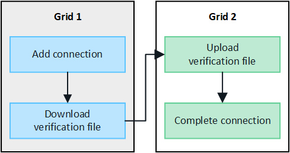

= 建立網格同盟連線
:allow-uri-read: 
:icons: font
:imagesdir: ../media/

[role="lead"]
如果您想要複製租戶詳細資料並複寫物件資料、可以在兩個 StorageGRID 系統之間建立網格同盟連線。

如圖所示、建立網格同盟連線包括兩個網格上的步驟。您可以在一個網格上新增連線、然後在另一個網格上完成連線。您可以從任一網格開始。

.開始之前
* 您已檢閱link:grid-federation-overview.html["考量與要求"]以設定網格同盟連線。
* 如果您打算為每個網格使用完整網域名稱（ FQDN ）、而非 IP 或 VIP 位址、則您知道要使用哪些名稱、而且已確認每個網格的 DNS 伺服器都有適當的項目。
* 您使用的是link:../admin/web-browser-requirements.html["支援的網頁瀏覽器"]。
* 您擁有兩個網格的「根」存取權限和資源配置複雜密碼。

== 新增連線

在兩個 StorageGRID 系統中的任一系統上執行這些步驟。

.步驟
. 從任一網格上的主要管理節點登入 Grid Manager 。
. 選擇*配置* > *系統* > *網格聯合*。
. 選取 * 新增連線 * 。
. 輸入連線的詳細資料。
+
[cols="1a,2a"]
|===
| 欄位 | 說明 

 a| 
連線名稱
 a| 
可協助您辨識此連線的唯一名稱、例如「 Grid 1-Grid 2 」。

 a| 
此網格的 FQDN 或 IP
 a| 
下列其中一項：

** 您目前登入之網格的 FQDN
** 此網格上 HA 群組的 VIP 位址
** 此網格上管理節點或閘道節點的 IP 位址。IP 可以位於目的地網格所能到達的任何網路上。

 a| 
連接埠
 a| 
您要用於此連線的連接埠。您可以輸入任何未使用的連接埠號碼、範圍從 23000 到 23999 。

此連線中的兩個網格都會使用相同的連接埠。您必須確保任一網格中的任何節點都不會使用此連接埠進行其他連線。

 a| 
此網格的憑證有效天數
 a| 
您希望此連線網格的安全性憑證有效的天數。預設值為 730 天（ 2 年）、但您可以輸入 1 至 762 天的任何值。

當您儲存連線時、 StorageGRID 會自動為每個網格產生用戶端和伺服器憑證。

 a| 
此網格的資源配置複雜密碼
 a| 
您已登入之網格的資源配置複雜密碼。

 a| 
其他網格的 FQDN 或 IP
 a| 
下列其中一項：

** 您要連線的網格 FQDN
** 其他網格上 HA 群組的 VIP 位址
** 另一個網格上管理節點或閘道節點的 IP 位址。IP 可以位於來源網格所能到達的任何網路上。

|===
. 選取 * 儲存並繼續 * 。
. 對於「下載驗證檔案」步驟、請選取 * 下載驗證檔案 * 。
+
在其他網格上完成連線後、您就無法再從任一網格下載驗證檔案。

. 找到下載的檔案(`_connection-name_.grid-federation`）、並將其儲存到安全的位置。
+

CAUTION: 此檔案包含機密（以遮罩 `***`）及其他敏感詳細資料、必須安全地儲存及傳輸。

. 選取 * 關閉 * 以返回「 Grid Federation 」頁面。
. 確認已顯示新連線、且其 * 連線狀態 * 為 * 正在等待連線 * 。
. 將檔案提供 `_connection-name_.grid-federation`給網格管理員以供其他網格使用。

== 完整連線

在您要連線的 StorageGRID 系統（另一個網格）上執行這些步驟。

.步驟
. 從主要管理節點登入 Grid Manager 。
. 選擇*配置* > *系統* > *網格聯合*。
. 選取 * 上傳驗證檔案 * 以存取「上傳」頁面。
. 選取 * 上傳驗證檔案 * 。然後，瀏覽並選擇從第一個網格下載的文件(`_connection-name_.grid-federation`）。
+
畫面會顯示連線的詳細資料。

. 您也可以為此網格輸入不同的安全性憑證有效天數。* 憑證有效天數 * 項目預設為您在第一個網格上輸入的值、但每個網格可以使用不同的到期日。
+
一般而言、在連線的兩端、使用相同天數的憑證。

+

CAUTION: 如果連線任一端的憑證過期、連線將會停止運作、而且在更新憑證之前、複製作業將會擱置。

. 輸入您目前登入網格的資源配置密碼。
. 選取 * 儲存並測試 * 。
+
會產生憑證並測試連線。如果連線有效、就會出現成功訊息、而且新連線會列在「 Grid Federation 」（網格聯盟）頁面上。* 連線狀態 * 將為 * 已連線 * 。

+
如果出現錯誤訊息、請解決任何問題。請參閱。 link:grid-federation-troubleshoot.html["疑難排解網格同盟錯誤"]

. 移至第一個網格上的「網格聯盟」頁面、然後重新整理瀏覽器。確認 * 連線狀態 * 現在為 * 連線 * 。
. 建立連線後、安全地刪除驗證檔案的所有複本。
+
如果您編輯此連線、將會建立新的驗證檔案。原始檔案無法重複使用。

.完成後
* 檢閱的考量事項link:grid-federation-manage-tenants.html["管理允許的租戶"]。
* link:creating-tenant-account.html["建立一個或多個新的租戶帳戶"]、指派 * 使用網格聯盟連線 * 權限、然後選取新的連線。
* link:grid-federation-manage-connection.html["管理連線"]視需要。您可以編輯連線值、測試連線、旋轉連線憑證或移除連線。
* link:../monitor/grid-federation-monitor-connections.html["監控連線"]作為正常 StorageGRID 監控活動的一部分。
* link:grid-federation-troubleshoot.html["疑難排解連線問題"]包括解決與帳戶複製和跨網格複寫有關的任何警示和錯誤。

