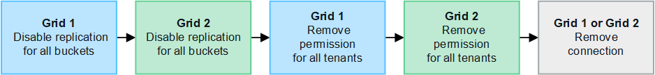

= 管理網格同盟連線
:allow-uri-read: 
:icons: font
:imagesdir: ../media/

[role="lead"]
管理 StorageGRID 系統之間的網格同盟連線、包括編輯連線詳細資料、旋轉憑證、移除租戶權限、以及移除未使用的連線。

.開始之前
* 您可以使用登入任一網格上的 Grid Manager link:../admin/web-browser-requirements.html["支援的網頁瀏覽器"]。
* 您擁有已登入的link:admin-group-permissions.html["root 存取權限"]網格。

== [[edit_grid_fed_connection] 編輯網格同盟連線

您可以登入連線中任一網格上的主要管理節點、以編輯網格同盟連線。變更第一個網格之後、您必須下載新的驗證檔案並上傳至其他網格。

NOTE: 編輯連線時、帳戶複製或跨網格複寫要求會繼續使用現有的連線設定。您對第一個網格所做的任何編輯都會儲存在本機、但在上傳至第二個網格、儲存及測試之前、不會使用。

=== 開始編輯連線

.步驟
. 從任一網格上的主要管理節點登入 Grid Manager 。
. 選取 * 節點 * 、並確認系統中的所有其他管理節點都已上線。
+

NOTE: 編輯網格同盟連線時、 StorageGRID 會嘗試在第一個網格上的所有管理節點上儲存「候選組態」檔案。如果無法將此檔案儲存至所有管理節點、當您選取 * 儲存並測試 * 時、會出現警告訊息。

. 選擇 * 組態 * > * 系統 * > * 網格聯盟 * 。
. 使用 Grid Federation 頁面上的 * Actions* 功能表或特定連線的詳細資料頁面、編輯連線詳細資料。請參閱link:grid-federation-create-connection.html["建立網格同盟連線"]以瞭解要輸入的內容。
+
[role="tabbed-block"]
====
.「行動」功能表
--
.. 選取連線的選項按鈕。
.. 選取 * 動作 * > * 編輯 * 。
.. 輸入新資訊。

--
.詳細資料頁面
--
.. 選取連線名稱以顯示其詳細資料。
.. 選擇*編輯*。
.. 輸入新資訊。

--
====
. 輸入您登入網格的資源配置密碼。
. 選取 * 儲存並繼續 * 。
+
新值會儲存、但在您將新驗證檔案上傳至其他網格之前、這些值不會套用至連線。

. 選擇 * 下載驗證檔案 * 。
+
若要稍後下載此檔案、請前往連線的詳細資料頁面。

. 找到下載的檔案(`_connection-name_.grid-federation`）、並將其儲存到安全的位置。
+

CAUTION: 驗證檔案包含機密資料、必須安全地儲存及傳輸。

. 選取 * 關閉 * 以返回「 Grid Federation 」頁面。
. 確認 * 連線狀態 * 為 * 擱置編輯 * 。
+

NOTE: 如果開始編輯連線時連線狀態不是 * 已連線 * 、則不會變更為 * 擱置編輯 * 。

. 將檔案提供 `_connection-name_.grid-federation`給網格管理員以供其他網格使用。

=== 完成連線編輯

將驗證檔案上傳至其他網格、即可完成連線編輯。

.步驟
. 從主要管理節點登入 Grid Manager 。
. 選擇 * 組態 * > * 系統 * > * 網格聯盟 * 。
. 選取 * 上傳驗證檔案 * 以存取上傳頁面。
. 選取 * 上傳驗證檔案 * 。然後、瀏覽並選取從第一個網格下載的檔案。
. 輸入您目前登入網格的資源配置密碼。
. 選取 * 儲存並測試 * 。
+
如果可以使用編輯的值建立連線、就會出現成功訊息。否則會出現錯誤訊息。檢閱訊息並解決任何問題。

. 關閉精靈以返回「 Grid Federation 」頁面。
. 確認 * 連線狀態 * 為 * 已連線 * 。
. 移至第一個網格上的「網格聯盟」頁面、然後重新整理瀏覽器。確認 * 連線狀態 * 現在為 * 連線 * 。
. 建立連線後、安全地刪除驗證檔案的所有複本。

== [[test_grid_fed_connection] 測試網格同盟連線

.步驟
. 從主要管理節點登入 Grid Manager 。
. 選擇 * 組態 * > * 系統 * > * 網格聯盟 * 。
. 使用 Grid Federation 頁面上的 * Actions* 功能表或特定連線的詳細資料頁面來測試連線。
+
[role="tabbed-block"]
====
.「行動」功能表
--
.. 選取連線的選項按鈕。
.. 選取 * 動作 * > * 測試 * 。

--
.詳細資料頁面
--
.. 選取連線名稱以顯示其詳細資料。
.. 選擇*測試連線*。

--
====
. 檢閱連線狀態：
+
[cols="1a,2a"]
|===
| 連線狀態 | 說明 

 a| 
連線
 a| 
兩個網格都已連線並正常通訊。

 a| 
錯誤
 a| 
連線處於錯誤狀態。例如、憑證已過期或組態值不再有效。

 a| 
擱置編輯
 a| 
您已編輯此網格上的連線、但連線仍在使用現有的組態。若要完成編輯、請將新的驗證檔案上傳至其他網格。

 a| 
正在等待連線
 a| 
您已在此網格上設定連線、但其他網格上的連線尚未完成。從這個網格下載驗證檔案、並將其上傳至其他網格。

 a| 
不明
 a| 
連線處於未知狀態、可能是因為網路問題或離線節點。

|===
. 如果連線狀態為 * 錯誤 * 、請解決任何問題。然後再次選擇 * 測試連線 * 以確認問題已解決。

== [[rotate_grid_fed_certificate]] 旋轉連線憑證

每個網格同盟連線都會使用四個自動產生的 SSL 憑證來保護連線安全。當每個網格的兩個憑證接近到期日時、 * 網格聯合憑證過期 * 警示會提醒您旋轉憑證。

CAUTION: 如果連線任一端的憑證過期、連線將會停止運作、而且在更新憑證之前、複製作業將會擱置。

.步驟
. 從任一網格上的主要管理節點登入 Grid Manager 。
. 選擇 * 組態 * > * 系統 * > * 網格聯盟 * 。
. 從「 Grid Federation 」（網格聯盟）頁面的任一索引標籤中、選取連線名稱以顯示其詳細資料。
. 選取*憑證*索引標籤。
. 選取 * 「旋轉憑證」 * 。
. 指定新憑證的有效天數。
. 輸入您登入網格的資源配置密碼。
. 選取 * 「旋轉憑證」 * 。
. 視需要在連線的其他網格上重複這些步驟。
+
一般而言、在連線的兩端、使用相同天數的憑證。

== [[remove_grid 饋送 _connection]] 移除網格同盟連線

您可以從連線中的任一網格移除網格同盟連線。如圖所示、您必須在兩個網格上執行必要步驟、以確認任一網格上的任何租戶都未使用連線。

移除連線之前、請注意下列事項：

* 移除連線並不會刪除已在方格之間複製的任何項目。例如、當租戶權限移除時、不會從任一網格中刪除兩個網格上的租戶使用者、群組和物件。如果要刪除這些項目、您必須手動從兩個方格中刪除它們。
* 當您移除連線時、任何擱置複寫的物件（擷取但尚未複寫到其他網格）都會永久失敗。

=== 停用所有租戶貯體的複寫

.步驟
. 從任一網格開始、從主要管理節點登入 Grid Manager 。
. 選擇 * 組態 * > * 系統 * > * 網格聯盟 * 。
. 選取連線名稱以顯示其詳細資料。
. 在 * 允許的租戶 * 標籤上、判斷是否有任何租戶正在使用連線。
. 如果列出任何租戶、請指示所有租戶link:../tenant/grid-federation-manage-cross-grid-replication.html["停用跨網格複寫"]在連線中的兩個網格上安裝所有貯體。
+

TIP: 如果任何租戶貯體已啟用跨網格複寫、則無法移除 * 使用網格同盟連線 * 權限。每個租戶帳戶都必須停用其在兩個網格上的貯體跨網格複寫。

=== 移除每個租戶的權限

停用所有租戶貯體的跨網格複寫之後、請移除兩個網格上所有租戶的 * 使用網格同盟權限 * 。

.步驟
. 選擇 * 組態 * > * 系統 * > * 網格聯盟 * 。
. 選取連線名稱以顯示其詳細資料。
. 對於「 * 允許租戶 * 」索引標籤上的每個租戶、請移除每個租戶的 * 使用網格同盟連線 * 權限。請參閱。 link:grid-federation-manage-tenants.html["管理允許的租戶"]
. 對其他網格上的允許租戶重複這些步驟。

=== 移除連線

.步驟
. 當任一網格上沒有租戶正在使用連線時、請選取 * 移除 * 。
. 檢閱確認訊息、然後選取 * 移除 * 。
+
** 如果可以移除連線、就會顯示成功訊息。網格同盟連線現在已從兩個網格中移除。
** 如果無法移除連線（例如、連線仍在使用中或發生連線錯誤）、則會顯示錯誤訊息。您可以執行下列其中一項：
+
*** 解決錯誤（建議）。請參閱。 link:grid-federation-troubleshoot.html["疑難排解網格同盟錯誤"]
*** 強制移除連線。請參閱下一節。

== [[force-remove_grid 饋送 _connection]] 強制移除網格同盟連線

如有必要、您可以強制移除狀態為 * 已連線 * 的連線。

強制移除只會從本機網格刪除連線。若要完全移除連線、請在兩個網格上執行相同步驟。

.步驟
. 在確認對話方塊中、選取 * 強制移除 * 。
+
隨即顯示成功訊息。無法再使用此網格同盟連線。不過、租戶貯體可能仍啟用跨網格複寫、而且可能已在連線的網格之間複寫某些物件複本。

. 從連線中的其他網格、從主要管理節點登入 Grid Manager 。
. 選擇 * 組態 * > * 系統 * > * 網格聯盟 * 。
. 選取連線名稱以顯示其詳細資料。
. 選取 * 移除 * 和 * 是 * 。
. 選取 * 強制移除 * 可移除此網格的連線。

