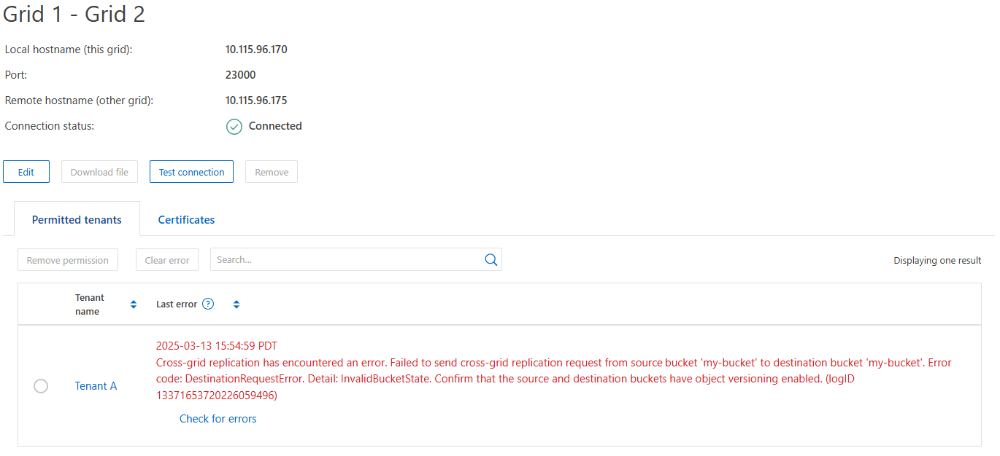

= 疑難排解網格同盟錯誤
:allow-uri-read: 
:icons: font
:imagesdir: ../media/

[role="lead"]
您可能需要疑難排解與網格同盟連線、帳戶複製和跨網格複寫相關的警示和錯誤。

== [[grid-Federation 錯誤 ]] Grid 聯盟連線警示和錯誤

您可能會收到網格同盟連線的警示或錯誤。

在進行任何變更以解決連線問題之後、請測試連線、以確保連線狀態回到 * 已連線 * 。有關說明，請參閱link:grid-federation-manage-connection.html["管理網格同盟連線"]。

=== Grid Federation 連線失敗警示

.問題
觸發 * Grid Federation 連線失敗 * 警示。

.詳細資料
此警示表示網格之間的網格同盟連線無法運作。

.建議採取的行動
. 檢閱網格同盟頁面上兩個網格的設定。確認所有值都正確無誤。請參閱。 link:grid-federation-manage-connection.html["管理網格同盟連線"]
. 檢閱用於連線的憑證。請確定沒有過期網格同盟憑證的警示、而且每個憑證的詳細資料都是有效的。請參閱中有關旋轉連線憑證link:grid-federation-manage-connection.html["管理網格同盟連線"]的說明。
. 確認兩個網格中的所有管理節點和閘道節點均為線上且可供使用。解決可能影響這些節點的任何警示、然後再試一次。
. 如果您為本機或遠端網格提供完整網域名稱（ FQDN ）、請確認 DNS 伺服器已連線且可供使用。如需網路、 IP 位址和 DNS 需求的詳細資訊、請參閱link:grid-federation-overview.html["什麼是網格同盟？"]。

=== Grid Federation 憑證警示過期

.問題
觸發了 * 網格聯合憑證過期 * 警示。

.詳細資料
此警示表示一或多個網格同盟憑證即將過期。

.建議採取的行動
請參閱中有關旋轉連線憑證link:grid-federation-manage-connection.html["管理網格同盟連線"]的說明。

=== 編輯網格同盟連線時發生錯誤

.問題
編輯網格同盟連線時、當您選取 * 儲存並測試 * 時、會看到下列警告訊息：「無法在一或多個節點上建立候選組態檔案。」

.詳細資料
編輯網格同盟連線時、 StorageGRID 會嘗試在第一個網格上的所有管理節點上儲存「候選組態」檔案。如果無法將此檔案儲存至所有管理節點、例如管理節點離線、就會出現警告訊息。

.建議採取的行動
. 從用於編輯連線的網格中、選取 * 節點 * 。
. 確認該網格的所有管理節點均已上線。
. 如果有任何節點離線、請將其重新上線、然後再次嘗試編輯連線。

== 帳戶複製錯誤

=== 無法登入複製的租戶帳戶

.問題
您無法登入複製的租戶帳戶。租戶管理程式登入頁面上的錯誤訊息是「您的此帳戶認證無效。請再試一次。 "

.詳細資料
基於安全理由、當租戶帳戶從租戶的來源網格複製到租戶的目的地網格時、您為租戶的本機根使用者設定的密碼不會複製。同樣地、當租戶在其來源網格上建立本機使用者時、本機使用者密碼不會複製到目的地網格。

.建議採取的行動
根使用者必須先在目的地網格上登入租戶的目的地網格、然後才能登入租戶的目的地link:changing-password-for-tenant-local-root-user.html["變更本機 root 使用者的密碼"]網格。

複製的本機使用者必須先在目的地網格上新增使用者密碼、才能登入租戶的目的地網格。如需相關指示、請參閱link:../tenant/managing-local-users.html["管理本機使用者"]使用租戶管理程式的說明。

=== 未建立複本的租戶

.問題
在建立具有「 * 使用網格同盟連線 * 」權限的新租用戶之後、您會看到訊息「租戶建立時不含複製項目」。

.詳細資料
如果連線狀態的更新延遲、可能導致不良連線被列為 * 連線 * 、就會發生此問題。

.建議採取的行動
. 檢閱錯誤訊息中列出的原因、並解決可能導致連線無法正常運作的任何網路或其他問題。請參閱。 <<grid-federation-errors,Grid Federation 連線警示和錯誤>>
. 請依照中的指示測試網格同盟連線link:grid-federation-manage-connection.html["管理網格同盟連線"]、確認問題已解決。
. 從租戶的來源網格中、選取 * 租戶 * 。
. 找出無法複製的租戶帳戶。
. 選取租戶名稱以顯示詳細資料頁面。
. 選擇 * 重試帳戶複製 * 。
+
image::../media/grid-federation-retry-account-clone.png[顯示錯誤訊息和重試帳戶複製按鈕的螢幕擷取畫面]

+
如果錯誤已解決、則租戶帳戶現在將會複製到其他網格。

== 跨網格複寫警示和錯誤

=== 顯示連線或租戶的最後一個錯誤

.問題
當link:../monitor/grid-federation-monitor-connections.html["檢視網格同盟連線"]（或連線時link:grid-federation-manage-tenants.html["管理允許的租戶"]）您在連線詳細資料頁面的 * 最後一個錯誤 * 欄中發現錯誤。例如：

.詳細資料
對於每個網格同盟連線、 * 最後一個錯誤 * 欄會顯示租戶資料複寫到其他網格時發生的最新錯誤（如果有）。此欄只會顯示最後發生的跨網格複寫錯誤、不會顯示先前可能發生的錯誤。此欄可能會因為下列其中一個原因而發生錯誤：

* 找不到來源物件版本。
* 找不到來源貯體。
* 目的地貯體已刪除。
* 目的地貯體是由不同的帳戶重新建立。
* 目的地貯體已暫停版本設定。
* 目的地貯體是由相同的帳戶重新建立、但現在已取消版本管理。

.建議採取的行動
如果在 * 最後一個錯誤 * 欄中出現錯誤訊息、請遵循下列步驟：

. 檢閱訊息文字。
. 執行任何建議的動作。例如、如果目的地貯體上的版本設定已暫停進行跨網格複寫、請重新啟用該貯體的版本設定。
. 從表格中選取連線或租戶帳戶。
. 選取 * 清除錯誤 * 。
. 選擇 * 是 * 以清除訊息並更新系統狀態。
. 等待 5-6 分鐘、然後將新物件擷取到貯體中。確認錯誤訊息不會再次出現。
+

NOTE: 若要確保清除錯誤訊息、請在訊息中的時間戳記之後至少等待 5 分鐘、然後再擷取新物件。

+

TIP: 清除錯誤之後、如果物件被擷取到另一個儲存格中、而且發生錯誤、就可能會出現新的 * 最後一個錯誤 * 。

. 若要判斷是否有任何物件因儲存區錯誤而無法複寫link:../admin/grid-federation-retry-failed-replication.html["識別並重試失敗的複寫作業"]、請參閱。

=== 跨網格複寫永久故障警示

.問題
觸發 * 跨網格複寫永久失敗 * 警示。

.詳細資料
此警示表示租戶物件無法在兩個網格上的貯體之間複寫、原因是需要使用者介入才能解決。此警示通常是由來源或目的地貯體變更所造成。

.建議採取的行動
. 登入觸發警示的網格。
. 移至 * 組態 * > * 系統 * > * 網格聯盟 * 、然後找出警示中列出的連線名稱。
. 在「允許的租戶」標籤上、查看 * 最後一個錯誤 * 欄、以判斷哪些租戶帳戶有錯誤。
. 若要深入瞭解故障、請參閱檢閱跨網格複寫計量的指示link:../monitor/grid-federation-monitor-connections.html["監控網格同盟連線"]。
. 對於每個受影響的租戶帳戶：
+
.. 請參閱中的指示link:../monitor/monitoring-tenant-activity.html["監控租戶活動"]、確認租戶在跨網格複寫的目的地網格上並未超過配額。
.. 視需要增加目標網格上的租戶配額、以允許儲存新物件。

. 對於每個受影響的租戶、請在兩個網格上登入租戶管理器、以便比較貯體清單。
. 針對已啟用跨網格複寫的每個貯體、請確認下列事項：
+
** 另一個網格上有相同租戶的對應貯體（必須使用正確名稱）。
** 兩個儲存格都已啟用物件版本設定（任一格線上都無法暫停版本設定）。
** 兩個貯體都停用 S3 物件鎖定。
** 兩個貯體都不處於 * 刪除物件：唯讀 * 狀態。

. 若要確認問題是否已解決、請參閱中的指示link:../monitor/grid-federation-monitor-connections.html["監控網格同盟連線"]、以檢閱跨網格複寫指標、或執行下列步驟：
+
.. 返回「 Grid Federation 」頁面。
.. 選取受影響的租戶、然後在 * 上次錯誤 * 欄中選取 * 清除錯誤 * 。
.. 選擇 * 是 * 以清除訊息並更新系統狀態。
.. 等待 5-6 分鐘、然後將新物件擷取到貯體中。確認錯誤訊息不會再次出現。
+

NOTE: 若要確保清除錯誤訊息、請在訊息中的時間戳記之後至少等待 5 分鐘、然後再擷取新物件。

+

NOTE: 警示解決後、可能需要一天的時間才能清除。

.. 請移至link:grid-federation-retry-failed-replication.html["識別並重試失敗的複寫作業"]以識別無法複寫到其他網格的任何物件或刪除標記、並視需要重試複寫。

=== 跨網格複寫資源無法使用警示

.問題
觸發 * 跨網格複寫資源 Unavailable * 警示。

.詳細資料
此警示表示跨網格複寫要求因資源無法使用而擱置中。例如、可能發生網路錯誤。

.建議採取的行動
. 監控警示、查看問題是否自行解決。
. 如果問題持續發生、請判斷網格是否有相同連線的 * 網格同盟連線失敗 * 警示、或是某個節點的 * 無法與節點 * 通訊警示。當您解決這些警示時、可能會解決此警示。
. 若要深入瞭解故障、請參閱檢閱跨網格複寫計量的指示link:../monitor/grid-federation-monitor-connections.html["監控網格同盟連線"]。
. 如果您無法解決警示、請聯絡技術支援部門。

問題解決後、跨網格複寫將會正常進行。
