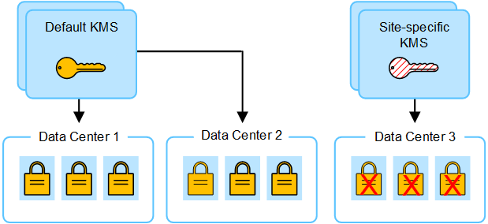
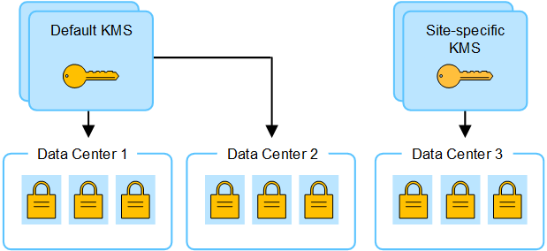

= 變更網站KMS的考量事項
:allow-uri-read: 
:icons: font
:imagesdir: ../media/

[role="lead"]
每個金鑰管理伺服器（KMS）或KMS叢集都會為單一站台或一組站台的所有應用裝置節點提供加密金鑰。如果您需要變更站台使用的KMS、可能需要將加密金鑰從一個KMS複製到另一個KMS。

如果您變更站台使用的KMS、則必須確保該站台先前加密的應用裝置節點可以使用儲存在新KMS上的金鑰來解密。在某些情況下、您可能需要將目前版本的加密金鑰從原始KMS複製到新的KMS。您必須確保KMS擁有正確的金鑰、以便在站台上解密加密的應用裝置節點。

例如：

. 您一開始會設定預設 KMS 、以套用至所有沒有專屬 KMS 的網站。
. 儲存KMS時、所有啟用「*節點加密*」設定的應用裝置節點都會連線至KMS、並要求加密金鑰。此金鑰用於加密所有站台的應用裝置節點。此相同金鑰也必須用於解密這些應用裝置。
+
image::../media/kms_default_key.png[KMS預設金鑰]

. 您決定為單一站台新增站台專屬的KMS（圖中的資料中心3）。不過、由於應用裝置節點已加密、因此當您嘗試儲存站台特定KMS的組態時、就會發生驗證錯誤。發生此錯誤的原因是站台特定的KMS沒有正確的金鑰來解密該站台的節點。
+

. 若要解決此問題、請將目前版本的加密金鑰從預設KMS複製到新的KMS。（技術上、您可以將原始金鑰複製到具有相同別名的新金鑰。原始金鑰會成為新金鑰的先前版本。）網站專屬的 KMS 現在擁有正確的金鑰、可將資料中心 3 的應用裝置節點解密、以便儲存在 StorageGRID 中。
+

== 變更站台使用KMS的使用案例

下表摘要列出變更站台KMS的最常見案例所需步驟。

[cols="1a,2a"]
|===
| 變更站台KMS的使用案例 | 必要步驟 

 a| 
您有一或多個站台專屬的KMS項目、您想要使用其中一個做為預設KMS。
 a| 
編輯站台專屬的KMS。在*管理金鑰*欄位中、選取*不受其他KMS管理的站台（預設KMS）*。網站專屬KMS現在將做為預設KMS使用。它將套用至任何沒有專屬 KMS 的網站。

link:kms-editing.html["編輯金鑰管理伺服器（KMS）"]

 a| 
您有預設的KMS、而且您在擴充中新增了一個網站。您不想在新網站上使用預設的 KMS 。
 a| 
. 如果新站台的應用裝置節點已在預設KMS中加密、請使用KMS軟體將目前版本的加密金鑰從預設KMS複製到新的KMS。
. 使用Grid Manager新增KMS並選取網站。

link:kms-adding.html["新增金鑰管理伺服器（KMS）"]

 a| 
您想讓站台的KMS使用不同的伺服器。
 a| 
. 如果站台上的應用裝置節點已由現有的KMS加密、請使用KMS軟體將目前版本的加密金鑰從現有的KMS複製到新的KMS。
. 使用Grid Manager編輯現有的KMS組態、然後輸入新的主機名稱或IP位址。

link:kms-adding.html["新增金鑰管理伺服器（KMS）"]

|===