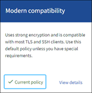

= 管理 TLS 和 SSH 原則
:allow-uri-read: 
:icons: font
:imagesdir: ../media/

[role="lead"]
TLS 和 SSH 原則決定使用哪些通訊協定和加密程式來建立與用戶端應用程式的安全 TLS 連線、以及安全的 SSH 連線至內部 StorageGRID 服務。

安全性原則控制 TLS 和 SSH 如何加密移動中的資料。一般而言、請使用現代化相容性（預設）原則、除非您的系統需要符合一般準則、或您需要使用其他密碼。

NOTE: 某些 StorageGRID 服務尚未更新、無法在這些原則中使用密碼。

.開始之前
* 您已使用登入 Grid Manager link:../admin/web-browser-requirements.html["支援的網頁瀏覽器"]。
* 您有link:admin-group-permissions.html["root 存取權限"]。

== 選取安全性原則

.步驟
. 選擇*配置* > *安全* > *安全設定*。
+
「 *TLS 與 SSH 原則 * 」標籤會顯示可用的原則。目前作用中的原則會在原則方塊上以綠色核取記號表示。

+

. 查看標籤以了解可用的策略。
+
[role="tabbed-block"]
====
.現代化相容性（預設）
--
如果您需要強加密且沒有特殊要求，請使用預設策略。此策略與大多數 TLS 和 SSH 用戶端相容。

--
.舊版相容性
--
如果您需要為舊用戶端提供額外的相容性選項，請使用舊版相容性原則。此策略中的附加選項可能會使其安全性低於現代相容性策略。

--
.一般準則
--
如果您需要通用標準認證，請使用通用標準政策。

--
.FIPS 嚴格
--
如果您需要通用標準認證，並且需要使用NetApp加密安全模組 (NCSM) 3.0.8 或NetApp StorageGRID核心加密 API 6.1.129-1-ntap1-amd64 模組將外部用戶端連接到負載平衡器端點、租用戶管理器和網格管理器，請使用 FIPS 嚴格原則。使用此策略可能會降低效能。

NCSM 3.0.8 和NetApp StorageGRID Kernel Crypto API 6.1.129-1-ntap1-amd64 模組用於下列操作：

** 全國運動醫學委員會
+
*** 以下服務之間的 TLS 連線：ADC、AMS、CMN、DDS、LDR、SSM、NMS、mgmt-api、nginx、nginx-gw 和 cache-svc
*** 用戶端和 nginx-gw 服務（負載平衡器端點）之間的 TLS 連接
*** 用戶端和 LDR 服務之間的 TLS 連接
*** SSE-S3、SSE-C 和儲存物件加密設定的物件內容加密
*** SSH 連線

+
欲了解更多信息，請參閱 NIST 加密演算法驗證程序link:https://csrc.nist.gov/projects/cryptographic-module-validation-program/certificate/4838["證書編號 #4838"^]。

** NetApp StorageGRID核心加密 API 模組
+
NetApp StorageGRID Kernel Crypto API 模組僅存在於 VM 和StorageGRID設備平台上。

+
*** 熵收集
*** 節點加密

+
欲了解更多信息，請參閱 NIST 加密演算法驗證程序link:https://csrc.nist.gov/projects/cryptographic-algorithm-validation-program/validation-search?searchMode=implementation&product=NetApp+StorageGRID+Kernel+Crypto+API&productType=-1&ipp=50["證書 #A6242 至 #A6257"^]和link:https://csrc.nist.gov/projects/cryptographic-module-validation-program/entropy-validations/certificate/223["熵證書#E223"^]。

*注意*：選擇此政策後，link:../maintain/rolling-reboot-procedure.html["執行滾動重啟"]所有節點均啟動 NCSM。使用*維護* > *滾動重新啟動*來啟動和監控重新啟動。

--
.自訂
--
如果您需要套用自己的密碼、請建立自訂原則。

或者，如果您的StorageGRID具有 FIPS 140 加密需求，請啟用 FIPS 模式功能以使用 NCSM 3.0.8 和NetApp StorageGRID Kernel Crypto API 6.1.129-1-ntap1-amd64 模組：

.. 設定 `fipsMode`參數 `true`。
.. 當出現提示時，link:../maintain/rolling-reboot-procedure.html["執行滾動重啟"]所有節點都啟動加密模組。使用*維護* > *滾動重新啟動*來啟動和監控重新啟動。
.. 選擇「*支援*」>「*診斷*」以查看活動的 FIPS 模組版本。

--
====
. 若要查看每個原則的密碼、通訊協定和演算法的詳細資料、請選取 * 檢視詳細資料 * 。
. 若要變更目前的原則、請選取 * 使用原則 * 。
+
原則方塊上的 * 目前原則 * 旁會出現綠色核取記號。

== 建立自訂安全性原則

如果您需要套用自己的密碼、可以建立自訂原則。

.步驟
. 從最類似您要建立之自訂原則的原則方塊中、選取 * 檢視詳細資料 * 。
. 選取 * 複製到剪貼簿 * 、然後選取 * 取消 * 。
+
image::../media/securitysettings-custom-security-policy-copy.png[複製現有原則以建立自訂原則]

. 從 * 自訂原則 * 方塊中、選取 * 設定與使用 * 。
. 貼上您複製的 JSON 、然後進行任何必要的變更。
. 選取 * 使用原則 * 。
+
「自訂原則」方塊的 * 目前原則 * 旁會出現綠色核取記號。

. 您也可以選擇 * 編輯組態 * 來對新的自訂原則進行更多變更。

== 暫時恢復為預設的安全性原則

如果您設定了自訂安全性原則、如果設定的 TLS 原則與不相容link:global-certificate-types.html["已設定的伺服器憑證"]、您可能無法登入 Grid Manager 。

您可以暫時還原為預設的安全性原則。

.步驟
. 登入管理節點：
+
.. 輸入下列命令： `ssh admin@_Admin_Node_IP_`
.. 輸入檔案中列出的密碼 `Passwords.txt`。
.. 輸入以下命令切換到 root ： `su -`
.. 輸入檔案中列出的密碼 `Passwords.txt`。
+
當您以 root 登入時、提示會從變更 `$`為 `#`。

. 執行下列命令：
+
`restore-default-cipher-configurations`

. 從網頁瀏覽器存取同一個管理節點上的Grid Manager。
. 請依照中的步驟<<select-a-security-policy,選取安全性原則>>重新設定原則。

