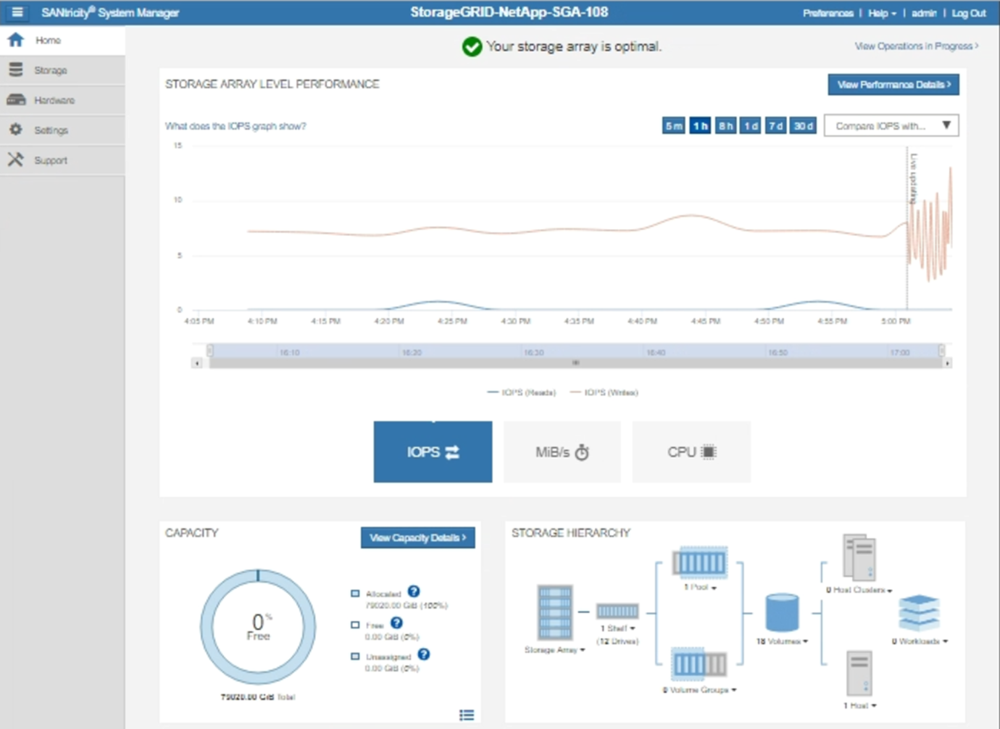

= 透過 StorageGRID 傳送 E 系列 AutoSupport 套件
:allow-uri-read: 
:icons: font
:imagesdir: ../media/

[role="lead"]
您可以透過 StorageGRID 管理節點、而非儲存設備管理連接埠、將 E 系列 SANtricity 系統管理員 AutoSupport 套件傳送給技術支援。

如需搭配 E 系列應用裝置使用 AutoSupport 的詳細資訊、請參閱 https://docs.netapp.com/us-en/e-series-santricity/sm-support/autosupport-feature-overview.html["E 系列硬體 AutoSupport"^]。

.開始之前
* 您已使用登入 Grid Manager link:../admin/web-browser-requirements.html["支援的網頁瀏覽器"]。
* 您有link:admin-group-permissions.html["儲存設備管理員或根存取權限"]。
* 您已設定 SANtricity AutoSupport ：
+
** 對於 SG6000 和 SG5700 應用裝置、 https://docs.netapp.com/us-en/storagegrid-appliances/installconfig/accessing-and-configuring-santricity-system-manager.html["在 SANtricity 系統管理員中設定 AutoSupport"^]

NOTE: 您必須擁有SANtricity 更新版本的韌體8.70才能SANtricity 使用Grid Manager存取《系統管理程式》。

.關於這項工作
E 系列 AutoSupport 套件包含儲存硬體的詳細資料、比 StorageGRID 系統傳送的其他 AutoSupport 套件更為具體。

您可以在 SANtricity 系統管理員中設定特殊的 Proxy 伺服器位址、以便透過 StorageGRID 管理節點傳輸 AutoSupport 套件、而無需使用應用裝置的管理連接埠。以這種方式傳輸的 AutoSupport 套件會由傳送link:../primer/what-admin-node-is.html["偏好的寄件者管理節點"]、而且會使用在 Grid Manager 中設定的任何link:../admin/configuring-admin-proxy-settings.html["管理 Proxy 設定"]套件。

NOTE: 此程序僅適用於設定 E 系列 AutoSupport 套件的 StorageGRID Proxy 伺服器。如需 E 系列 AutoSupport 組態的詳細資訊，請參閱 https://docs.netapp.com/us-en/e-series-family/index.html["NetApp E系列與SANtricity VMware文檔"^]。

.步驟
. 在Grid Manager中、選取* nodes *。
. 從左側節點清單中、選取您要設定的儲存應用裝置節點。
. 選擇* SANtricity 《系統管理程式》*。
+
出現「系統管理程式」首頁。SANtricity

+

. 選擇*支援*>*支援中心*>* AutoSupport 支援*。
+
畫面上會出現「介紹操作」頁面。AutoSupport

+
image::../media/autosupport_santricity_operations.png[營運AutoSupport SANtricity AutoSupport]

. 選擇*設定AutoSupport 「供應方法」*。
+
此時會出現「設定AutoSupport 供應方法」頁面。

+
image::../media/autosupport_configure_delivery_santricity.png[執行不需執行的功能AutoSupport AutoSupport SANtricity]

. 選擇* HTTPS *作為交付方法。
+

NOTE: 已預先安裝啟用 HTTPS 的憑證。

. 選擇*透過Proxy伺服器*。
. 輸入 `tunnel-host` * 主機位址 * 。
+
`tunnel-host`是使用管理節點傳送 E 系列 AutoSupport 套件的特殊位址。

. 輸入 `10225` * 連接埠號碼 * 。
+
`10225`是 StorageGRID Proxy 伺服器上的連接埠編號、可從應用裝置的 E 系列控制器接收 AutoSupport 套件。

. 選擇*測試組態*來測試AutoSupport 您的Proxy伺服器的路由和組態。
+
如果正確、綠色橫幅中會出現訊息：「您的 AutoSupport 組態已通過驗證。」

+
如果測試失敗、則會在紅色橫幅中顯示錯誤訊息。請檢查您的 StorageGRID DNS 設定和網路、確定link:../primer/what-admin-node-is.html["偏好的寄件者管理節點"]可以連線至 NetApp 支援網站、然後再試一次測試。

. 選擇*保存*。
+
隨即儲存組態、並顯示確認訊息：「 AutoSupport 傳遞方法已設定。」

