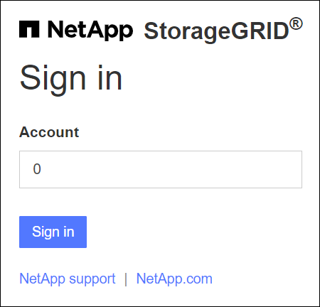
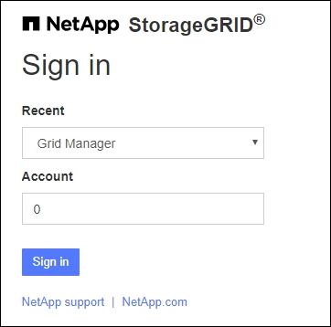

= 登入Grid Manager
:allow-uri-read: 
:icons: font
:imagesdir: ../media/

[role="lead"]
您可以在支援的網頁瀏覽器的位址列中輸入管理節點的完整網域名稱（FQDN）或IP位址、以存取Grid Manager登入頁面。

每StorageGRID 個系統包含一個主要管理節點和任意數量的非主要管理節點。您可以登入任何管理節點上的Grid Manager來管理StorageGRID 此系統。不過、某些維護程序只能從主要管理節點執行。

=== 連線至 HA 群組

如果管理節點包含在高可用度（HA）群組中、您可以使用HA群組的虛擬IP位址或對應至虛擬IP位址的完整網域名稱來連線。主要管理節點應選取為群組的主要介面、以便在存取Grid Manager時、在主要管理節點上存取、除非主要管理節點無法使用。請參閱。 link:managing-high-availability-groups.html["管理高可用度群組"]

=== 使用 SSO

登入步驟會在link:configuring-sso.html["已設定單一登入（ SSO ）"]下列情況下略有不同：

== 在第一個管理節點上登入 Grid Manager

.開始之前
* 您擁有登入認證資料。
* 您使用的是link:../admin/web-browser-requirements.html["支援的網頁瀏覽器"]。
* Cookie會在您的網頁瀏覽器中啟用。
* 您屬於至少有一個權限的使用者群組。
* 您擁有 Grid Manager 的 URL ：
+
`https://_FQDN_or_Admin_Node_IP_/`

+
您可以使用完整網域名稱、管理節點的 IP 位址、或管理節點 HA 群組的虛擬 IP 位址。

+
若要在 HTTPS 預設連接埠（ 443 ）以外的連接埠上存取 Grid Manager 、請在 URL 中加入連接埠編號：

+
`https://_FQDN_or_Admin_Node_IP:port_/`

+

NOTE: SSO 無法在受限的 Grid Manager 連接埠上使用。您必須使用連接埠443。

.步驟
. 啟動支援的網頁瀏覽器。
. 在瀏覽器的網址列中、輸入 Grid Manager 的 URL 。
. 如果系統提示您輸入安全性警示、請使用瀏覽器的安裝精靈來安裝憑證。請參閱。 link:using-storagegrid-security-certificates.html["管理安全性憑證"]
. 登入Grid Manager。
+
顯示的登入畫面取決於是否已針對 StorageGRID 設定單一登入（ SSO ）。

+
[role="tabbed-block"]
====
.未使用 SSO
--
.. 輸入Grid Manager的使用者名稱和密碼。
.. 選擇*登入*。
+
image::../media/sign_in_grid_manager_no_sso.png[登入頁面]

--
.使用 SSO
--
** 如果 StorageGRID 正在使用 SSO 、而這是您第一次在此瀏覽器上存取 URL ：
+
... 選擇*登入*。您可以將 0 留在「帳戶」欄位中。
+

... 在組織的SSO登入頁面上輸入標準SSO認證。例如：
+
image::../media/sso_organization_page.gif[SSO的組織登入頁面範例]

** 如果 StorageGRID 使用 SSO 、且您先前已存取 Grid Manager 或租戶帳戶：
+
... 輸入 * 0* （ Grid Manager 的帳戶 ID ）、或選擇 * Grid Manager* （如果它出現在最近帳戶清單中）。
+

... 選擇*登入*。
... 在組織的SSO登入頁面上、以標準SSO認證登入。

--
====

登入後、會出現 Grid Manager 首頁、其中包含儀表板。若要瞭解所提供的資訊，請參閱link:../monitor/viewing-dashboard.html["檢視及管理儀表板"]。

image::../media/grid_manager_dashboard.png[儀表板]

== 登入另一個管理節點

請依照下列步驟登入其他管理節點。

[role="tabbed-block"]
====
.未使用 SSO
--
.步驟
. 在瀏覽器的位址列中、輸入其他管理節點的完整網域名稱或IP位址。視需要附上連接埠號碼。
. 輸入Grid Manager的使用者名稱和密碼。
. 選擇*登入*。

--
.使用 SSO
--
如果 StorageGRID 正在使用 SSO 、而且您已登入一個管理節點、則無需再次登入即可存取其他管理節點。

.步驟
. 在瀏覽器的網址列中、輸入其他管理節點的完整網域名稱或 IP 位址。
. 如果您的 SSO 工作階段已過期、請再次輸入您的認證。

--
====