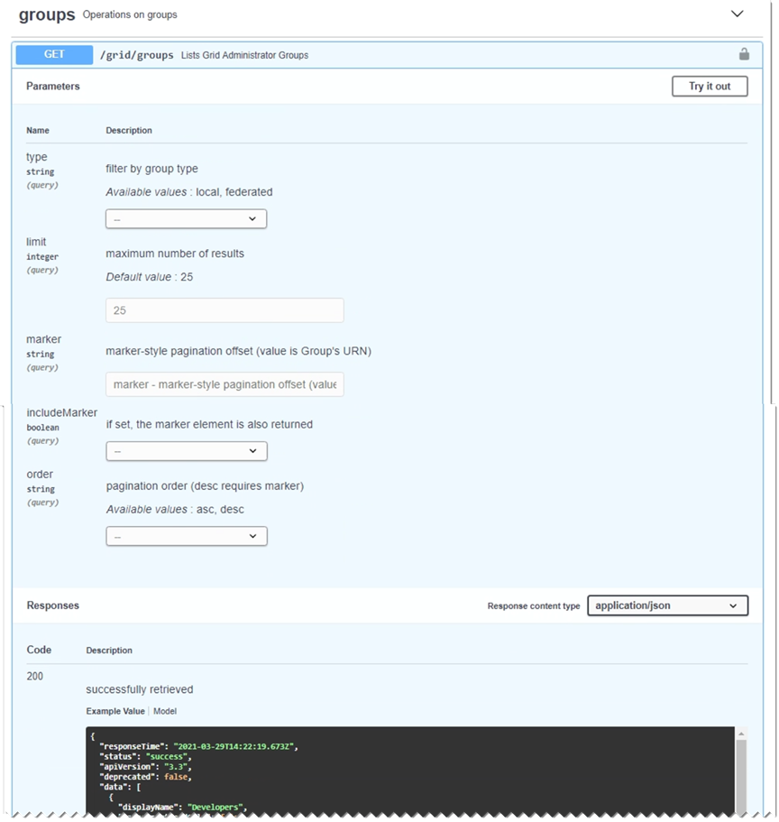

= 使用Grid Management API
:allow-uri-read: 
:icons: font
:imagesdir: ../media/

[role="lead"]
您可以使用Grid Management REST API而非Grid Manager使用者介面來執行系統管理工作。例如、您可能想要使用API來自動化作業、或更快建立多個實體、例如使用者。

== 頂級資源

Grid Management API提供下列頂級資源：

* `/grid`：存取權限僅限 Grid Manager 使用者使用、並以設定的群組權限為基礎。
* `/org`：只有屬於租戶帳戶之本機或同盟 LDAP 群組的使用者才能存取。如需詳細資訊、請參閱 link:../tenant/index.html["使用租戶帳戶"]。
* `/private`：存取權限僅限 Grid Manager 使用者使用、並以設定的群組權限為基礎。私有API如有變更、恕不另行通知。私有端點也會忽略該要求的API版本。StorageGRID

== 發出API要求

Grid Management API使用Swagger開放原始碼API平台。Swagger提供直覺式使用者介面、可讓開發人員和非開發人員StorageGRID 利用API在Real-Time中執行作業。

Swagger使用者介面提供每個API作業的完整詳細資料和文件。

.開始之前
* 您已使用登入 Grid Manager link:../admin/web-browser-requirements.html["支援的網頁瀏覽器"]。
* 您有 link:admin-group-permissions.html["特定存取權限"]。

CAUTION: 您使用 API 文件網頁執行的任何 API 作業都是即時作業。請小心不要錯誤地建立、更新或刪除組態資料或其他資料。

.步驟
. 從 Grid Manager 標頭選取說明圖示、然後選取 * API 文件 * 。
+
image::../media/help_menu.png[說明功能表]

. 若要使用私有API執行作業、請選取StorageGRID 「畫面管理API」頁面上的*前往私有API文件*。
+
私有API如有變更、恕不另行通知。私有端點也會忽略該要求的API版本。StorageGRID

. 選取所需的作業。
+
展開API作業時、您可以看到可用的HTTP動作、例如GET、PUT、update和DELETE。

. 選取HTTP動作以查看申請詳細資料、包括端點URL、任何必要或選用參數的清單、申請本文的範例（視需要）、以及可能的回應。
+

. 判斷要求是否需要其他參數、例如群組或使用者ID。然後取得這些值。您可能需要先發出不同的API要求、才能取得所需的資訊。
. 判斷您是否需要修改範例要求本文。如果是、您可以選取*模型*來瞭解每個欄位的需求。
. 選擇*試用*。
. 提供任何必要的參數、或視需要修改申請本文。
. 選擇*執行*。
. 檢閱回應代碼以判斷要求是否成功。

