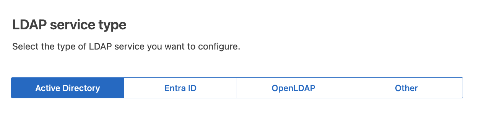

= 使用身分識別聯盟
:allow-uri-read: 
:icons: font
:imagesdir: ../media/

[role="lead"]
使用身分識別聯盟可更快設定群組和使用者、並讓使用者StorageGRID 使用熟悉的認證登入到這個功能。

== 設定Grid Manager的身分識別聯盟

如果您希望在另一個系統（例如 Active Directory、Microsoft Entra ID、OpenLDAP 或 Oracle Directory Server）中管理管理群組和用戶，則可以在網格管理器中設定身份聯合。

.開始之前
* 您已使用link:../admin/web-browser-requirements.html["支援的網頁瀏覽器"]。
* 你已經link:admin-group-permissions.html["特定存取權限"]。
* 您正在使用 Active Directory、Microsoft Entra ID、OpenLDAP 或 Oracle Directory Server 作為身分識別提供者。
+

NOTE: 如果您想使用未列出的 LDAP v3 服務，請聯絡技術支援。

* 如果您打算使用OpenLDAP、則必須設定OpenLDAP伺服器。請參閱。 <<設定OpenLDAP伺服器的準則>>
* 如果您打算啟用單一登入 (SSO)，您已查看link:requirements-for-sso.html["單一登入的要求與考量"]。
* 如果您打算使用傳輸層安全性（TLS）與LDAP伺服器進行通訊、則身分識別供應商使用的是TLS 1.2或1.3。請參閱。 link:supported-ciphers-for-outgoing-tls-connections.html["用於傳出TLS連線的支援密碼"]

.關於這項工作
如果您想要從其他系統（例如 Active Directory、Microsoft Entra ID、OpenLDAP 或 Oracle Directory Server）匯入群組，則可以為網格管理員設定身分識別來源。您可以匯入以下類型的群組：

* 管理群組：管理群組中的使用者可以登入Grid Manager、並根據指派給群組的管理權限來執行工作。
* 不使用其本身身分識別來源的租戶使用者群組。租戶群組中的使用者可以登入租戶管理程式、並根據在租戶管理程式中指派給群組的權限來執行工作。如需詳細資訊、請參閱link:creating-tenant-account.html["建立租戶帳戶"]和link:../tenant/index.html["使用租戶帳戶"]。

=== 輸入組態

.步驟
. 選擇*配置* > *存取控制* > *身份聯合*。
. 選取*啟用身分識別聯盟*。
. 在LDAP服務類型區段中、選取您要設定的LDAP服務類型。
+

+
選擇*其他*以設定使用Oracle Directory Server的LDAP伺服器值。

. 如果選擇*其他*、請填寫「LDAP屬性」區段中的欄位。否則、請前往下一步。
+
** *使用者唯一名稱*：包含 LDAP 使用者唯一識別碼的屬性名稱。此屬性相當於 `sAMAccountName`對於 Active Directory 和 `uid`對於 OpenLDAP。如果您正在設定 Oracle Directory Server，請輸入 `uid`。
** *使用者 UUID*：包含 LDAP 使用者的永久唯一識別碼的屬性名稱。此屬性相當於 `objectGUID`對於 Active Directory 和 `entryUUID`對於 OpenLDAP。如果您正在設定 Oracle Directory Server，請輸入 `nsuniqueid`。每個使用者的指定屬性值必須是 16 位元組或字串格式的 32 位元十六進位數，其中連字元將被忽略。
** *群組唯一名稱*：包含 LDAP 群組唯一識別碼的屬性的名稱。此屬性相當於 `sAMAccountName`對於 Active Directory 和 `cn`對於 OpenLDAP。如果您正在設定 Oracle Directory Server，請輸入 `cn`。
** *群組 UUID*：包含 LDAP 群組的永久唯一識別碼的屬性的名稱。此屬性相當於 `objectGUID`對於 Active Directory 和 `entryUUID`對於 OpenLDAP。如果您正在設定 Oracle Directory Server，請輸入 `nsuniqueid`。每個群組的指定屬性的值必須是 16 位元組或字串格式的 32 位元十六進位數，其中連字元將被忽略。

. 對於所有LDAP服務類型、請在「設定LDAP伺服器」區段中輸入所需的LDAP伺服器和網路連線資訊。
+
** *主機名稱*：LDAP伺服器的完整網域名稱（FQDN）或IP位址。
** *連接埠*：用於連接LDAP伺服器的連接埠。
+

NOTE: STARTTLS的預設連接埠為389、LDAPS的預設連接埠為636。不過、只要防火牆設定正確、您就可以使用任何連接埠。

** *使用者名稱*：將連線至LDAP伺服器之使用者的辨別名稱（DN）完整路徑。
+
對於Active Directory、您也可以指定低層級的登入名稱或使用者主要名稱。

+
指定的使用者必須擁有列出群組和使用者的權限、並可存取下列屬性：

+
*** `sAMAccountName`或 `uid`
*** `objectGUID`、 `entryUUID`或 `nsuniqueid`
*** `cn`
*** `memberOf`或 `isMemberOf`
*** * Active Directory* ： `objectSid`、 `primaryGroupID`、 `userAccountControl`和 `userPrincipalName`
*** *入口 ID*: `accountEnabled`和 `userPrincipalName`

** *密碼*：與使用者名稱相關的密碼。
+

NOTE: 如果您在未來變更密碼、您必須在此頁面上更新密碼。

** *群組基礎DN*：您要搜尋群組之LDAP子樹狀結構的辨別名稱（DN）完整路徑。在Active Directory範例（如下）中、識別名稱相對於基礎DN（DC=storagegRID、DC=example、DC=com）的所有群組均可做為聯盟群組使用。
+

NOTE: 「群組唯一名稱*」值必須在所屬的*群組基礎DN*中是唯一的。

** *使用者基礎DN*：您要搜尋使用者之LDAP子樹狀目錄的辨別名稱（DN）完整路徑。
+

NOTE: *使用者唯一名稱*值必須在其所屬的*使用者基礎DN*內是唯一的。

** * 連結使用者名稱格式 * （選用）：如果無法自動判斷模式、則應使用預設的使用者名稱模式 StorageGRID 。
+
建議提供*連結使用者名稱格式*、因為StorageGRID 如果無法連結服務帳戶、使用者可以登入。

+
輸入下列其中一種模式：

+
*** *UserPrincipalName 模式（AD 和 Entra ID）*： `[USERNAME]@_example_.com`
*** *下級登入名稱模式（AD 和 Entra ID）*： `_example_\[USERNAME]`
*** * 辨別名稱模式 * ： `CN=[USERNAME],CN=Users,DC=_example_,DC=com`
+
請準確附上所寫的*（使用者名稱）*。

. 在傳輸層安全性（TLS）區段中、選取安全性設定。
+
** *使用 STARTTLS*：使用 STARTTLS 確保與 LDAP 伺服器的通訊安全。這是 Active Directory、OpenLDAP 或其他的建議選項，但 Microsoft Entra ID 不支援此選項。
** *使用 LDAPS*：LDAPS（透過 SSL 的 LDAP）選項使用 TLS 建立與 LDAP 伺服器的連線。您必須為 Microsoft Entra ID 選擇此選項。
** *請勿使用 TLS*： StorageGRID系統和 LDAP 伺服器之間的網路流量將不安全。  Microsoft Entra ID 不支援此選項。
+

NOTE: 如果您的 Active Directory 伺服器強制執行 LDAP 簽名，則不支援使用 *不使用 TLS* 選項。您必須使用 STARTTLS 或 LDAPS。

. 如果您選取了ARTTLS或LDAPS、請選擇用來保護連線安全的憑證。
+
** *使用作業系統CA憑證*：使用作業系統上安裝的預設Grid CA憑證來保護連線安全。
** *使用自訂CA憑證*：使用自訂安全性憑證。
+
如果選取此設定、請將自訂安全性憑證複製並貼到CA憑證文字方塊中。

=== 測試連線並儲存組態

輸入所有值之後、您必須先測試連線、才能儲存組態。如果您提供LDAP伺服器的連線設定和連結使用者名稱格式、則可透過此驗證。StorageGRID

.步驟
. 選擇*測試連線*。
. 如果您沒有提供綁定使用者名稱格式：
+
** 如果連線設定有效、就會出現「測試連線成功」訊息。選取*「Save（儲存）」*以儲存組態。
** 如果連線設定無效、就會出現「無法建立測試連線」訊息。選擇*關閉*。然後、解決所有問題、並再次測試連線。

. 如果您提供連結使用者名稱格式、請輸入有效同盟使用者的使用者名稱和密碼。
+
例如、輸入您自己的使用者名稱和密碼。請勿在使用者名稱中包含任何特殊字元、例如 @ 或 / 。

+
image::../media/identity_federation_test_connection.png[驗證繫結使用者名稱格式的身分識別聯盟提示]

+
** 如果連線設定有效、就會出現「測試連線成功」訊息。選取*「Save（儲存）」*以儲存組態。
** 如果連線設定、連結使用者名稱格式或測試使用者名稱和密碼無效、則會出現錯誤訊息。解決所有問題、然後再次測試連線。

== 強制與身分識別來源同步

此系統會定期同步來自身分識別來源的聯盟群組和使用者。StorageGRID如果您想要盡快啟用或限制使用者權限、可以強制啟動同步。

.步驟
. 前往「身分識別聯盟」頁面。
. 選取頁面頂端的*同步伺服器*。
+
視您的環境而定、同步處理程序可能需要一些時間。

+

NOTE: 如果同步處理來自身分識別來源的聯盟群組和使用者時發生問題、則會觸發*身分識別聯盟同步處理失敗*警示。

== 停用身分識別聯盟

您可以暫時或永久停用群組和使用者的身份聯合。當身分聯合被停用時， StorageGRID和身分來源之間就沒有通訊。但是，您配置的任何設定都會保留，以便您將來可以輕鬆地重新啟用身份聯合。

.關於這項工作
在停用身分識別聯盟之前、您應注意下列事項：

* 聯盟使用者將無法登入。
* 目前已登入的聯盟使用者將在StorageGRID 其工作階段過期之前保留對此系統的存取權、但在工作階段過期後仍無法登入。
* StorageGRID系統和身分來源之間不會發生同步，並且不會對尚未同步的帳戶發出警報。
* 如果單一登入 (SSO) 狀態為 *已啟用* 或 *沙盒模式*，則 *啟用身分聯合* 核取方塊將會停用。在停用身分聯合之前，單一登入頁面上的 SSO 狀態必須為 *已停用*。看link:../admin/disabling-single-sign-on.html["停用單一登入"] 。

.步驟
. 前往「身分識別聯盟」頁面。
. 取消勾選 * 啟用身分識別聯盟 * 核取方塊。

== 設定OpenLDAP伺服器的準則

如果您要使用OpenLDAP伺服器進行身分識別聯盟、則必須在OpenLDAP伺服器上設定特定設定。

CAUTION: 對於非 Active Directory 或 Microsoft Entra ID 的識別來源， StorageGRID不會自動阻止外部停用的使用者存取 S3。若要封鎖 S3 訪問，請刪除使用者的所有 S3 金鑰或從所有群組中刪除該使用者。

=== memberOf和refert覆疊

應啟用memberof和refert覆疊。如需詳細資訊，請參閱中的反向群組成員資格維護指示http://www.openldap.org/doc/admin24/index.html["OpenLDAP文件：2.4版管理員指南"^]。

=== 索引

您必須使用指定的索引關鍵字來設定下列OpenLDAP屬性：

* `olcDbIndex: objectClass eq`
* `olcDbIndex: uid eq,pres,sub`
* `olcDbIndex: cn eq,pres,sub`
* `olcDbIndex: entryUUID eq`

此外、請確定使用者名稱說明中所述的欄位已建立索引、以獲得最佳效能。

請參閱中有關反向群組成員資格維護的資訊http://www.openldap.org/doc/admin24/index.html["OpenLDAP文件：2.4版管理員指南"^]。
