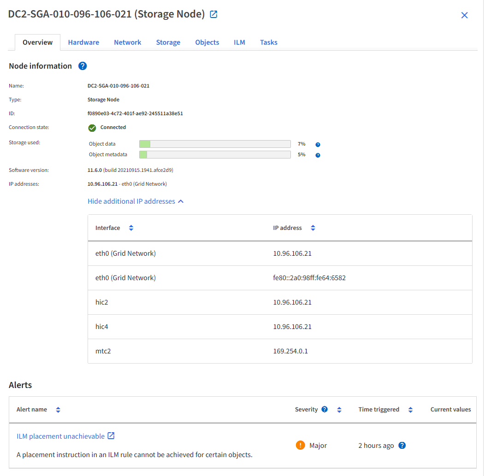

= 檢視IP位址
:allow-uri-read: 
:icons: font
:imagesdir: ../media/

[role="lead"]
您可以檢視StorageGRID 您的系統的各個網格節點的IP位址。然後、您可以使用此 IP 位址登入命令列的網格節點、並執行各種維護程序。

.開始之前
您已使用登入 Grid Manager link:../admin/web-browser-requirements.html["支援的網頁瀏覽器"]。

.關於這項工作
如需變更 IP 位址的相關資訊，請參閱link:../maintain/configuring-ip-addresses.html["設定IP位址"]。

.步驟
. 選擇*節點* > *_grid node_* > *概覽*。
. 選取IP位址標題右側的*顯示更多*。
+
該網格節點的IP位址會列在表格中。

+

