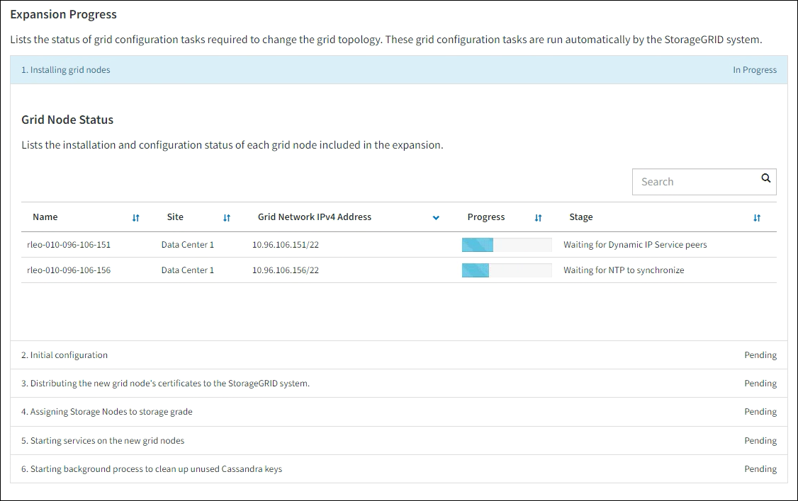

= 執行擴充
:allow-uri-read: 
:icons: font
:imagesdir: ../media/

[role="lead"]
當您執行擴充時、新的網格節點會新增至您現有StorageGRID 的功能介紹部署。

.開始之前
* 您已使用登入 Grid Manager link:../admin/web-browser-requirements.html["支援的網頁瀏覽器"]。
* 您有資源配置通關密碼。
* 您已部署此擴充中要新增的所有網格節點。
* 您有link:../admin/admin-group-permissions.html["維護或根存取權限"]。
* 如果您要新增儲存節點、表示您已確認在還原過程中執行的所有資料修復作業均已完成。請參閱。 link:../maintain/checking-data-repair-jobs.html["檢查資料修復工作"]
* 如果您要新增儲存節點、而且想要將自訂儲存等級指派給這些節點、您已經擁有了link:../ilm/creating-and-assigning-storage-grades.html["已建立自訂儲存等級"]。您也擁有「根目錄」存取權限、或同時擁有「維護」和「 ILM 」權限。
* 如果您要新增網站、您已檢閱並更新 ILM 規則。您必須確保物件複本不會儲存到新站台、直到擴充完成為止。例如、如果規則使用預設儲存池（ * 所有儲存節點 * ）、則您必須link:../ilm/creating-storage-pool.html["建立新的儲存池"]只包含現有儲存節點和 ILM 原則、才能使用該新儲存link:../ilm/working-with-ilm-rules-and-ilm-policies.html["更新 ILM 規則"]池。否則、只要該站台的第一個節點變成作用中、就會將物件複製到新站台。

.關於這項工作
執行擴充包括下列主要使用者工作：

. 設定擴充。
. 開始擴充。
. 下載新的恢復套件檔案。
. 監控擴充步驟和階段、直到安裝和設定所有新節點、並啟動所有服務為止。
+

CAUTION: 某些擴充步驟和階段可能需要大量時間才能在大型網格上執行。例如、如果Cassandra資料庫是空的、將Cassandra串流至新的儲存節點可能只需要幾分鐘的時間。不過、如果Cassandra資料庫包含大量的物件中繼資料、這個階段可能需要數小時或更長的時間。在「展開 Cassandra 叢集」或「啟動 Cassandra 和串流資料」階段期間、請勿重新啟動任何儲存節點。

.步驟
. 選擇*維護*>*工作*>*擴充*。
+
此時會出現「Grid Expansion（網格擴充）」「擱置節點」區段會列出已準備好新增的節點。

+
image::../media/grid_expansion_page.png[顯示Grid Expansion頁面的快照]

. 選擇*組態擴充*。
+
此時會出現站台選擇對話方塊。

. 選取您要開始的擴充類型：
+
** 如果您要新增站台、請選取*新增*、然後輸入新站台的名稱。
** 如果您要將一個或多個節點新增至現有站台、請選取 * 現有 * 。

. 選擇*保存*。
. 檢閱「*擱置節點*」清單、並確認其顯示您部署的所有網格節點。
+
視需要、您可以將游標放在節點的 * 網格網路 MAC 位址 * 上、以查看該節點的詳細資料。

+
image::../media/grid_node_details.png[Grid Node詳細資料的快照]

+

NOTE: 如果節點遺失、請確認已成功部署。

. 從擱置節點清單中、核准您要新增至此擴充項目的節點。
+
.. 選取您要核准之第一個擱置的網格節點旁的選項按鈕。
.. 選取*核准*。
+
此時將出現網格節點組態表單。

.. 視需要修改一般設定：
+
[cols="1a,2a"]
|===
| 欄位 | 說明 

 a| 
網站
 a| 
與網格節點相關聯的站台名稱。如果您要新增多個節點、請務必為每個節點選取正確的站台。如果您要新增站台、所有節點都會新增至新站台。

 a| 
名稱
 a| 
節點的系統名稱。內部 StorageGRID 作業需要系統名稱、因此無法變更。

 a| 
儲存類型（僅限儲存節點）
 a| 
*** * 資料與中繼資料 * （「組合」）：物件資料與中繼資料儲存節點
*** * 僅限資料 * ：僅包含物件資料的儲存節點（無中繼資料）
*** * 僅中繼資料 * ：僅包含中繼資料的儲存節點（無物件資料）

 a| 
NTP 角色
 a| 
網格節點的網路時間傳輸協定（ NTP ）角色：

*** 選取 * 自動 * （預設）以自動指派 NTP 角色給節點。主要角色將指派給管理節點、具有 ADC 服務的儲存節點、閘道節點、以及任何具有非靜態 IP 位址的網格節點。用戶端角色將指派給所有其他網格節點。
*** 選取 * 主要 * 以手動將主要 NTP 角色指派給節點。每個站台至少應有兩個節點具有「主要」角色、以提供對外部計時來源的備援系統存取。
*** 選擇 * Client* 可手動將 Client NTP 角色指派給節點。

 a| 
ADC 服務（組合式或純中繼資料儲存節點）
 a| 
此儲存節點是否會執行管理網域控制站（ ADC ）服務。ADC服務會追蹤網格服務的位置和可用度。每個站台至少必須有三個儲存節點包含ADC服務。您無法在部署 ADC 服務之後、將其新增至節點。

*** 如果您要更換的儲存節點包含 ADC 服務、請選取 * 是 * 。由於如果仍有太少的 ADC 服務、您就無法取消委任儲存節點、因此這可確保在移除舊服務之前、有新的 ADC 服務可用。
*** 選取 * 自動 * 讓系統判斷此節點是否需要 ADC 服務。

瞭解link:../maintain/understanding-adc-service-quorum.html["ADC 仲裁"]。

 a| 
儲存等級（組合式或純資料儲存節點）
 a| 
使用 * 預設 * 儲存等級、或選取您要指派給此新節點的自訂儲存等級。

儲存等級由 ILM 儲存資源池使用、因此您的選擇可能會影響將哪些物件放置在儲存節點上。

|===
.. 視需要修改網格網路、管理網路和用戶端網路的設定。
+
*** * IPV4位址（CIDR）*：網路介面的CIDR網路位址。例如： 172.16.10.100/24
+

NOTE: 如果您在核准節點時發現網格網路上的節點有重複的 IP 位址、則必須取消擴充、重新部署具有非重複 IP 的虛擬機器或應用裝置、然後重新啟動擴充。

*** *閘道*：網格節點的預設閘道。例如： 172.16.10.1
*** *子網路（CIDR）*：管理網路的一或多個子網路。

.. 選擇*保存*。
+
核准的網格節點會移至「核准的節點」清單。

+
*** 若要修改已核准網格節點的內容、請選取其選項按鈕、然後選取*編輯*。
*** 若要將已核准的網格節點移回「Pending Node」（擱置節點）清單、請選取其選項按鈕、然後選取* Reset*（重設*）。
*** 若要永久移除已核准的網格節點、請關閉節點電源。然後選取其選項按鈕、並選取*移除*。

.. 針對您要核准的每個擱置的網格節點、重複這些步驟。
+

NOTE: 如有可能、您應核准所有待處理的網格備註、並執行單一擴充。如果您執行多項小型擴充、則需要更多時間。

. 核准所有網格節點後、請輸入*資源配置密碼*、然後選取*展開*。
+
幾分鐘後、此頁面會更新以顯示擴充程序的狀態。當影響個別網格節點的工作正在進行中時、「網格節點狀態」區段會列出每個網格節點的目前狀態。

+

NOTE: 在新應用裝置的「安裝網格節點」步驟中、 StorageGRID 應用裝置安裝程式會顯示安裝從第 3 階段移至第 4 階段、完成安裝。當階段4完成時、控制器會重新開機。

+

+

NOTE: 站台擴充包括為新站台設定Cassandra的額外工作。

. 一旦出現*下載恢復套件*連結、請立即下載恢復套件檔案。
+
您必須在StorageGRID 變更整個系統的網格拓撲之後、盡快下載更新的恢復套件檔案複本。恢復套件檔案可讓您在發生故障時還原系統。

+
.. 選取下載連結。
.. 輸入資源配置通關密碼、然後選取*開始下載*。
.. 下載完成後、請開啟 `.zip`檔案並確認您可以存取內容、包括 `Passwords.txt`檔案。
.. 將下載的恢復軟件包文件複製(`.zip`到兩個安全且獨立的位置。
+

CAUTION: 必須保護恢復套件檔案、因為其中包含可用於從StorageGRID 該系統取得資料的加密金鑰和密碼。

. 如果您要將儲存節點新增至現有站台或新增站台、請監控 Cassandra 階段、這些階段會在新的網格節點上啟動服務時發生。
+

CAUTION: 在「展開 Cassandra 叢集」或「啟動 Cassandra 和串流資料」階段、請勿重新啟動任何儲存節點。每個新的儲存節點可能需要許多小時才能完成這些階段、尤其是現有的儲存節點包含大量的物件中繼資料時。

+
[role="tabbed-block"]
====
.新增儲存節點
--
如果您要將儲存節點新增至現有站台、請檢閱「啟動 Cassandra 和串流資料」狀態訊息中顯示的百分比。

image::../media/grid_expansion_starting_cassandra.png[Grid Expansion >正在啟動Cassandra和串流資料]

此百分比會根據可用的Cassandra資料總量和已寫入新節點的數量、來估計Cassandra串流作業的完成程度。

--
.新增站台
--
如果您要新增站台、請使用 `nodetool status`監控 Cassandra 串流的進度、並查看在「擴充 Cassandra 叢集」階段中、已將多少中繼資料複製到新站台。新站台上的資料負載總計應在目前站台總數的20%之內。

--
====
. 繼續監控擴充作業、直到所有工作都完成、且「*組態擴充*」按鈕再次出現。

.完成後
視您新增的網格節點類型而定、請執行其他整合和組態步驟。請參閱。 link:configuring-expanded-storagegrid-system.html["擴充後的組態步驟"]
