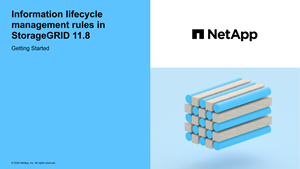

= 存取建立 ILM 規則精靈
:allow-uri-read: 
:icons: font
:imagesdir: ../media/

[role="lead"]
ILM規則可讓您管理物件資料隨時間的放置。若要建立 ILM 規則、請使用建立 ILM 規則精靈。

NOTE: 如果您要建立原則的預設 ILM 規則、請link:creating-default-ilm-rule.html["建立預設 ILM 規則的指示"]改用。

.開始之前
* 您已使用登入 Grid Manager link:../admin/web-browser-requirements.html["支援的網頁瀏覽器"]。
* 您有 link:../admin/admin-group-permissions.html["特定存取權限"]。
* 如果您想要指定此規則適用的租戶帳戶、您可以擁有link:../admin/admin-group-permissions.html["租戶帳戶權限"]或知道每個帳戶的帳戶 ID 。
* 如果您希望規則根據上次存取時間中繼資料篩選物件、則必須由 S3 儲存區啟用上次存取時間更新。
* 您已設定要使用的任何雲端儲存池。請參閱。 link:creating-cloud-storage-pool.html["建立雲端儲存資源池"]
* 您熟悉link:data-protection-options-for-ingest.html["擷取選項"]。
* 如果您需要建立與 S3 物件鎖定搭配使用的相容規則，您就熟悉了link:requirements-for-s3-object-lock.html["S3物件鎖定需求"]。
* 您也可以觀看影片： https://netapp.hosted.panopto.com/Panopto/Pages/Viewer.aspx?id=9872d38f-80b3-4ad4-9f79-b1ff008760c7["影片： ILM 規則概觀"^]。
+
[link=https://netapp.hosted.panopto.com/Panopto/Pages/Viewer.aspx?id=9872d38f-80b3-4ad4-9f79-b1ff008760c7]

.關於這項工作
建立ILM規則時：

* 請考慮StorageGRID 使用此系統的拓撲和儲存組態。
* 思考您要製作的物件複本類型（複寫或刪除編碼）、以及每個物件所需的複本數量。
* 判斷哪些類型的物件中繼資料用於連接StorageGRID 到該系統的應用程式。ILM規則會根據物件的中繼資料來篩選物件。
* 請思考您希望物件複本隨時間放置在何處。
* 決定要使用的擷取選項（平衡、嚴格或雙重認可）。

.步驟
. 選擇* ILM *>* Rules *。
. 選擇* Create *（建立*）。link:create-ilm-rule-enter-details.html["步驟 1 （輸入詳細資料）"]將顯示「建立 ILM 規則」精靈的。

