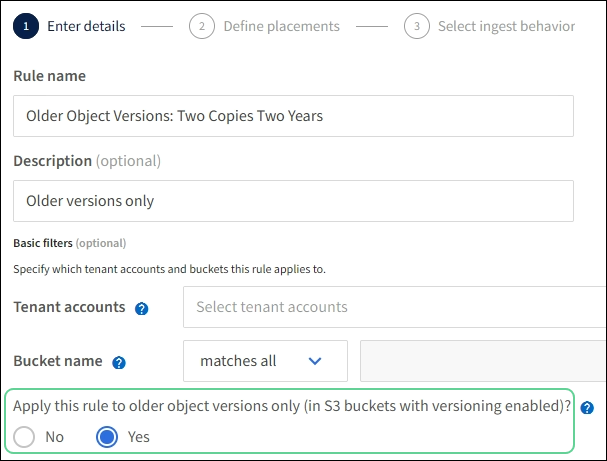

= 範例4：S3版本化物件的ILM規則和原則
:allow-uri-read: 
:icons: font
:imagesdir: ../media/

[role="lead"]
如果您有啟用版本設定的 S3 儲存區、則可以在 ILM 原則中加入使用「非目前時間」做為參考時間的規則、以管理非目前物件版本。

CAUTION: 如果您為物件指定有限的保留時間、這些物件將會在達到期間之後永久刪除。請務必瞭解物件的保留時間。

如本範例所示、您可以針對非目前物件版本、使用不同的放置說明來控制版本控制物件所使用的儲存容量。

CAUTION: 下列ILM規則和原則僅為範例。有許多方法可以設定ILM規則。在啟動新原則之前、請先進行模擬、確認其運作方式符合保護內容免於遺失的目的。

NOTE: 若要在物件的非目前版本上執行 ILM 原則模擬、您必須知道物件版本的 UUID 或 CBID 。若要尋找 UUID 和 CBID 、請在物件仍為最新狀態時使用link:verifying-ilm-policy-with-object-metadata-lookup.html["物件中繼資料查詢"]。

.相關資訊
link:how-objects-are-deleted.html["如何刪除物件"]

== ILM規則1（例如4）：儲存三份複本10年

本範例 ILM 規則會將每個物件的複本儲存在三個站台上 10 年。

此規則適用於所有物件、無論其版本是否為版本控制。

[cols="1a,2a"]
|===
| 規則定義 | 範例值 

 a| 
儲存資源池
 a| 
三個儲存資源池、每個資源池由不同的資料中心組成、分別命名為站台 1 、站台 2 和站台 3 。

 a| 
規則名稱
 a| 
三份十年

 a| 
參考時間
 a| 
擷取時間

 a| 
刊登位置
 a| 
在第 0 天、保留三個複寫複本 10 年（ 3 、 652 天）、一個在站台 1 、一個在站台 2 、一個在站台 3 。在10年結束時、請刪除物件的所有複本。

|===

== ILM規則2例如4：將兩個非目前版本的複本儲存2年

本範例ILM規則儲存S3版本物件的兩個非目前版本複本、為期2年。

由於ILM規則1適用於物件的所有版本、因此您必須建立另一個規則、以篩選出任何非目前版本。

若要建立使用「非目前時間」做為參考時間的規則、請針對「僅將此規則套用至較舊的物件版本（在啟用版本設定的 S3 儲存區中）」問題選取 * 是 * ？ 在「建立 ILM 規則」精靈的步驟 1 （輸入詳細資料）中。當您選取 * 是 * 時、就會自動為參考時間選取 _ 非目前時間 _ 、而且您無法選取不同的參考時間。

在此範例中、只會儲存兩個非目前版本的複本、而這些複本會儲存兩年。

[cols="1a,2a"]
|===
| 規則定義 | 範例值 

 a| 
儲存資源池
 a| 
兩個儲存資源池、分別位於不同的資料中心：站台 1 和站台 2 。

 a| 
規則名稱
 a| 
非最新版本：兩年兩份

 a| 
參考時間
 a| 
非目前時間

當您針對「僅將此規則套用至較舊的物件版本（在啟用版本設定的 S3 儲存區中）」問題選取 * 是 * 時、會自動選取此選項？ 在「建立 ILM 規則」精靈中。

 a| 
刊登位置
 a| 
第 0 天相對於非目前時間（即從物件版本變成非目前版本的那一天開始）、保留兩個非目前物件版本的複寫複本 2 年（ 730 天）、一個在站台 1 、一個在站台 2 。在2年結束時、請刪除非最新版本。

|===

== ILM原則、例如4：S3版本控制物件

如果您想要以不同於目前版本的方式來管理物件的舊版、則使用「非目前時間」做為參考時間的規則必須先出現在 ILM 原則中、然後才會套用至目前物件版本的規則。

S3版本化物件的ILM原則可能包含下列ILM規則：

* 從版本變成非最新的那一天起、將每個物件的任何舊版（非最新版）保留2年。
+

NOTE: 「非目前時間」規則必須出現在原則中、然後才會套用至目前物件版本的規則。否則、非目前物件版本永遠不會與「非目前時間」規則相符。

* 在擷取時、建立三個複寫複本、並在三個站台中每個站台儲存一個複本。將目前物件版本的複本保留10年。

模擬範例原則時、您預期測試物件的評估方式如下：

* 任何非目前的物件版本都會與第一個規則相符。如果非目前的物件版本早於2年、則ILM會永久刪除該版本（從網格中移除的所有非目前版本複本）。
* 目前的物件版本會與第二個規則相符。當目前的物件版本已儲存 10 年、 ILM 程序會將刪除標記新增為物件的目前版本、並將先前的物件版本設為「非目前」。下次進行 ILM 評估時、第一個規則會比對此非目前版本。如此一來、將會清除第 3 站點的複本、並將第 1 站點和第 2 站點的兩份複本再儲存 2 年。

