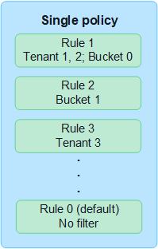
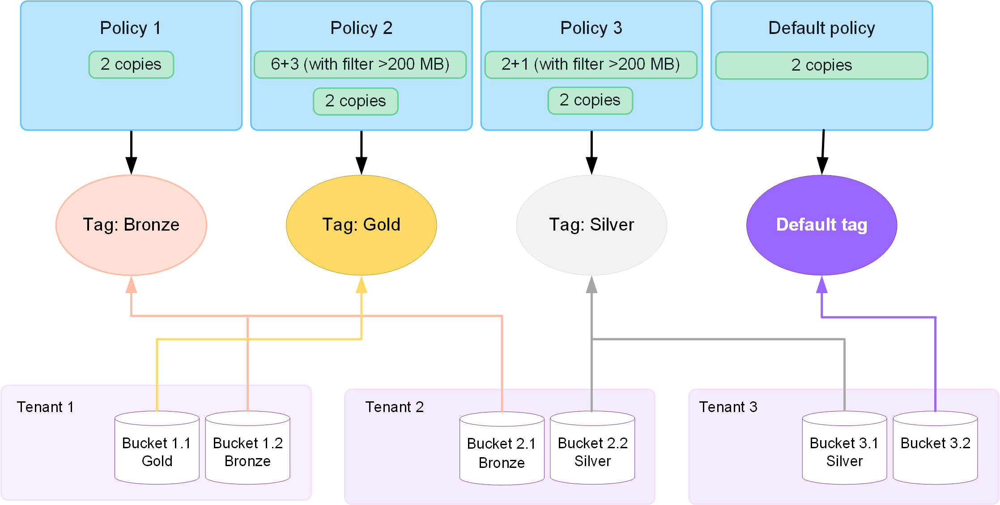

= 使用 ILM 原則
:allow-uri-read: 
:icons: font
:imagesdir: ../media/

[role="lead"]
資訊生命週期管理（ILM）原則是一組依序排列的ILM規則、可決定StorageGRID 整個過程中、物件資料的管理方式。

CAUTION: 如果ILM原則設定不正確、可能導致無法恢復的資料遺失。啟動ILM原則之前、請仔細檢閱ILM原則及其ILM規則、然後模擬ILM原則。請務必確認ILM原則是否正常運作。

== 預設 ILM 原則

當您安裝 StorageGRID 並新增站台時、系統會自動建立預設的 ILM 原則、如下所示：

* 如果您的網格包含一個站台、則預設原則會包含一個預設規則、用於複寫該站台每個物件的兩個複本。
* 如果您的網格包含多個站台、預設規則會在每個站台上複寫每個物件的一個複本。

如果預設策略無法滿足您的儲存需求，您可以建立自己的規則和策略。看link:what-ilm-rule-is.html["建立 ILM 規則"]和link:creating-ilm-policy.html["建立ILM原則"]。

== 一或多個使用中的 ILM 原則？

您一次可以有一個或多個使用中的 ILM 原則。

=== 單一原則

如果您的網格將使用簡單的資料保護方案、其中只有少數特定租戶和特定貯體規則、請使用單一主動式 ILM 原則。ILM 規則可以包含篩選器、以管理不同的貯體或租戶。

當您只有一個原則且租戶的需求變更時、您必須建立新的 ILM 原則或複製現有原則、以套用變更、模擬、然後啟動新的 ILM 原則。變更 ILM 原則可能會導致物件移動、可能需要數天的時間、並導致系統延遲。

=== 多個原則

若要為租戶提供不同的服務品質選項、您一次可以有多個作用中原則。每個原則都可以管理特定租戶、 S3 貯體和物件。當您為一組特定租戶或物件套用或變更一個原則時、套用至其他租戶和物件的原則不會受到影響。

ILM 原則標籤:: 如果您想要讓租戶輕鬆地在每個貯體的多個資料保護原則之間切換、請使用多個 ILM 原則搭配 _ILM 原則標籤 _ 。您可以將每個 ILM 原則指派給標記、然後將貯體標記為標記、以將原則套用至該貯體。您只能在 S3 儲存區上設定 ILM 原則標籤。
+
--
例如、您可能會有三個標記、分別命名為「金」、「銀」和「銅」。您可以根據原則儲存物件的時間和位置、將 ILM 原則指派給每個標記。租戶可以透過標記其貯體來選擇要使用的原則。標記為 Gold 的貯體是由 Gold 原則管理、並獲得 Gold 等級的資料保護與效能。

--

NOTE: 你可以link:../ilm/creating-ilm-policy.html#activate-ilm-policy["最多可建立 10 個策略標籤"]為您的網格。

預設 ILM 原則標籤:: 安裝 StorageGRID 時會自動建立預設的 ILM 原則標籤。每個網格都必須有一個作用中原則指派給預設標籤。預設原則適用於任何未標配的 S3 儲存區。

== ILM原則如何評估物件？

主動式 ILM 原則可控制物件的放置、持續時間和資料保護。

當用戶端將物件儲存至 StorageGRID 時、會根據原則中的一組已排序的 ILM 規則來評估物件、如下所示：

. 如果原則中第一個規則的篩選器符合物件、則會根據該規則的擷取行為擷取物件、並根據該規則的放置指示加以儲存。
. 如果第一個規則的篩選條件與物件不符、則會根據原則中的每個後續規則來評估物件、直到進行符合為止。
. 如果沒有符合物件的規則、則會套用原則中預設規則的擷取行為和放置指示。預設規則是原則中的最後一個規則。預設規則必須套用至所有租戶、所有 S3 貯體和所有物件版本、而且不能使用任何進階篩選器。

== ILM原則範例

舉例來說、 ILM 原則可能包含三個 ILM 規則、其中指定下列項目：

* * 規則 1 ：租戶 A* 的複寫複本
+
** 比對屬於 Tenant A. 的所有物件
** 將這些物件儲存為三個站台的三個複寫複本。
** 屬於其他租戶的物件不符合規則 1 、因此會根據規則 2 進行評估。

* * 規則 2 ： 1 MB* 以上物件的銷毀編碼
+
** 比對其他租戶的所有物件、但只有在物件大於 1 MB 時才會比對。這些較大的物件使用6+3銷毀編碼儲存在三個站台。
** 不符合 1 MB 或更小的物件、因此會根據規則 3 來評估這些物件。

* * 規則 3 ： 2 份複本 2 個資料中心 * （預設）
+
** 是原則中的最後一個和預設規則。不使用篩選器。
** 為規則 1 或規則 2 不相符的所有物件建立兩個複寫複本（不屬於租戶 A 且小於 1 MB 的物件）。

image::../media/ilm_policy_and_rules.png[ILM原則與規則]

== 什麼是作用中和非作用中原則？

每個 StorageGRID 系統必須至少有一個主動式 ILM 原則。如果您想要有多個使用中的 ILM 原則、請建立 ILM 原則標籤、並將原則指派給每個標籤。租戶接著將標籤套用至 S3 貯體。預設原則會套用至未指派原則標記的貯體中所有物件。

當您第一次建立 ILM 原則時、請選取一或多個 ILM 規則、然後依特定順序排列。模擬原則以確認其行為之後、您就會將其啟動。

當您啟動一個 ILM 原則時、 StorageGRID 會使用該原則來管理所有物件、包括現有物件和新擷取的物件。在新原則中實作ILM規則時、現有物件可能會移至新位置。

如果您一次啟動多個 ILM 原則、且租戶將原則標籤套用到 S3 貯體、則每個貯體中的物件都會根據指派給標籤的原則進行管理。

StorageGRID 系統會追蹤已啟用或停用之原則的歷程記錄。

== 建立ILM原則的考量

* 只能在測試系統中使用系統提供的原則「基準 2 複本」原則。對於 StorageGRID 11.6 及更早版本、本原則中的「製作 2 份複本」規則會使用「所有儲存節點」儲存池、其中包含所有站台。如果StorageGRID 您的作業系統有多個站台、則一個物件的兩份複本可能會放在同一個站台上。
+

NOTE: 安裝 StorageGRID 11.6 及更早版本時、系統會自動建立 All Storage Nodes 儲存池。如果您升級至較新版本的 StorageGRID 、則所有儲存節點集區仍會存在。如果您以新安裝方式安裝 StorageGRID 11.7 或更新版本、則不會建立所有儲存節點集區。

* 設計新原則時、請考量可能擷取到網格的所有不同類型物件。請確定原則包含符合的規則、並視需要放置這些物件。
* 盡量簡化ILM原則。這可避免在StorageGRID 物件資料不受預期保護的情況下、隨著時間而對該系統進行變更時、發生潛在的危險情況。
* 請確定原則中的規則順序正確。當原則啟動時、新物件和現有物件會依照列出的順序進行評估、從上方開始。例如、如果原則中的第一個規則符合某個物件、則任何其他規則都不會評估該物件。
* 每個 ILM 原則的最後一個規則是預設的 ILM 規則、無法使用任何篩選器。如果某個物件未被其他規則比對、則預設規則會控制該物件放置的位置、以及保留多久。
* 在啟動新原則之前、請先檢閱原則對現有物件放置位置所做的任何變更。變更現有物件的位置、可能會在評估和實作新放置位置時、導致暫時性資源問題。

