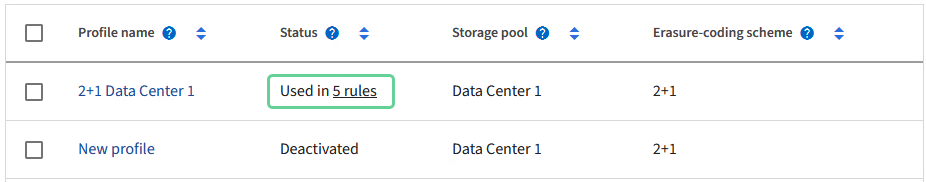

= 管理銷毀編碼設定檔
:allow-uri-read: 
:icons: font
:imagesdir: ../media/

[role="lead"]
您可以檢視抹除編碼設定檔的詳細資料、並視需要重新命名設定檔。如果目前未在任何 ILM 規則中使用抹除編碼設定檔、您可以停用該設定檔。

.開始之前
* 您已使用登入 Grid Manager link:../admin/web-browser-requirements.html["支援的網頁瀏覽器"]。
* 您有link:../admin/admin-group-permissions.html["必要的存取權限"]。

== 檢視銷毀編碼設定檔詳細資料

您可以檢視銷毀編碼設定檔的詳細資料、以判斷其狀態、使用的銷毀編碼配置、以及其他資訊。

.步驟
. 選擇 * 組態 * > * 系統 * > * 刪除編碼 * 。
. 選取設定檔。設定檔的詳細資料頁面隨即出現。
. 您也可以檢視 ILM 規則索引標籤、以取得使用設定檔的 ILM 規則清單、以及使用這些規則的 ILM 原則。
. 您也可以檢視儲存節點索引標籤、以取得設定檔儲存池中每個儲存節點的詳細資料、例如其所在的站台和儲存使用量。

== 重新命名抹除編碼設定檔

您可能想要重新命名抹除編碼設定檔、以使設定檔的功能更為明顯。

.步驟
. 選擇 * 組態 * > * 系統 * > * 刪除編碼 * 。
. 選取您要重新命名的設定檔。
. 選取*重新命名*。
. 輸入銷毀編碼設定檔的唯一名稱。
+
銷毀編碼設定檔名稱會附加至 ILM 規則放置指示中的儲存資源池名稱。

+

NOTE: 銷毀編碼設定檔名稱必須是唯一的。如果您使用現有設定檔的名稱、即使該設定檔已停用、也會發生驗證錯誤。

. 選擇*保存*。

== 停用抹除編碼設定檔

如果您不再打算使用抹除編碼設定檔、且目前未在任何 ILM 規則中使用該設定檔、則可以停用該設定檔。

TIP: 確認沒有任何銷毀編碼的資料修復作業或取消委任程序正在進行中。如果您嘗試在其中任一項作業進行中停用銷毀編碼設定檔、就會傳回錯誤訊息。

.關於這項工作
如果下列任一項為真、 StorageGRID 可防止您停用銷毀編碼設定檔：

* 銷毀編碼設定檔目前用於 ILM 規則。
* 刪除編碼設定檔不再用於任何 ILM 規則、但該設定檔的物件資料和同位元檢查片段仍存在。

.步驟
. 選擇 * 組態 * > * 系統 * > * 刪除編碼 * 。
. 在「作用中」標籤上、檢閱 * 狀態 * 欄、確認您要停用的銷毀編碼設定檔未用於任何 ILM 規則。
+
如果在任何 ILM 規則中使用抹除編碼設定檔、則無法停用該設定檔。在範例中、 2+1 Data Center 1 設定檔至少用於一個 ILM 規則。

+

. 如果在ILM規則中使用設定檔、請遵循下列步驟：
+
.. 選擇* ILM *>* Rules *。
.. 選取每個規則並檢閱保留圖表、以判斷規則是否使用您要停用的銷毀編碼設定檔。
.. 如果 ILM 規則使用您要停用的銷毀編碼設定檔、請判斷該規則是否用於任何 ILM 原則。
.. 根據刪除編碼設定檔的使用位置、完成表格中的其他步驟。
+
[cols="2a,4a,1a"]
|===
| 設定檔在哪裡使用？ | 停用設定檔之前要執行的其他步驟 | 請參閱這些額外說明 

 a| 
絕不用於任何ILM規則
 a| 
不需執行其他步驟。繼續執行此程序。
 a| 
_無_

 a| 
在從未用於任何ILM原則的ILM規則中
 a| 
... 編輯或刪除所有受影響的ILM規則。如果您編輯規則、請移除所有使用抹除編碼設定檔的放置位置。
... 繼續執行此程序。

 a| 
link:working-with-ilm-rules-and-ilm-policies.html["使用ILM規則和ILM原則"]

 a| 
目前處於使用中 ILM 原則的 ILM 規則
 a| 
... 複製原則。
... 移除使用抹除編碼設定檔的 ILM 規則。
... 新增一或多個新的ILM規則、以確保物件受到保護。
... 儲存、模擬及啟動新原則。
... 等待新原則套用、並根據您新增的新規則、將現有物件移至新位置。
+
*附註：* StorageGRID 視物件數量和您的一套系統尺寸而定、ILM作業可能需要數週甚至數月的時間、才能根據新的ILM規則、將物件移至新位置。

+
雖然您可以在銷毀編碼設定檔仍與資料相關聯的情況下、安全地嘗試停用該設定檔、但停用操作將會失敗。如果設定檔尚未準備好停用、將會出現錯誤訊息通知您。

... 編輯或刪除您從原則中移除的規則。如果您編輯規則、請移除所有使用抹除編碼設定檔的放置位置。
... 繼續執行此程序。

 a| 
link:creating-ilm-policy.html["建立ILM原則"]

link:working-with-ilm-rules-and-ilm-policies.html["使用ILM規則和ILM原則"]

 a| 
目前在 ILM 原則中的 ILM 規則
 a| 
... 編輯原則。
... 移除使用抹除編碼設定檔的 ILM 規則。
... 新增一或多個新的ILM規則、確保所有物件都受到保護。
... 儲存原則。
... 編輯或刪除您從原則中移除的規則。如果您編輯規則、請移除所有使用抹除編碼設定檔的放置位置。
... 繼續執行此程序。

 a| 
link:creating-ilm-policy.html["建立ILM原則"]

link:working-with-ilm-rules-and-ilm-policies.html["使用ILM規則和ILM原則"]

|===
.. 重新整理「刪除編碼設定檔」頁面、以確保 ILM 規則中不會使用設定檔。

. 如果ILM規則中未使用設定檔、請選取選項按鈕、然後選取* Deactonate*。此時會出現停用銷毀編碼設定檔對話方塊。
+

TIP: 只要每個設定檔未用於任何規則、您就可以同時選取多個設定檔來停用。

. 如果確定要停用設定檔、請選取* Deactivate（停用）*。

.結果
* 如果 StorageGRID 能夠停用抹除編碼設定檔、其狀態就會停用。您無法再為任何ILM規則選取此設定檔。您無法重新啟動已停用的設定檔。
* 如果StorageGRID 無法停用設定檔、就會出現錯誤訊息。例如、如果物件資料仍與此設定檔相關聯、就會出現錯誤訊息。您可能需要等待數週、才能再次嘗試停用程序。

