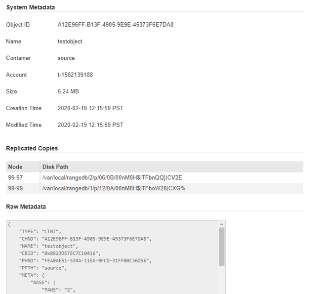

= 使用物件中繼資料查詢來驗證ILM原則
:allow-uri-read: 
:icons: font
:imagesdir: ../media/

[role="lead"]
啟動 ILM 原則後、將代表性測試物件擷取至 StorageGRID 系統、然後執行物件中繼資料查詢、確認複本是否依照預期製作、並放置在正確的位置。

.開始之前
您有一個物件識別碼、可以是 * * UUID * ：物件的通用唯一識別碼。* * CBID* ： StorageGRID 中物件的唯一識別碼。您可以從稽核記錄取得物件的CBID。輸入全大寫的CBID。* * S3 貯體和物件金鑰 * ：當物件透過 S3 介面擷取時、用戶端應用程式會使用貯體和物件金鑰組合來儲存和識別物件。如果S3儲存區已版本化、而您想要使用儲存區和物件金鑰來查詢S3物件的特定版本、您就擁有*版本ID*。

.步驟
. 擷取物件。
. 選取* ILM *>*物件中繼資料查詢*。
. 在*識別碼*欄位中輸入物件的識別碼。您可以輸入 UUID 、 CBID 或 S3 貯體 / 物件金鑰。
. 或者、輸入物件的版本ID（僅限S3）。
. 選擇*查詢*。
+
隨即顯示物件中繼資料查詢結果。本頁列出下列資訊類型：

+
** 系統中繼資料、例如物件 ID （ UUID ）、結果類型（物件、刪除標記、 S3 貯體）、以及物件的邏輯大小。如需詳細資料、請參閱以下範例螢幕擷取畫面。
** 任何與物件相關聯的自訂使用者中繼資料金鑰值配對。
** 對於S3物件、任何與物件相關聯的物件標記金鑰值配對。
** 對於複寫的物件複本、每個複本的目前儲存位置。
** 對於以銷毀編碼的物件複本、每個片段的目前儲存位置。
** 對於Cloud Storage Pool中的物件複本、物件的位置、包括外部儲存區名稱和物件的唯一識別碼。
** 對於分段物件和多部分物件、包含區段識別碼和資料大小的物件區段清單。對於超過100個區段的物件、只會顯示前100個區段。
** 所有物件中繼資料均採用未處理的內部儲存格式。此原始中繼資料包含內部系統中繼資料、無法保證從發行到發行都會持續存在。

. 確認物件儲存在正確的位置或位置、而且是正確的複本類型。
+
如果啟用「稽核」選項、您也可以監控符合ORLM物件規則訊息的稽核記錄。ORLM 稽核訊息可提供您更多有關 ILM 評估程序狀態的資訊、但無法提供物件資料放置正確或 ILM 原則完整性的資訊。您必須自行評估。如需詳細資訊、請參閱 link:../audit/index.html["檢閱稽核記錄"]。

下列範例顯示儲存為兩個複寫複本之S3測試物件的物件中繼資料查詢結果。

NOTE: 以下螢幕擷取畫面為範例。您的結果會因 StorageGRID 版本而異。

.相關資訊
link:../s3/index.html["使用S3 REST API"]
