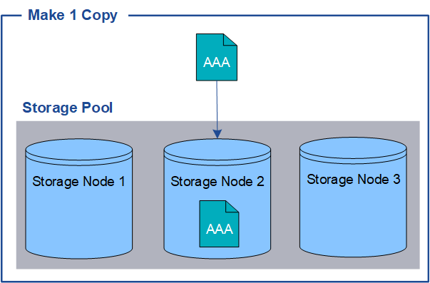

= 為何不應使用單一複製複寫
:allow-uri-read: 
:icons: font
:imagesdir: ../media/

[role="lead"]
建立ILM規則以建立複寫複本時、您應該在放置指示中、隨時至少指定兩個複本。

NOTE: 請勿使用 ILM 規則、在任何時間段內只建立一個複寫複本。如果只有一個物件複寫複本存在、則當儲存節點故障或發生重大錯誤時、該物件就會遺失。在升級等維護程序期間、您也會暫時失去物件的存取權。

在下列範例中、「製作1複製ILM」規則會指定將物件的一個複寫複本放在包含三個儲存節點的儲存資源池中。擷取符合此規則的物件時StorageGRID 、將單一複本放在單一儲存節點上。

如果ILM規則只建立物件的一個複寫複本、則當儲存節點無法使用時、物件就無法存取。在此範例中、只要儲存節點2離線（例如在升級或其他維護程序期間）、您就會暫時失去物件aaa的存取權。如果儲存節點2故障、您將完全失去物件AAA。

image::../media/ilm_replication_make_1_copy_sn_fails.png[ILM複製使1個複製SN失敗]

為了避免遺失物件資料、您應該一律至少製作兩份複本、以複寫方式保護所有物件。如果有兩個以上的複本存在、您仍可在一個儲存節點故障或離線時存取物件。

image::../media/ilm_replication_make_2_copies_sn_fails.png[ILM複寫會產生2個複本SN失敗]
