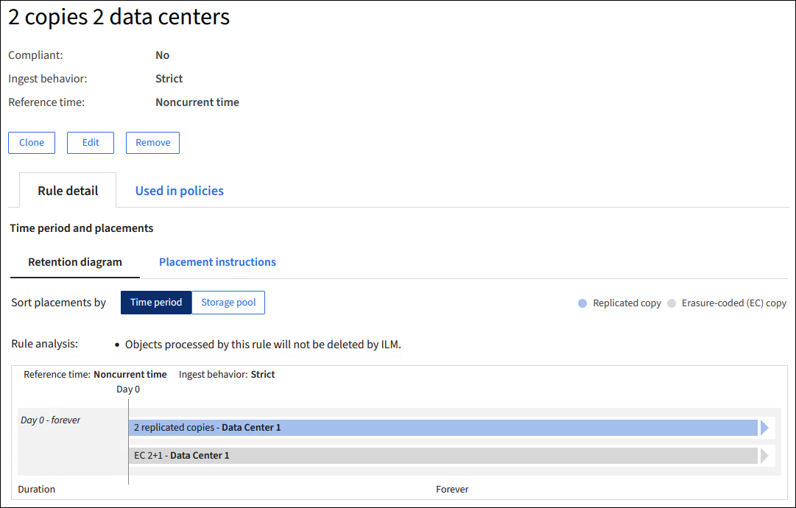
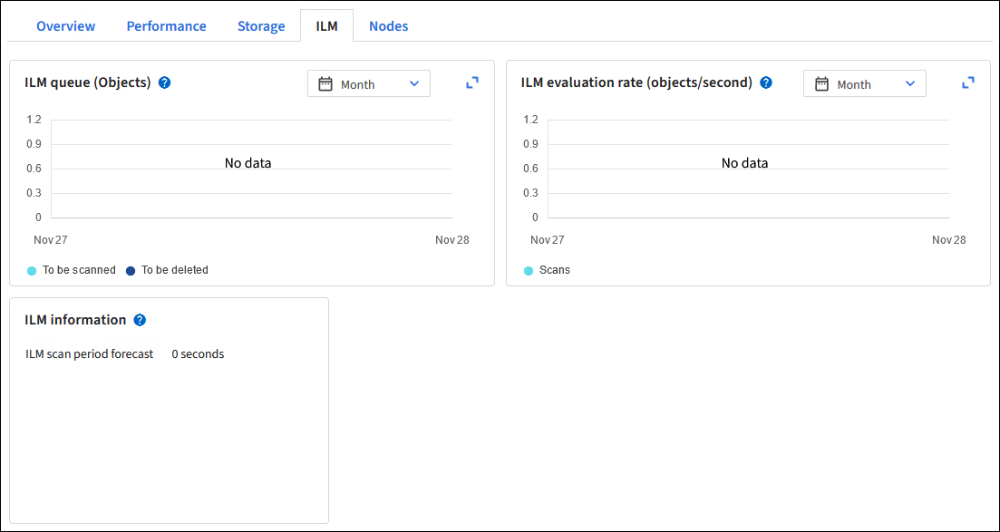

= 使用 ILM 原則和 ILM 規則
:allow-uri-read: 
:icons: font
:imagesdir: ../media/

[role="lead"]
隨著儲存需求的變更、您可能需要設定其他原則、或修改與原則相關的 ILM 規則。您可以檢視 ILM 指標來判斷系統效能。

.開始之前
* 您已使用登入 Grid Manager link:../admin/web-browser-requirements.html["支援的網頁瀏覽器"]。
* 您有 link:../admin/admin-group-permissions.html["特定存取權限"]。

== 檢視 ILM 原則

若要檢視作用中和非作用中的 ILM 原則和原則啟動歷程記錄：

. 選擇* ILM *>* Policies *。
. 選取 * 原則 * 以檢視作用中和非作用中原則的清單。下表列出每個原則的名稱、原則指派的標記、以及原則是作用中或非作用中。
. 選取 * 啟動歷程記錄 * 以檢視原則的啟動開始和結束日期清單。
. 選取原則名稱以檢視原則的詳細資料。
+

NOTE: 如果您檢視狀態為已編輯或刪除之原則的詳細資料、會出現一則訊息、說明您正在檢視在指定時間範圍內作用中且自此之後已編輯或刪除的原則版本。

== 編輯 ILM 原則

您只能編輯非作用中原則。若要編輯作用中原則、請停用該原則、或建立複本並編輯複本。

編輯原則：

. 選擇* ILM *>* Policies *。
. 選中要編輯的策略的複選框，然後選擇 *Edit* 。
. 請依照中的指示編輯原則link:creating-ilm-policy.html["建立 ILM 原則"]。
. 在重新啟動原則之前、請先模擬原則。

CAUTION: 如果ILM原則設定不正確、可能導致無法恢復的資料遺失。啟動ILM原則之前、請仔細檢閱ILM原則及其ILM規則、然後模擬ILM原則。請務必確認ILM原則是否正常運作。

== 複製 ILM 原則

複製 ILM 原則：

. 選擇* ILM *>* Policies *。
. 選中要克隆的策略的複選框，然後選擇 *Clone* 。
. 依照中的指示link:creating-ilm-policy.html["建立 ILM 原則"]、從您複製的原則開始建立新原則。

CAUTION: 如果ILM原則設定不正確、可能導致無法恢復的資料遺失。啟動ILM原則之前、請仔細檢閱ILM原則及其ILM規則、然後模擬ILM原則。請務必確認ILM原則是否正常運作。

== 移除 ILM 原則

您只能移除非使用中的 ILM 原則。若要移除原則：

. 選擇* ILM *>* Policies *。
. 選取您要移除之非作用中原則的核取方塊。
. 選擇*移除*。

== 檢視 ILM 規則詳細資料

若要檢視 ILM 規則的詳細資料、包括規則的保留圖表和放置指示：

. 選擇* ILM *>* Rules *。
. 選取您要檢視其詳細資料的規則名稱。範例：
+

此外、您也可以使用詳細資料頁面來複製、編輯或移除規則。如果規則用於任何原則、您就無法編輯或移除規則。

== 複製ILM規則

如果您想要建立使用現有規則部分設定的新規則、可以複製現有規則。如果您需要編輯任何原則中使用的規則、請改為複製規則並變更複製。變更複本之後、您可以從原則中移除原始規則、並視需要以修改版本取代原始規則。

NOTE: 如果 ILM 規則是使用 StorageGRID 10.2 版或更早版本所建立、則無法複製該規則。

.步驟
. 選擇* ILM *>* Rules *。
. 選中要克隆的規則的複選框，然後選擇 *Clone* 。或者、選取規則名稱、然後從規則詳細資料頁面中選取 * 完整複製 * 。
. 按照和的步驟更新克隆規則<<編輯ILM規則,編輯 ILM 規則>>link:create-ilm-rule-enter-details.html#use-advanced-filters-in-ilm-rules["在 ILM 規則中使用進階篩選器"]。
+
複製ILM規則時、您必須輸入新名稱。

== 編輯ILM規則

您可能需要編輯ILM規則、才能變更篩選或放置指示。

如果規則用於任何 ILM 原則、則無法編輯規則。您可以<<clone-ilm-rule,複製規則>>對複製的複本進行任何必要的變更。

CAUTION: 如果ILM原則設定不正確、可能導致無法恢復的資料遺失。啟動ILM原則之前、請仔細檢閱ILM原則及其ILM規則、然後模擬ILM原則。請務必確認ILM原則是否正常運作。

.步驟
. 選擇* ILM *>* Rules *。
. 確認您要編輯的規則未在任何 ILM 原則中使用。
. 如果您要編輯的規則未在使用中、請選取規則的核取方塊、然後選取 * 動作 * > * 編輯 * 。或者、選取規則名稱、然後在規則詳細資料頁面上選取 * 編輯 * 。
. 完成編輯 ILM 規則精靈的步驟。如有必要，請按照和link:create-ilm-rule-enter-details.html#use-advanced-filters-in-ilm-rules["在 ILM 規則中使用進階篩選器"]的步驟link:create-ilm-rule-enter-details.html["建立ILM規則"]操作。
+
編輯 ILM 規則時、您無法變更其名稱。

== 移除 ILM 規則

若要讓目前的 ILM 規則清單保持可管理的狀態、請移除您不太可能使用的任何 ILM 規則。

.步驟
若要移除目前用於作用中原則的 ILM 規則：

. 複製原則。
. 從原則複製移除 ILM 規則。
. 儲存、模擬及啟動新原則、以確保物件受到預期的保護。
. 請前往移除目前用於非作用中原則的 ILM 規則的步驟。

若要移除目前用於非作用中原則的 ILM 規則：

. 選取非作用中原則。
. 從原則或<<remove-ilm-policy,移除原則>>中移除 ILM 規則。
. 請前往移除目前未使用的 ILM 規則的步驟。

移除目前未使用的 ILM 規則：

. 選擇* ILM *>* Rules *。
. 確認您要移除的規則未用於任何原則。
. 如果您要移除的規則未在使用中、請選取規則、然後選取 * 動作 * > * 移除 * 。您可以選取多個規則、並同時移除所有規則。
. 選取 * 是 * 以確認您要移除 ILM 規則。

== 檢視 ILM 指標

您可以檢視 ILM 的度量、例如佇列中的物件數目和評估率。您可以監控這些指標來判斷系統效能。大量佇列或評估率可能表示系統無法跟上擷取速度、用戶端應用程式的負載過大、或存在一些異常狀況。

.步驟
. 選取 * 儀表板 * > * ILM * 。
+

NOTE: 由於儀表板可以自訂、因此 ILM 索引標籤可能無法使用。

. 監控 ILM 索引標籤上的度量。
+
您可以選取問號image:../media/icon_nms_question.png["問號圖示"]、查看 ILM 索引標籤上項目的說明。

+

