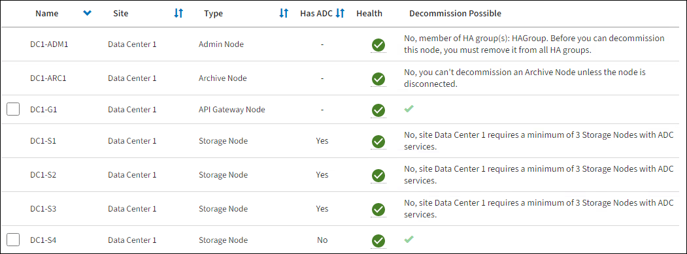

= 存取「取消委任節點」頁面
:allow-uri-read: 
:icons: font
:imagesdir: ../media/

[role="lead"]
當您存取Grid Manager中的「取消委任節點」頁面時、您可以一覽哪些節點可以停用。

.開始之前
* 您已使用登入 Grid Manager link:../admin/web-browser-requirements.html["支援的網頁瀏覽器"]。
* 您有link:../admin/admin-group-permissions.html["維護或根存取權限"]。

CAUTION: 在包含僅軟體中繼資料節點的網格中取消委任儲存節點時、請務必謹慎。如果您取消委任所有設定為儲存物件和中繼資料的節點、則儲存物件的能力會從網格中移除。如需僅中繼資料儲存節點的詳細資訊、請參閱link:../primer/what-storage-node-is.html#types-of-storage-nodes["儲存節點類型"]。

.步驟
. 選擇*維護* > *任務* > *退役*。
. 選取*取消委任節點*。
+
此時會出現「取消委任節點」頁面。在此頁面中、您可以：

+
** 判斷哪些網格節點目前可以停用。
** 查看所有網格節點的健全狀況
** 按*名稱*、*站台*、*類型*或*具有ADC/*的遞增或遞減順序排序清單。
** 輸入搜尋詞彙以快速尋找特定節點。
+
在此範例中、「可能取消委任」欄表示您可以取消委任「閘道節點」和四個「儲存節點」中的其中一個。

+

. 檢閱您要取消委任之每個節點的*可能取消委任*欄。
+
如果可以取消委任網格節點、則此欄會包含綠色核取記號、左欄則會包含核取方塊。如果節點無法停用、此欄會說明問題。如果節點無法停用的原因不止一個、則會顯示最重要的原因。

+
[cols="1a,1a,1a"]
|===
| 取消委任可能原因 | 說明 | 解決步驟 

 a| 
否、不支援 _ 節點類型 _ 停用。
 a| 
您無法取消委任主要管理節點。
 a| 
無。

 a| 
否、至少有一個網格節點已中斷連線。

*注意*：此訊息僅針對連接的網格節點顯示。
 a| 
如果任何網格節點中斷連線、則無法取消委任已連線的網格節點。

「*健全狀況*」欄包含下列其中一個已中斷連線的網格節點圖示：

** image:../media/icon_alarm_gray_administratively_down.png["灰色問號圖示"]（灰色）：管理性關閉
** image:../media/icon_alarm_blue_unknown.png["藍色問號圖示"]（藍色）：未知

 a| 
您必須將所有中斷連線的節點重新上線、或在移除已連線link:decommissioning-disconnected-grid-nodes.html["取消委任所有中斷連線的節點"]的節點之前。

* 注意 * ：如果您的網格包含多個中斷連線的節點、軟體會要求您同時將它們全部取消委任、這會增加產生非預期結果的可能性。

 a| 
否、目前有一或多個必要節點已中斷連線、必須加以恢復。

*注意*：此訊息僅針對斷開連接的網格節點顯示。
 a| 
如果一或多個必要節點也中斷連線（例如、 ADC 仲裁所需的儲存節點）、則無法取消委任中斷連線的網格節點。
 a| 
.. 檢閱所有中斷連線節點的取消委任可能訊息。
.. 判斷哪些節點因為需要而無法停用。
+
*** 如果所需節點的健全狀況為管理性關機、請將節點重新連線。
*** 如果所需節點的健全狀況為「未知」、請執行節點還原程序來恢復所需節點。

 a| 
否，HA 組的成員：_組名稱_。在停用此節點之前，您必須將其從所有 HA 群組中刪除。
 a| 
如果節點介面屬於高可用度（ HA ）群組、則無法取消委任管理節點或閘道節點。
 a| 
編輯HA群組以移除節點的介面、或移除整個HA群組。請參閱。 link:../admin/configure-high-availability-group.html["設定高可用度群組"]

 a| 
否、站台_x_需要至少_n_個儲存節點搭配ADC服務。
 a| 
*僅儲存節點*（組合或僅元資料的儲存節點）。如果網站上剩餘的節點不足以支援 ADC 仲裁要求，則您無法停用儲存節點。但是，您可以將 ADC 服務移至另一個儲存節點。
 a| 
link:../maintain/move-adc-service.html["將 ADC 服務移至同一網站上的另一個儲存節點"]或透過向網站新增新的儲存節點並指定它應該具有 ADC 服務來執行擴充。請參閱link:understanding-adc-service-quorum.html["ADC 仲裁"] 。

 a| 
否、一或多個銷毀編碼設定檔至少需要 _n_ 個儲存節點。如果ILM規則未使用設定檔、您可以停用該設定檔。
 a| 
*僅限儲存節點*。除非為現有的擦除編碼設定檔保留足夠的節點，否則您無法停用儲存節點。

例如、如果存在用於 4+2 銷毀編碼的銷毀編碼設定檔、則至少必須保留 6 個儲存節點。
 a| 
針對每個受影響的抹除編碼設定檔、根據設定檔的使用方式、執行下列其中一個步驟：

** * 用於主動 ILM 原則 * ：執行擴充。新增足夠的新儲存節點、以便繼續進行銷毀編碼。請參閱的說明link:../expand/index.html["擴充您的網格"]。
** * 用於 ILM 規則、但不在使用中的 ILM 原則 * ：編輯或刪除規則、然後停用銷毀編碼設定檔。
** * 未用於任何 ILM 規則 * ：停用銷毀編碼設定檔。

* 附註： * 如果您嘗試停用銷毀編碼設定檔、且物件資料仍與設定檔相關聯、則會出現錯誤訊息。您可能需要等待數週、才能再次嘗試停用程序。

瞭解 link:../ilm/manage-erasure-coding-profiles.html["停用銷毀編碼設定檔"]。

 a| 
否、除非節點中斷連線、否則您無法取消委任歸檔節點。
 a| 
如果保存節點仍在連線、則無法將其移除。
 a| 
* 附註 * ：已移除對歸檔節點的支援。如果您需要取消委任歸檔節點、請參閱 https://docs.netapp.com/us-en/storagegrid-118/maintain/grid-node-decommissioning.html["Grid 節點汰換（ StorageGRID 11.8 doc 網站）"^]

|===

