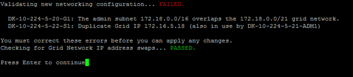

= 變更節點網路組態
:allow-uri-read: 
:icons: font
:imagesdir: ../media/

[role="lead"]
您可以使用變更IP工具來變更一或多個節點的網路組態。您可以變更Grid Network的組態、或新增、變更或移除管理或用戶端網路。

.開始之前
您有 `Passwords.txt`檔案。

.關於這項工作
* Linux：*如果您是第一次將網格節點新增至管理網路或用戶端網路、而且您之前未在節點組態檔中設定admin_network_target或client_network_target、則必須立即進行。

請參閱適用於您的 Linux 作業系統的 StorageGRID 安裝說明：

* link:../rhel/index.html["在 Red Hat Enterprise Linux 上安裝 StorageGRID"]
* link:../ubuntu/index.html["在 Ubuntu 或 Debian 上安裝 StorageGRID"]

* 應用裝置： * 在 StorageGRID 應用裝置上、如果在初始安裝期間未在 StorageGRID 應用裝置安裝程式中設定用戶端或管理網路、則無法僅使用變更 IP 工具來新增網路。首先、您必須 https://docs.netapp.com/us-en/storagegrid-appliances/commonhardware/placing-appliance-into-maintenance-mode.html["將產品置於維護模式"^]設定連結、將應用裝置恢復為正常操作模式、然後使用變更 IP 工具來修改網路組態。請參閱 https://docs.netapp.com/us-en/storagegrid-appliances/installconfig/configuring-network-links.html["設定網路連結的程序"^]。

您可以變更任何網路上一或多個節點的IP位址、子網路遮罩、閘道或MTU值。

您也可以從用戶端網路或管理網路新增或移除節點：

* 您可以將該網路上的IP位址/子網路遮罩新增至節點、將節點新增至用戶端網路或管理網路。
* 您可以刪除該網路上節點的IP位址/子網路遮罩、從用戶端網路或管理網路中移除節點。
+
無法從 Grid Network 移除節點。

NOTE: 不允許 IP 位址交換。如果您必須在網格節點之間交換IP位址、則必須使用暫用的中繼IP位址。

NOTE: 如果StorageGRID 您的系統啟用單一登入（SSO）、且您正在變更管理節點的IP位址、請注意、使用管理節點的IP位址（而非建議的完整網域名稱）設定的任何依賴方信任都將無效。您將無法再登入節點。變更IP位址之後、您必須立即使用新的IP位址來更新或重新設定節點在Active Directory Federation Services（AD FS）中的依賴方信任。請參閱的說明link:../admin/configure-sso.html["設定 SSO"]。

NOTE: 您使用變更IP工具對網路所做的任何變更、都會傳播至StorageGRID 安裝程式韌體、以供使用各種版本的應用裝置使用。如此一StorageGRID 來、如果在應用裝置上重新安裝了支援功能的軟體、或是將應用裝置置於維護模式、網路組態就會正確。

.步驟
. 登入主要管理節點：
+
.. 輸入下列命令： `ssh admin@_primary_Admin_Node_IP_`
.. 輸入檔案中列出的密碼 `Passwords.txt`。
.. 輸入以下命令切換到 root ： `su -`
.. 輸入檔案中列出的密碼 `Passwords.txt`。

+
當您以 root 登入時、提示會從變更 `$`為 `#`。

. 輸入下列命令以啟動變更 IP 工具： `change-ip`
. 在提示字元下輸入資源配置通關密碼。
+
主功能表隨即出現。

+
image::../media/change_ip_tool_main_menu.png[顯示變更IP工具歡迎畫面的快照]

. （可選）選擇* 1*以選擇要更新的節點。然後選取下列其中一個選項：
+
** *1*：單一節點-依名稱選取
** *2*：單一節點-依站台、然後依名稱選取
** * 3*：單一節點-依目前IP選取
** * 4 *：站台上的所有節點
** *5*：網格中的所有節點
+
*附註：*如果您要更新所有節點、請允許「ALL」保持選取狀態。

+
選擇之後、主功能表隨即出現、*所選節點*欄位會更新以反映您的選擇。所有後續行動只會在顯示的節點上執行。

. 在主功能表上、選取選項* 2*以編輯所選節點的IP/遮罩、閘道和MTU資訊。
+
.. 選取您要變更的網路：
+
--
*** * 1 *：網格網路
*** * 2 *：管理網路
*** * 3 *：用戶端網路
*** *4* ：所有網路

--
+
--
選擇之後、提示會顯示節點名稱、網路名稱（ Grid 、 Admin 或 Client ）、資料類型（ IP/ 遮罩、 閘道或 MTU ）、以及目前的值。

編輯DHCP設定介面的IP位址、字首長度、閘道或MTU、將會將介面變更為靜態。當您選擇變更DHCP設定的介面時、會顯示警告、通知您介面將變更為靜態。

設定為的介面 `fixed`無法編輯。

--
.. 若要設定新值、請以目前值的顯示格式輸入。
.. 若要保持目前值不變、請按* Enter *。
.. 如果資料類型為 `IP/mask`、您可以輸入 * d* 或 * 0.0.0/0* 、從節點刪除管理或用戶端網路。
.. 編輯完所有要變更的節點之後、輸入* q*即可返回主功能表。
+
您的變更會保留到清除或套用為止。

. 選取下列其中一個選項、以檢閱您的變更：
+
** *5*：顯示輸出中的編輯內容、這些編輯內容被隔離、僅顯示變更的項目。變更會以綠色（新增）或紅色（刪除）強調顯示、如範例輸出所示：
+
image::../media/change_ip_tool_edit_ip_mask_sample_output.png[周邊文字所述的螢幕擷取畫面]

** *6*：顯示輸出中顯示完整組態的編輯內容。變更會以綠色（新增）或紅色（刪除）強調顯示。
+

NOTE: 某些命令列介面可能會使用刪除線格式顯示新增和刪除內容。正確的顯示取決於您的終端用戶端是否支援必要的VT100轉義序列。

. 選擇選項* 7*以驗證所有變更。
+
這項驗證可確保 Grid 、 Admin 和 Client Networks 的規則（例如不使用重疊的子網路）不會受到違反。

+
在此範例中、驗證傳回錯誤。

+

+
在此範例中、驗證已通過。

+
image::../media/change_ip_tool_validate_sample_passed_messages.gif[周邊文字所述的螢幕擷取畫面]

. 驗證通過後、請選擇下列其中一個選項：
+
** *8*：儲存未套用的變更。
+
此選項可讓您結束變更IP工具、並在稍後重新啟動、而不會遺失任何未套用的變更。

** * 10*：套用新的網路組態。

. 如果您選擇選項*10*、請選擇下列其中一個選項：
+
** *套用*：立即套用變更、必要時自動重新啟動每個節點。
+
如果新的網路組態不需要任何實體網路變更、您可以選取*套用*來立即套用變更。必要時、節點會自動重新啟動。此時會顯示需要重新啟動的節點。

** *階段*：下次手動重新啟動節點時套用變更。
+
如果您需要變更實體或虛擬網路組態以使新的網路組態正常運作、您必須使用*登臺*選項、關閉受影響的節點、進行必要的實體網路變更、然後重新啟動受影響的節點。如果您選擇*套用*而不先進行這些網路變更、變更通常會失敗。

+

NOTE: 如果您使用* st段*選項、則必須在接移後盡快重新啟動節點、以將中斷情況降至最低。

** * 取消 * ：目前請勿進行任何網路變更。
+
如果您不知道所提議的變更需要重新啟動節點、您可以延後變更、將使用者影響降至最低。選取*取消*會返回主功能表、並保留您的變更、以便稍後套用。

+
當您選取*套用*或*階段*時、會產生新的網路組態檔、執行資源配置、並以新的工作資訊更新節點。

+
在資源配置期間、輸出會在套用更新時顯示狀態。

+
[listing]
----
Generating new grid networking description file...

Running provisioning...

Updating grid network configuration on Name
----

+
套用或重新設定變更後，會因網格組態變更而產生新的還原套件。

. 如果您選擇*階段*、請在資源配置完成後遵循下列步驟：
+
.. 進行所需的實體或虛擬網路變更。
+
*實體網路變更*：進行必要的實體網路變更、必要時可安全關閉節點。

+
*Linux* ：如果您是第一次將節點新增至管理網路或用戶端網路、請務必依照中所述新增介面link:linux-adding-interfaces-to-existing-node.html["Linux：新增介面至現有節點"]。

.. 重新啟動受影響的節點。

. 選取「* 0*」以在變更完成後結束「變更IP」工具。
. 從 Grid Manager 下載新的恢復套件。
+
.. 選擇* maintenance *>* System*>* Recovery套件*。
.. 輸入資源配置通關密碼。

== 暫時變更 LACP PDU 速率

若要對裝置中安裝的網路元件執行維護作業，例如升級 NIC 韌體，您可以檢查目前的 LACP PDU 速率設定。如果需要，您也可以不持續地在快速和慢速之間切換 LACP PDU 速率。

NOTE: 若要永久變更 LACP PDU 速率，請參閱 https://docs.netapp.com/us-en/storagegrid-appliances/installconfig/configuring-network-links.html["設定網路連結"^]。

.開始之前
* 管理節點已安裝並正在執行。
* 您有 `Passwords.txt`檔案。

.步驟
. 登入主要管理節點：
+
.. 輸入下列命令： `ssh admin@primary_Admin_Node_IP`
.. 輸入檔案中列出的密碼 `Passwords.txt`。
.. 輸入以下命令切換到 root ： `su -`
.. 輸入檔案中列出的密碼 `Passwords.txt`。
+
當您以 root 登入時、提示會從變更 `$`為 `#`。

. 若要檢查目前的 LACP PDU 速率設定，請輸入下列命令：
+
`run-each-node --parallel --port 8022 '/usr/sbin/set-lacp-rate.sh --lacprate'`

. 若要暫時變更 LACP PDU 速率，請輸入下列命令：
+
`run-each-node --parallel --port 8022 '/usr/sbin/set-lacp-rate.sh --lacprate _<speed>_'`

+
 `fast`位於或 `slow`的位置 `_<version-number>_`。

LACP PDU 率將在下次設備重新開機時恢復到先前的設定。
