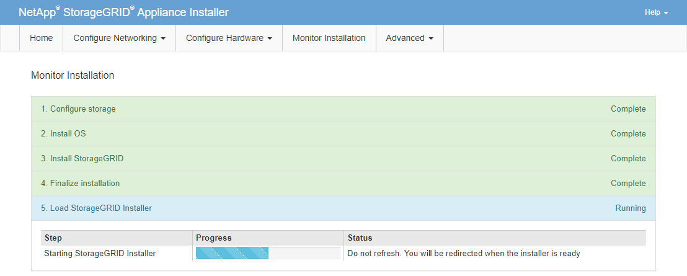

= 監控服務應用裝置安裝
:allow-uri-read: 
:icons: font
:imagesdir: ../media/

[role="lead"]
直到安裝完成為止、才會StorageGRID 顯示此狀態。軟體安裝完成後、即會重新啟動應用裝置。

.步驟
. 若要監控安裝進度、請按一下功能表列中的*監控安裝*。
+
「監視器安裝」頁面會顯示安裝進度。

+
image::../media/monitor_installation_services_appl.png[監控安裝-服務應用]

+
藍色狀態列會指出目前正在進行的工作。綠色狀態列表示已成功完成的工作。

+

NOTE: 安裝程式可確保先前安裝中完成的工作不會重新執行。如果您正在重新執行安裝、任何不需要重新執行的工作都會顯示綠色狀態列和「略過」狀態。

. 檢閱前兩個安裝階段的進度。
+
** *1.設定儲存設備*
+
在此階段中、安裝程式會清除磁碟機的任何現有組態、並設定主機設定。

** *2.安裝作業系統*
+
在此階段、安裝程式會將基礎作業系統映像複製StorageGRID 到應用裝置、以供從主管理節點複製到應用裝置、或是從主要管理節點的安裝套件安裝基礎作業系統。

. 繼續監控安裝進度、直到發生下列其中一項：
+
** 若為應用裝置閘道節點或非主要應用裝置管理節點、則會StorageGRID 暫停「*安裝Sid*」階段、並在內嵌式主控台顯示訊息、提示您使用Grid Manager在管理節點上核准此節點。
+
image::../media/monitor_installation_install_sgws.gif[影像會以周遭文字說明]

** 若為應用裝置主要管理節點StorageGRID 、則會出現第五階段（Load速度安裝程式）。如果第五階段進行超過10分鐘、請手動重新整理頁面。
+

. 請前往您要還原之應用裝置網格節點類型的下一個還原程序步驟。
+
[cols="1a,2a"]
|===
| 恢復類型 | 參考資料 

 a| 
閘道節點
 a| 
link:selecting-start-recovery-to-configure-gateway-node.html["選取「Start Recovery（開始恢復）」以設定閘道節點"]

 a| 
非主要管理節點
 a| 
link:selecting-start-recovery-to-configure-non-primary-admin-node.html["選取「Start Recovery」（開始還原）以設定非主要管理節點"]

 a| 
主要管理節點
 a| 
link:configuring-replacement-primary-admin-node.html["設定替換的主要管理節點"]

|===

