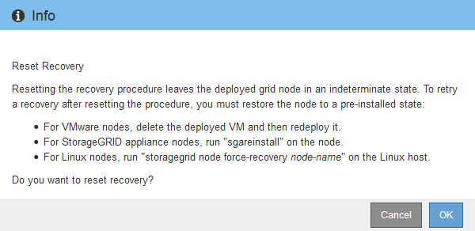

= 選取「Start Recovery（開始恢復）」以設定閘道節點
:allow-uri-read: 
:icons: font
:imagesdir: ../media/

[role="lead"]
更換閘道節點之後、您必須在Grid Manager中選取「Start Recovery」（開始還原）、將新節點設定為故障節點的替換節點。

.開始之前
* 您已使用登入 Grid Manager link:../admin/web-browser-requirements.html["支援的網頁瀏覽器"]。
* 您有link:../admin/admin-group-permissions.html["維護或根存取權限"]。
* 您有資源配置通關密碼。
* 您已部署並設定替換節點。

.步驟
. 從Grid Manager中選擇* maintenance *>* Tasks *>* Recovery*。
. 在「Pending Node」（擱置節點）清單中選取您要恢復的網格節點。
+
節點在故障後會出現在清單中、但您無法選取節點、直到節點重新安裝並準備好恢復為止。

. 輸入*配置密碼*。
. 單擊*開始恢復*。
+
image::../media/4b_select_recovery_node.png[顯示「維護」>「恢復」頁面的快照]

. 監控恢復網格節點表格中的恢復進度。
+

NOTE: 在恢復程序執行期間、您可以按一下*重設*來開始新的恢復。此時會出現一個對話方塊、表示如果您重設程序、節點將保持在不確定的狀態。

+

+
如果您想在重設程序後重試恢復、則必須將節點還原至預先安裝的狀態、如下所示：

+
** * VMware*：刪除已部署的虛擬網格節點。然後、當您準備好重新啟動恢復時、請重新部署節點。
** *Linux* ：在 Linux 主機上執行以下命令、重新啟動節點： `storagegrid node force-recovery _node-name_`
** * 應用裝置 * ：如果您想在重設程序後重試恢復、您必須在節點上執行、將應用裝置節點還原為預先安裝的狀態 `sgareinstall`。請參閱。 link:preparing-appliance-for-reinstallation-platform-replacement-only.html["準備設備以重新安裝（僅限平台更換）"]

