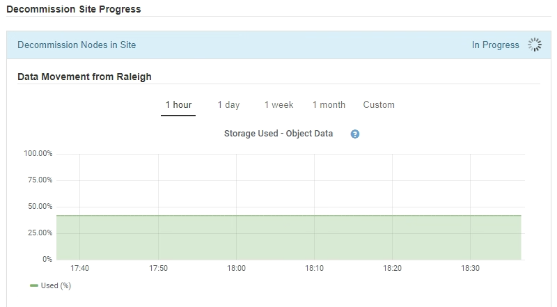

= 步驟6：監控取消委任
:allow-uri-read: 
:icons: font
:imagesdir: ../media/

[role="lead"]
從取消配置網站頁面精靈的步驟6（監控取消配置）、您可以在移除網站時監控進度。

.關於這項工作
當執行此動作時、若從連線的站台移除節點、則會依照下列順序移除節點：StorageGRID

. 閘道節點
. 管理節點
. 儲存節點

當用這個順序移除中斷連線的站台時、它會移除節點：StorageGRID

. 閘道節點
. 儲存節點
. 管理節點

每個閘道節點或管理節點可能只需要幾分鐘或一小時即可移除、不過儲存節點可能需要數天或數週的時間。

.步驟
. 一旦產生新的還原套件，請立即下載檔案。
+
image::../media/decommission_site_step_6_recovery_package.png[站台取消委任步驟 6 恢復套件]

+

NOTE: 請盡快下載恢復套件，以確保在取消委任程序期間發生錯誤時，您可以恢復網格。

+
.. 選取訊息中的連結、或選取* maintenance *>* System*>* Recovery套件*。
.. 下載 `.zip`檔案。
+
請參閱的說明link:downloading-recovery-package.html["下載恢復套件"]。

+

NOTE: 恢復套件檔案必須受到保護、因為它包含可用於從 StorageGRID 系統取得資料的加密金鑰和密碼。

. 使用「資料移動」圖表、監控物件資料從此站台移至其他站台的移動。
+
當您在步驟3中啟動新的ILM原則（修訂ILM原則）時、資料便會開始移動。資料會在整個取消委任程序期間移動。

+

. 在頁面的「節點進度」區段中、監控節點移除時取消委任程序的進度。
+
移除儲存節點時、每個節點都會經歷一系列階段。雖然這些階段大多發生得很快、甚至難以察覺、但您可能需要等待數天甚至數週、才能完成其他階段、視需要移動多少資料而定。需要更多時間來管理銷毀編碼資料並重新評估ILM。

+
image::../media/decommission_site_step_6_storage_node.png[取消委任站台步驟6儲存節點]

+
如果您正在監控連線站台取消委任的進度、請參閱下表以瞭解儲存節點的取消委任階段：

+
[cols="1a,2a"]
|===
| 階段 | 預估持續時間 

 a| 
擱置中
 a| 
分鐘或更短

 a| 
等待鎖定
 a| 
分鐘

 a| 
準備工作
 a| 
分鐘或更短

 a| 
將LDR標記為已停用
 a| 
分鐘

 a| 
解除委任複寫和刪除編碼資料
 a| 
小時、天或週、視資料量而定

*附註*：如果您需要執行其他維護活動、您可以在此階段暫停站台停用。

 a| 
LMR設定狀態
 a| 
分鐘

 a| 
清除稽核佇列
 a| 
根據訊息數量和網路延遲、從數分鐘到數小時。

 a| 
完成
 a| 
分鐘

|===
+
如果您正在監控中斷站台取消委任的進度、請參閱下表以瞭解儲存節點的取消委任階段：

+
[cols="1a,1a"]
|===
| 階段 | 預估持續時間 

 a| 
擱置中
 a| 
分鐘或更短

 a| 
等待鎖定
 a| 
分鐘

 a| 
準備工作
 a| 
分鐘或更短

 a| 
停用外部服務
 a| 
分鐘

 a| 
憑證撤銷
 a| 
分鐘

 a| 
節點取消登錄
 a| 
分鐘

 a| 
儲存分級取消註冊
 a| 
分鐘

 a| 
移除儲存群組
 a| 
分鐘

 a| 
實體移除
 a| 
分鐘

 a| 
完成
 a| 
分鐘

|===
. 當所有節點都達到完整階段之後、請等待其餘站台取消委任作業完成。
+
** 在*修復Cassandra *步驟中、StorageGRID 針對保留在網格中的Cassandra叢集進行必要的修復。視網格中剩餘的儲存節點數量而定、這些修復可能需要數天或更久的時間。
+
image::../media/decommission_site_step_6_repair_cassandra.png[取消委任站台步驟6修復Cassandra]

** 在「*停用EC設定檔與刪除儲存資源池*」步驟中、會進行下列ILM變更：
+
*** 任何轉介至站台的銷毀編碼設定檔都會停用。
*** 任何參照站台的儲存資源池都會刪除。
+

NOTE: 所有儲存節點儲存池（ StorageGRID 11.6 及更早版本）也會移除、因為它使用「 All Sites 」（所有站台）站台。

** 最後、在「*移除組態*」步驟中、任何對站台及其節點的剩餘參照都會從網格的其餘部分移除。
+
image::../media/decommission_site_step_6_remove_configuration.png[取消委任站台步驟6移除組態]

. 當取消委任程序完成時、取消委任網站頁面會顯示成功訊息、且移除的網站將不再顯示。
+
image::../media/decommission_site_success_message.png[取消委任站台成功訊息]

.完成後
完成站台取消委任程序後、請完成下列工作：

* 確保已淘汰站台中所有儲存節點的磁碟機都已清除。使用市售的資料抹除工具或服務、永久且安全地移除磁碟機中的資料。
* 如果站台包含一或多個管理節點、且您StorageGRID 的作業系統已啟用單一登入（SSO）、請從Active Directory Federation Services（AD FS）移除該站台的所有依賴方信任。
* 在連接站台取消委任程序中自動關閉節點之後、請移除相關的虛擬機器。

