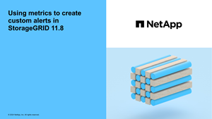

= 建立自訂警示規則
:allow-uri-read: 
:icons: font
:imagesdir: ../media/

[role="lead"]
您可以建立自訂警示規則、以定義自己觸發警示的條件。

.開始之前
* 您已使用登入 Grid Manager link:../admin/web-browser-requirements.html["支援的網頁瀏覽器"]。
* 您有link:../admin/admin-group-permissions.html["管理警示或根目錄存取權限"]。
* 您熟悉link:commonly-used-prometheus-metrics.html["常用的Prometheus指標"]。
* 您瞭解 https://prometheus.io/docs/prometheus/latest/querying/basics/["Prometheus查詢的語法"^]。
* 您也可以觀看影片： https://netapp.hosted.panopto.com/Panopto/Pages/Viewer.aspx?id=54af90c4-9a38-4136-9621-b1ff008604a3["影片：自訂警示"^]。
+
[link=https://netapp.hosted.panopto.com/Panopto/Pages/Viewer.aspx?id=54af90c4-9a38-4136-9621-b1ff008604a3]

.關於這項工作
無法驗證自訂警示。StorageGRID如果您決定建立自訂警示規則、請遵循下列一般準則：

* 查看預設警示規則的條件、並將其做為自訂警示規則的範例。
* 如果您為警示規則定義多個條件、請針對所有條件使用相同的運算式。然後變更每個條件的臨界值。
* 仔細檢查每個條件是否有錯字和邏輯錯誤。
* 僅使用Grid Management API中列出的度量。
* 使用 Grid Management API 測試運算式時、請注意「成功」回應可能是空的回應主體（未觸發警示）。若要查看警示是否實際觸發、您可以暫時將臨界值設定為目前預期為真的值。
+
例如、若要測試運算式 `node_memory_MemTotal_bytes < 24000000000`、請先執行、 `node_memory_MemTotal_bytes >= 0`並確保您獲得預期的結果（所有節點都會傳回值）。接著、將運算子和臨界值變更回預期值、然後再次執行。沒有任何結果表示此運算式目前沒有警示。

* 除非您已驗證警示會在預期時觸發、否則請勿假設自訂警示正常運作。

.步驟
. 選取*警示*>*規則*。
+
此時會出現警示規則頁面。

. 選取*建立自訂規則*。
+
「建立自訂規則」對話方塊隨即出現。

+
image::../media/alerts_create_custom_rule.png[警示>建立自訂規則]

. 選取或清除 *Enabled* 核取方塊、以判斷目前是否啟用此警示規則。
+
如果停用警示規則、則不會評估其運算式、也不會觸發警示。

. 輸入下列資訊：
+
[cols="1a,2a"]
|===
| 欄位 | 說明 

 a| 
唯一名稱
 a| 
此規則的唯一名稱。警示規則名稱會顯示在「警示」頁面上、也是電子郵件通知的主旨。警示規則的名稱可以介於1到64個字元之間。

 a| 
說明
 a| 
所發生問題的說明。說明是警示訊息、顯示在「警示」頁面和電子郵件通知中。警示規則的說明可介於1到128個字元之間。

 a| 
建議行動
 a| 
也可以選擇觸發此警示時要採取的建議行動。以純文字輸入建議的動作（無格式化代碼）。警示規則的建議動作可介於0到1,024個字元之間。

|===
. 在「條件」區段中、輸入一或多個警示嚴重性層級的Prometheus運算式。
+
基本運算式通常採用以下形式：

+
`[metric] [operator] [value]`

+
運算式可以是任何長度、但會出現在使用者介面的單行上。至少需要一個運算式。

+
如果節點安裝的RAM容量少於24、000、000、000位元組（24 GB）、則會觸發警示。

+
`node_memory_MemTotal_bytes < 24000000000`

+
若要查看可用的度量並測試 Prometheus 運算式、請選取說明圖示image:../media/icon_nms_question.png["問號圖示"]、然後依循 Grid Management API 「 Metrics 」（計量）區段的連結。

. 在*持續時間*欄位中、輸入觸發警示之前條件必須持續有效的時間量、然後選取時間單位。
+
要在條件變爲true時立即觸發警報，請輸入*0*。請增加此值、以防止暫時性情況觸發警示。

+
預設值為 5 分鐘。

. 選擇*保存*。
+
對話方塊隨即關閉、新的自訂警示規則會出現在警示規則表格中。

