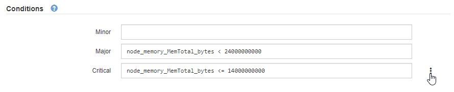

= 編輯警示規則
:allow-uri-read: 
:icons: font
:imagesdir: ../media/

[role="lead"]
您可以編輯警示規則來變更觸發條件、針對自訂警示規則、也可以更新規則名稱、說明及建議的動作。

.開始之前
* 您已使用登入 Grid Manager link:../admin/web-browser-requirements.html["支援的網頁瀏覽器"]。
* 您有link:../admin/admin-group-permissions.html["管理警示或根目錄存取權限"]。

.關於這項工作
當您編輯預設警示規則時、可以變更次要、主要和關鍵警示的條件、以及持續時間。當您編輯自訂警示規則時、也可以編輯規則的名稱、說明和建議的動作。

CAUTION: 決定編輯警示規則時請務必小心。如果您變更觸發值、則在無法完成關鍵作業之前、可能無法偵測潛在問題。

.步驟
. 選擇*警報* > *規則*。
+
此時會出現警示規則頁面。

. 選取您要編輯之警示規則的選項按鈕。
. 選擇*編輯規則*。
+
「編輯規則」對話方塊隨即出現。此範例顯示預設警示規則、「唯一名稱」、「說明」和「建議動作」欄位已停用、無法編輯。

+
image::../media/alert_rules_edit_rule.png[警示>編輯規則]

. 選取或清除 *Enabled* 核取方塊、以判斷目前是否啟用此警示規則。
+
如果停用警示規則、則不會評估其運算式、也不會觸發警示。

+

NOTE: 如果停用目前警示的警示規則、您必須等待數分鐘、使警示不再顯示為作用中警示。

+

CAUTION: 一般而言、不建議停用預設警示規則。如果警示規則已停用、則在無法完成關鍵作業之前、您可能不會偵測到潛在問題。

. 如需自訂警示規則、請視需要更新下列資訊。
+

NOTE: 您無法編輯預設警示規則的此資訊。

+
[cols="1a,2a"]
|===
| 欄位 | 說明 

 a| 
唯一名稱
 a| 
此規則的唯一名稱。警示規則名稱會顯示在「警示」頁面上、也是電子郵件通知的主旨。警示規則的名稱可以介於1到64個字元之間。

 a| 
說明
 a| 
所發生問題的說明。說明是警示訊息、顯示在「警示」頁面和電子郵件通知中。警示規則的說明可介於1到128個字元之間。

 a| 
建議行動
 a| 
也可以選擇觸發此警示時要採取的建議行動。以純文字輸入建議的動作（無格式化代碼）。警示規則的建議動作可介於0到1,024個字元之間。

|===
. 在「條件」區段中、輸入或更新一或多個警示嚴重性層級的Prometheus運算式。
+

NOTE: 如果您想要將已編輯的預設警示規則的條件還原回原始值、請選取修改條件右側的三個點。

+

+

NOTE: 如果您更新目前警示的條件、則在解決先前的條件之前、您的變更可能不會實作。下次符合規則的其中一個條件時、警示將會反映更新的值。

+
基本運算式通常採用以下形式：

+
`[metric] [operator] [value]`

+
運算式可以是任何長度、但會出現在使用者介面的單行上。至少需要一個運算式。

+
如果節點安裝的RAM容量少於24、000、000、000位元組（24 GB）、則會觸發警示。

+
`node_memory_MemTotal_bytes < 24000000000`

. 在*持續時間*欄位中、輸入觸發警示之前條件必須持續保持有效的時間量、然後選取時間單位。
+
要在條件變爲true時立即觸發警報，請輸入*0*。請增加此值、以防止暫時性情況觸發警示。

+
預設值為 5 分鐘。

. 選擇*保存*。
+
如果您編輯了預設警示規則、*預設*會出現在類型欄中。如果您停用預設或自訂警示規則、*停用*會出現在*狀態*欄中。

