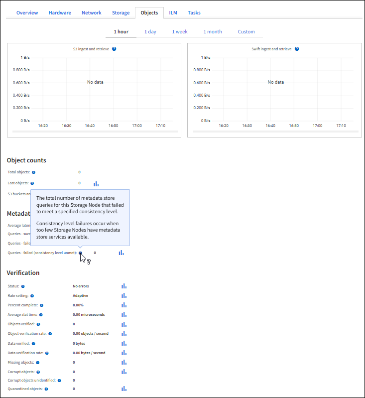

= 監控 S3 用戶端作業
:allow-uri-read: 
:icons: font
:imagesdir: ../media/

[role="lead"]
您可以監控物件擷取和擷取速率、以及物件計數、查詢和驗證的度量。您可以檢視用戶端應用程式在StorageGRID 讀取、寫入及修改物件時、成功和失敗的嘗試次數。

.開始之前
您已使用登入 Grid Manager link:../admin/web-browser-requirements.html["支援的網頁瀏覽器"]。

.步驟
. 從儀表板選取 * 效能 * 索引標籤。
. 請參閱 S3 圖表、其中摘要說明儲存節點執行的用戶端作業數、以及儲存節點在所選時間範圍內接收的 API 要求數。
. 選擇“*節點*”以存取“節點”頁面。
. 從節點首頁（網格層級）選取 * 物件 * 索引標籤。
+
此圖表顯示整個 StorageGRID 系統的 S3 擷取和擷取速率、單位為每秒位元組數、以及擷取或擷取的資料量。您可以選擇時間間隔或套用自訂時間間隔。

. 若要查看特定儲存節點的資訊、請從左側清單中選取節點、然後選取 * 物件 * 索引標籤。
+
圖表顯示節點的擷取和擷取速率。索引標籤也包含物件計數、中繼資料查詢和驗證作業的度量。

+

