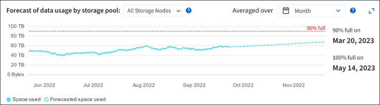

= 監控儲存容量
:allow-uri-read: 
:icons: font
:imagesdir: ../media/

[role="lead"]
監控可用空間總量、確保StorageGRID 不讓物件或物件中繼資料的儲存空間耗盡。

物件資料和物件中繼資料會分開儲存、並針對包含物件中繼資料的分散式Cassandra資料庫保留特定空間量。StorageGRID監控物件和物件中繼資料所耗用的空間總量、以及各物件所耗用空間量的趨勢。這可讓您預先規劃新增節點、避免任何服務中斷。

您可以link:viewing-storage-tab.html["檢視儲存容量資訊"]針對整個網格、每個網站、以及 StorageGRID 系統中的每個儲存節點、進行設定。

== 監控整個網格的儲存容量

監控網格的整體儲存容量、確保物件資料和物件中繼資料有足夠的可用空間。瞭解隨著時間而改變的儲存容量、有助於您在使用網格的可用儲存容量之前、計畫新增儲存節點或儲存磁碟區。

Grid Manager 儀表板可讓您快速評估整個網格和每個資料中心有多少可用儲存空間。「節點」頁面提供更詳細的物件資料和物件中繼資料值。

.步驟
. 評估整個網格和每個資料中心可用的儲存容量。
+
.. 選取 * 儀表板 > 總覽 * 。
.. 請注意「資料空間使用量明細」和「中繼資料允許空間使用量明細」卡上的值。每張卡片都會列出儲存使用率的百分比、已用空間的容量、以及站台可用或允許的總空間。
+

NOTE: 摘要不包括歸檔媒體。

+
image::../media/dashboard_data_and_metadata_space_usage_breakdown.png[資料與中繼資料空間使用率明細]

.. 記下儲存設備隨時間卡上的圖表。使用「時間週期」下拉式清單、協助您判斷儲存設備的使用速度。
+
image::../media/dashboard_storage_over_time.png[隨時間推移的儲存]

. 請使用「節點」頁面、進一步瞭解已使用的儲存空間量、以及在網格上可用於物件資料和物件中繼資料的儲存空間量。
+
.. 選擇*節點*。
.. 選擇「*網格_*>*儲存設備*」。
+
image::../media/nodes_deployment_storage_tab.png[節點部署儲存索引標籤]

.. 將游標放在 * 已使用的儲存空間 - 物件資料 * 和 * 已使用的儲存空間 - 物件中繼資料 * 圖表上、以查看整個網格有多少物件儲存空間和物件中繼資料儲存空間可供使用、以及一段時間內已使用的容量。
+

NOTE: 站台或網格的總值不包括至少五分鐘未報告度量的節點、例如離線節點。

. 計畫在使用網格可用儲存容量之前、先執行擴充以新增儲存節點或儲存磁碟區。
+
規劃擴充的時間時、請考量購買和安裝額外儲存設備所需的時間。

+

NOTE: 如果您的ILM原則使用銷毀編碼、當現有的儲存節點已滿約70%時、您可能會偏好擴充、以減少必須新增的節點數量。

+
如需規劃儲存擴充的詳細資訊，請參閱link:../expand/index.html["擴充StorageGRID 功能說明"]。

== 監控每個儲存節點的儲存容量

監控每個儲存節點的總可用空間、確保節點有足夠空間容納新的物件資料。

.關於這項工作
可用空間是儲存物件可用的儲存空間量。儲存節點的總可用空間是透過將節點內所有物件存放區的可用空間一起新增來計算。

image::../media/calculating_watermarks.gif[總可用空間的概念性繪圖]

.步驟
. 選擇*節點*>*儲存節點*>*儲存設備*。
+
此時會顯示節點的圖形和表格。

. 將游標放在「已使用的儲存空間 - 物件資料」圖表上。
+
顯示下列值：

+
** *已用（%）*：已用於物件資料的總可用空間百分比。
** *已用*：用於物件資料的總可用空間量。
** *複寫資料*：此節點、站台或網格上的複寫物件資料量預估。
** *銷毀編碼資料*：此節點、站台或網格上的銷毀編碼物件資料量預估。
** *總計*：此節點、站台或網格上的可用空間總量。使用的值為 `storagegrid_storage_utilization_data_bytes`度量。
+
image::../media/nodes_page_storage_used_object_data.png[節點頁面儲存使用的物件資料]

. 檢閱「Volumes and Object Stores」（磁碟區和物件儲存區）表格中的可用值、圖表下方。
+

NOTE: 若要檢視這些值的圖形、請按一下可用欄中的圖表圖示image:../media/icon_chart_new_for_11_5.png["圖表圖示"]。

+
image::../media/nodes_page_storage_tables.png[物件儲存資料表]

. 監控一段時間內的值、以預估可用儲存空間的使用率。
. 若要維持正常的系統作業、請先新增儲存節點、新增儲存磁碟區或歸檔物件資料、然後再使用可用空間。
+
規劃擴充的時間時、請考量購買和安裝額外儲存設備所需的時間。

+

NOTE: 如果您的ILM原則使用銷毀編碼、當現有的儲存節點已滿約70%時、您可能會偏好擴充、以減少必須新增的節點數量。

+
如需規劃儲存擴充的詳細資訊，請參閱link:../expand/index.html["擴充StorageGRID 功能說明"]。

+
link:../troubleshoot/troubleshooting-low-object-data-storage-alert.html["低物件資料儲存"]當在儲存節點上儲存物件資料的空間不足時、就會觸發警示。

== 監控每個儲存節點的物件中繼資料容量

監控每個儲存節點的中繼資料使用量、確保有足夠的空間可供重要的資料庫作業使用。在物件中繼資料超過允許的100%中繼資料空間之前、您必須在每個站台新增儲存節點。

.關於這項工作
支援在每個站台維護三份物件中繼資料複本、以提供備援功能、並保護物件中繼資料免於遺失。StorageGRID這三個複本會使用保留給每個儲存節點之儲存Volume 0上的中繼資料的空間、平均分散於每個站台的所有儲存節點。

在某些情況下、網格的物件中繼資料容量使用速度可能比物件儲存容量快。例如、如果您通常會擷取大量的小型物件、則可能需要新增儲存節點來增加中繼資料容量、即使物件儲存容量仍足夠。

可增加中繼資料使用量的部分因素包括使用者中繼資料和標記的大小和數量、多重內容上傳的零件總數、以及ILM儲存位置變更的頻率。

.步驟
. 選擇*節點*>*儲存節點*>*儲存設備*。
. 將游標放在「已使用的儲存空間 - 物件中繼資料」圖表上、即可查看特定時間的值。
+
image::../media/storage_used_object_metadata.png[使用的儲存設備-物件中繼資料]

+
已用（%）:: 此儲存節點上已使用之允許中繼資料空間的百分比。
+
--
Prometheus 指標： `storagegrid_storage_utilization_metadata_bytes`和 `storagegrid_storage_utilization_metadata_allowed_bytes`

--
已使用:: 此儲存節點上已使用之允許中繼資料空間的位元組。
+
--
Prometheus 公制： `storagegrid_storage_utilization_metadata_bytes`

--
允許:: 此儲存節點上允許用於物件中繼資料的空間。要了解如何確定每個 Storage Node 的此值，請參閱link:../admin/managing-object-metadata-storage.html#allowed-metadata-space["允許中繼資料空間的完整說明"]。
+
--
Prometheus 公制： `storagegrid_storage_utilization_metadata_allowed_bytes`

--
實際保留:: 保留給此儲存節點上中繼資料的實際空間。包括允許的空間及必要的中繼資料作業空間。若要瞭解如何為每個儲存節點計算此值，請參閱link:../admin/managing-object-metadata-storage.html#actual-reserved-space-for-metadata["中繼資料的實際保留空間完整說明"]。
+
--
未來版本將新增 _Prometheus 指標。 _

--

+

NOTE: 站台或網格的總值不包括至少五分鐘未報告度量的節點、例如離線節點。

. 如果*已用（%）*值為70%或更高、請StorageGRID 在每個站台新增儲存節點來擴充您的系統。
+

CAUTION: 當*已用（%）*值達到特定臨界值時、會觸發*低中繼資料儲存*警示。如果物件中繼資料使用超過100%的允許空間、可能會產生不理想的結果。

+
新增節點時、系統會自動在站台內的所有儲存節點之間重新平衡物件中繼資料。請參閱link:../expand/index.html["擴充StorageGRID 功能的說明"]。

== 監控空間使用量預測

監控使用者資料和中繼資料的空間使用量預測link:../expand/index.html["展開網格"]、以預估何時需要。

如果您注意到使用率隨著時間變化、請從 * 平均過 * 下拉式清單中選取較短的範圍、以僅反映最近的擷取模式。如果您注意到季節性模式、請選擇較長的範圍。

如果您有新的 StorageGRID 安裝、請在評估空間使用量預測之前、先允許資料和中繼資料累積。

.步驟
. 在儀表板上、選取 * 儲存 * 。
. 檢視儀表板卡、依儲存池預測資料使用量、以及依站台預測中繼資料使用量。
. 使用這些值來估計何時需要新增資料和中繼資料儲存的儲存節點。

