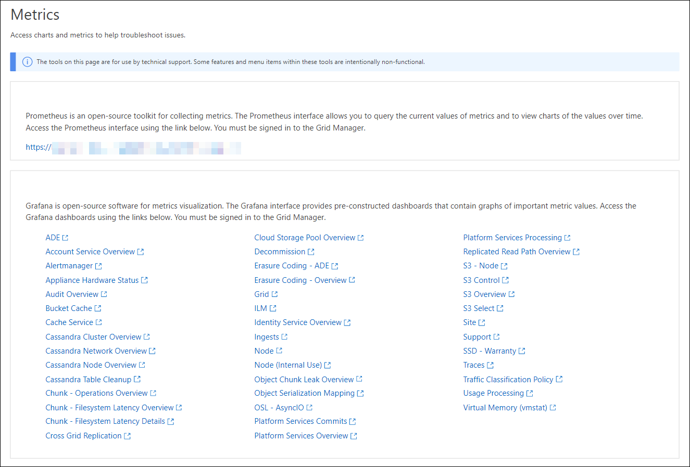

= 檢視支援指標
:allow-uri-read: 
:icons: font
:imagesdir: ../media/

[role="lead"]
疑難排解問題時、您可以與技術支援部門合作、檢閱StorageGRID 有關您的整套系統的詳細指標和圖表。

.開始之前
* 您必須使用登入 Grid Manager link:../admin/web-browser-requirements.html["支援的網頁瀏覽器"]。
* 您有 link:../admin/admin-group-permissions.html["特定存取權限"]。

.關於這項工作
「指標」頁面可讓您存取Prometheus和Grafana使用者介面。Prometheus是開放原始碼軟體、可用來收集指標。Grafana是開放原始碼軟體、可用於指標視覺化。

NOTE: 「指標」頁面上提供的工具僅供技術支援使用。這些工具中的某些功能和功能表項目會刻意無法運作、而且可能會有所變更。請參閱清單link:commonly-used-prometheus-metrics.html["常用的Prometheus指標"]。

.步驟
. 依照技術支援的指示，選擇 *支援* > *工具* > *指標*。
+
此處顯示「指標」頁面的範例：

+

. 若要查詢StorageGRID 目前的各項指標值、並檢視一段時間內的值圖表、請按一下「Prometheus」區段中的連結。
+
隨即顯示Prometheus介面。您可以使用此介面來執行有關可用StorageGRID 的版本資訊指標的查詢、StorageGRID 並在一段時間內繪製各種版本的資訊。

+

NOTE: 名稱中包含_Private的指標僅供內部使用、StorageGRID 可能會在不另行通知的情況下於各個版本之間變更。

. 若要存取預先建構的儀表板、其中包含StorageGRID 一段時間內的各種指標圖表、請按一下Grafana區段中的連結。
+
此時會出現所選連結的Grafana介面。

+
image::../media/metrics_page_grafana.png[度量頁面Grafana]

