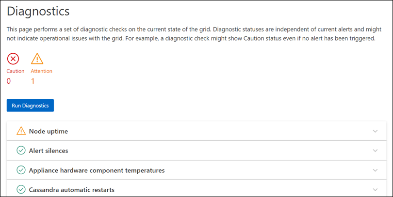
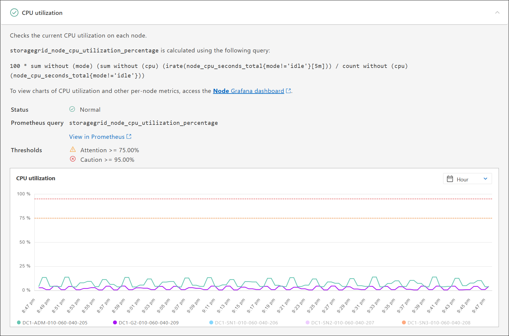

= 執行診斷
:allow-uri-read: 
:icons: font
:imagesdir: ../media/

[role="lead"]
疑難排解問題時、您可以與技術支援部門合作、在StorageGRID 您的故障排除系統上執行診斷、並檢閱結果。

* link:reviewing-support-metrics.html["檢視支援指標"]
* link:commonly-used-prometheus-metrics.html["常用的Prometheus指標"]

.開始之前
* 您已使用登入 Grid Manager link:../admin/web-browser-requirements.html["支援的網頁瀏覽器"]。
* 您有 link:../admin/admin-group-permissions.html["特定存取權限"]。

.關於這項工作
「診斷」頁面會針對網格的目前狀態執行一組診斷檢查。每項診斷檢查都有三種狀態之一：

* image:../media/icon_alert_green_checkmark.png["圖示警示綠色核取記號"]* 正常 * ：所有值都在正常範圍內。
* image:../media/icon_alert_yellow_minor.png["圖示警示黃色次要"]* 注意 * ：一個或多個值超出正常範圍。
* * 注意 * ：一個或多個值明顯超出正常範圍。

診斷狀態與目前警示無關、可能無法指出網格的作業問題。例如、即使未觸發警示、診斷檢查仍可能顯示「警示」狀態。

.步驟
. 選擇*支援*>*工具*>*診斷*。
+
「診斷」頁面隨即出現、並列出每項診斷檢查的結果。結果依嚴重性排序（注意、注意、然後正常）。在每個嚴重性範圍內、結果會依字母順序排序。

+
在此範例中，一個診斷狀態為「注意」，三個診斷狀態為「正常」。

+

. 若要深入瞭解特定診斷、請按一下列中的任何位置。
+
將顯示診斷及其目前結果的詳細資料。下列為詳細資料：

+
** *狀態*：此診斷的目前狀態：正常、注意或注意。
** * Prometheus query*：如果用於診斷、則用於產生狀態值的Prometheus運算式。（並非所有診斷都使用Prometheus運算式。）
** *臨界值*：如果可用於診斷、則每個異常診斷狀態的系統定義臨界值。（臨界值並非用於所有診斷。）
+

NOTE: 您無法變更這些臨界值。

** * 狀態值 * ：顯示整個 StorageGRID 系統之診斷狀態和值的圖表（表格未顯示在螢幕擷取畫面中）。在此範例StorageGRID 中、會顯示目前的CPU使用率、供整個系統的每個節點使用。所有節點值均低於注意和注意臨界值、因此診斷的整體狀態為正常。
+

. * 選用 * ：若要查看與此診斷相關的 Grafana 圖表，請選取 * Grafana Dashboard * 。
+
並非所有診斷都會顯示此連結。

+
此時會出現相關的Grafana儀表板。在此範例中，「節點」儀表板會顯示此節點的 CPU 使用率，以及節點的其他 Grafana 圖表。

+

NOTE: 您也可以從*支援*>*工具*>*指標*頁面的Grafana區段存取預先建置的Grafana儀表板。

+
image::../media/grafana_dashboard_nodes.png[Grafana儀表板節點]

. *選用*：若要查看Prometheus運算式一段時間的圖表、請按一下*在Prometheus*中檢視。
+
隨即顯示診斷所使用之運算式的Prometheus圖表。

+
image::../media/support_diagnostics_prometheus_png.png[支援診斷Prometheus頁面]

