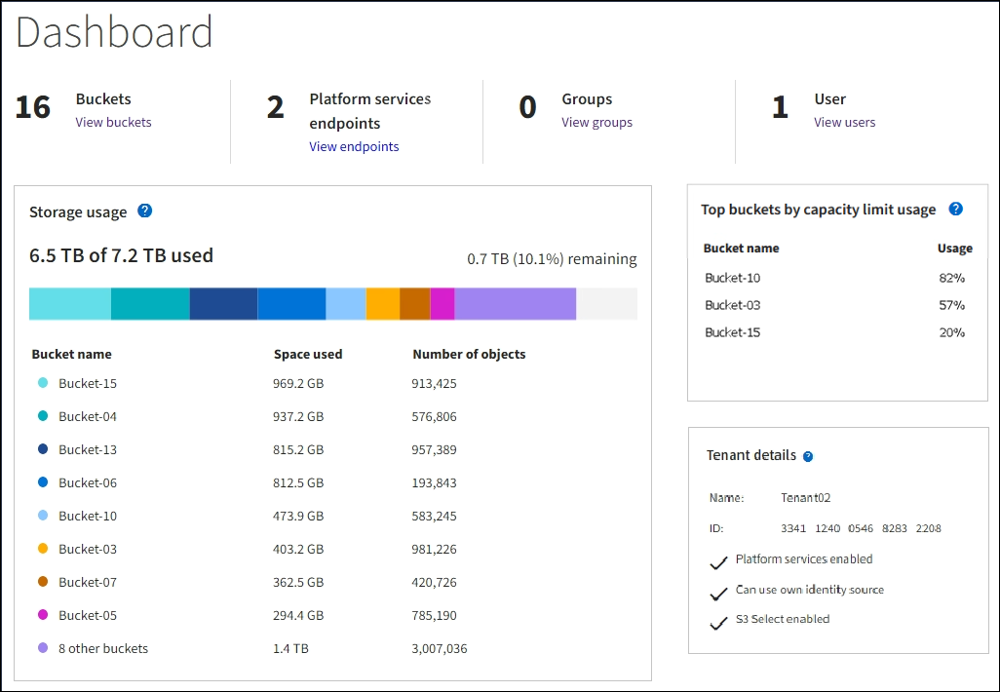

= 使用圖表
:allow-uri-read: 
:icons: font
:imagesdir: ../media/

[role="lead"]
您可以使用圖表和報告來監控StorageGRID 整個系統的狀態、並疑難排解問題。

NOTE: Grid Manager 會隨每個版本一起更新、可能與此頁面上的範例螢幕擷取畫面不符。

== 圖表類型

圖表摘要說明特定StorageGRID 的功能性指標和屬性的價值。

Grid Manager 儀表板包含摘要說明網格和每個網站可用儲存空間的卡片。

image::../media/dashboard_data_and_metadata_space_usage_breakdown.png[儀表板資料和中繼資料空間使用量明細]

租戶管理器儀表板上的「儲存使用」面板會顯示下列內容：

* 租戶最大的貯體（S3）或容器（Swift）清單
* 代表最大桶或容器之相對大小的長條圖
* 已用空間總量、如果已設定配額、則會顯示剩餘空間的數量和百分比

此外、StorageGRID 可從節點頁面和*支援*>*工具*>*網格拓撲*頁面、取得顯示隨著時間而改變的各項指標和屬性圖表。

圖形有四種類型：

* * Grafana圖表*：如節點頁面所示、Grafana圖表可用來繪製Prometheus測量數據的值。例如、「儲存節點」的*節點*>*網路*索引標籤包含網路流量的Grafana圖表。
+
image::../media/nodes_page_network_tab.png[「節點」頁面「網路」標籤]

+

NOTE: Grafana圖表也包含在預先建置的儀表板上、您可從*支援*>*工具*>*指標*頁面取得。

* * 折線圖 * ：可從「節點」頁面和「 * 支援 * 」 > 「工具 * 」 > 「 * 網格拓撲 * 」頁面（資料值之後選取圖表圖示）取得、折線圖可image:../media/icon_chart_new_for_11_5.png["圖示圖表（新增）"]用來繪製具有單位值的 StorageGRID 屬性值（例如 NTP 頻率偏移、以百萬分之單位計）。隨著時間推移、數值的變更會以一般資料時間間隔（資料箱）來繪製。
+
image::../media/line_graph.gif[折線圖]

* * 區域圖形 * ：可從「節點」頁面和「 * 支援 * 」 > 「工具 * 」 > 「 * 格網拓撲 * 」頁面（資料值之後選取圖表圖示）取得、區域圖形可image:../media/icon_chart_new_for_11_5.png["圖示圖表（新增）"]用來繪製體積屬性數量、例如物件數或服務負載值。區域圖類似於線圖、但在線下方會加上淺褐色陰影。隨著時間推移、數值的變更會以一般資料時間間隔（資料箱）來繪製。
+
image::../media/area_graph.gif[區域圖]

* 有些圖表會以不同類型的圖表圖示表示image:../media/icon_chart_new_for_11_5.png["圖表圖示"]、格式也不同：
+
image::../media/charts_lost_object_detected.png[偵測到圖表遺失物件]

* * 狀態圖形 * ：可從 * 支援 * > * 工具 * > * 網格拓撲 * 頁面取得（在資料值之後選取圖表圖示）、狀態圖形可image:../media/icon_chart_new_for_11_5.png["圖示圖表（新增）"]用來繪製代表不同狀態的屬性值、例如可以是線上、待命或離線的服務狀態。狀態圖表類似於線圖、但轉換是不連續的；也就是值會從一個狀態值跳到另一個狀態值。
+
image::../media/state_graph.gif[狀態圖表]

.相關資訊
* link:viewing-nodes-page.html["檢視「節點」頁面"]
* link:viewing-grid-topology-tree.html["檢視Grid拓撲樹狀結構"]
* link:reviewing-support-metrics.html["檢視支援指標"]

== 圖表圖例

用來繪製圖表的線條和色彩具有特定意義。

[cols="1a,3a"]
|===
| 範例 | 意義 

 a| 
image:../media/dark_green_chart_line.gif["顯示深綠色線的快照"]
 a| 
報告的屬性值會使用深綠色線來繪製。

 a| 
image:../media/light_green_chart_line.gif["顯示陰影的快照、表示資料正在抽稀"]
 a| 
暗綠色線條周圍的淺綠色陰影表示該時間範圍內的實際值會有所不同、並已「拼出」以加快繪圖速度。黑線代表加權平均值。淡綠色範圍代表出紙槽內的最大值和最小值。淺褐色陰影用於區域圖形、以指出體積資料。

 a| 
image:../media/no_data_plotted_chart.gif["顯示繪圖線上空白區域的快照"]
 a| 
空白區域（未繪製資料）表示屬性值無法使用。背景可以是藍色、灰色或灰色與藍色的混合、視報告屬性的服務狀態而定。

 a| 
image:../media/light_blue_chart_shading.gif["螢幕擷取畫面顯示淺藍色陰影、表示值不確定"]
 a| 
淺藍色陰影表示當時的部分或全部屬性值尚未確定、因為服務處於未知狀態、所以屬性並未報告值。

 a| 
image:../media/gray_chart_shading.gif["螢幕擷取畫面顯示由於不明值而產生的灰色陰影"]
 a| 
灰色陰影表示當時的部分或全部屬性值並不知道、因為報告屬性的服務是以管理方式關閉。

 a| 
image:../media/gray_blue_chart_shading.gif["顯示混合不確定值和未知值的螢幕快照"]
 a| 
灰色與藍色陰影的混合表示當時的部分屬性值未確定（因為服務處於未知狀態）、而其他屬性值則不知道、因為報告屬性的服務因管理性關機而關閉。

|===

== 顯示圖表

節點頁面包含您應定期存取的圖表和圖表、以監控儲存容量和處理量等屬性。在某些情況下、尤其是與技術支援合作時、您可以使用*支援*>*工具*>*網格拓撲*頁面來存取其他圖表。

.開始之前
您必須使用登入 Grid Manager link:../admin/web-browser-requirements.html["支援的網頁瀏覽器"]。

.步驟
. 選擇*節點*。然後選取節點、站台或整個網格。
. 選取您要檢視其資訊的索引標籤。
+
有些索引標籤包含一或多個Grafana圖表、可用來繪製Prometheus測量數據的值。例如、節點的*節點*>*硬體*索引標籤包含兩個Grafana圖表。

+
image::../media/nodes_page_hardware_tab_graphs.png[節點頁面硬體索引標籤圖表]

. 您也可以將游標放在圖表上、以查看特定時間點的更詳細值。
+
image::../media/nodes_page_memory_usage_details.png[節點頁面記憶體使用量詳細資料]

. 視需要、您通常可以顯示特定屬性或度量的圖表。從「節點」頁面的表格中、選取屬性名稱右側的圖表圖示image:../media/icon_chart_new_for_11_5.png["圖表圖示"]。
+

NOTE: 並非所有指標和屬性都有圖表。

+
* 範例 1* ：從儲存節點的「物件」索引標籤、您可以選取圖表圖示image:../media/icon_chart_new_for_11_5.png["圖表圖示"]、查看儲存節點的中繼資料儲存查詢總數。

+
image::../media/nodes_page_objects_successful_metadata_queries.png[成功的中繼資料查詢]

+
image::../media/nodes_page-objects_chart_successful_metadata_queries.png[記錄成功的中繼資料查詢]

+
* 範例 2 * ：從儲存節點的「物件」索引標籤中、您可以選取圖表圖示image:../media/icon_chart_new_for_11_5.png["圖表圖示"]、以查看一段時間內偵測到的遺失物件數之 Grafana 圖形。

+
image::../media/object_count_table.png[物件計數表]

+
image::../media/charts_lost_object_detected.png[偵測到圖表遺失物件]

. 若要顯示「節點」頁面上未顯示的屬性圖表、請選取 * 支援 * > * 工具 * > * 網格拓撲 * 。
. 選擇*網格節點_*>*元件或服務_*>*總覽*>*主要*。
+
image::../media/nms_chart.gif[周邊文字所述的螢幕擷取畫面]

. 選取屬性旁邊的圖表圖示image:../media/icon_chart_new_for_11_5.png["圖表圖示"]。
+
顯示畫面會自動變更為「*報告*>*圖表*」頁面。圖表會顯示屬性過去一天的資料。

== 產生圖表

圖表會以圖形方式顯示屬性資料值。您可以報告資料中心站台、網格節點、元件或服務。

.開始之前
* 您必須使用登入 Grid Manager link:../admin/web-browser-requirements.html["支援的網頁瀏覽器"]。
* 您有 link:../admin/admin-group-permissions.html["特定存取權限"]。

.步驟
. 選取*支援*>*工具*>*網格拓撲*。
. 選擇*網格節點_*>*元件或服務_*>*報告*>*圖表*。
. 從「*屬性*」下拉式清單中選取要報告的屬性。
. 若要強制 Y 軸從零開始、請清除 * 垂直縮放 * 核取方塊。
. 若要完全精確顯示值、請選取 * 原始資料 * 核取方塊、或是將值四捨五入至最多三位小數位數（例如、將屬性報告為百分比）、請清除 * 原始資料 * 核取方塊。
. 從「*快速查詢*」下拉式清單中選取要報告的時段。
+
選取「自訂查詢」選項以選取特定時間範圍。

+
圖表會在幾分鐘後出現。請等待數分鐘、以製作長時間範圍的表格。

. 如果您選取「自訂查詢」、請輸入*開始日期*和*結束日期*來自訂圖表的時間段。
+
請使用本機時間格式 `_YYYY/MM/DDHH:MM:SS_`。必須輸入前置零以符合格式。例如、 202017 年 4 月 6 日 7 ： 30 ： 00 驗證失敗。正確格式為： 202017 年 4 月 06 日 07:30 。

. 選擇*更新*。
+
數秒後便會產生圖表。請等待數分鐘、以製作長時間範圍的表格。根據查詢設定的時間長度、會顯示原始文字報告或彙總文字報告。

