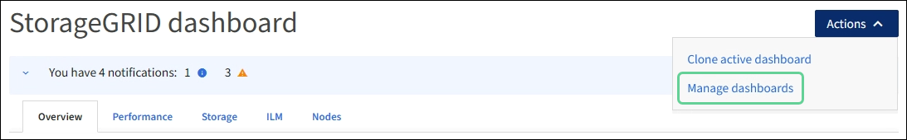

= 檢視及管理儀表板
:allow-uri-read: 
:icons: font
:imagesdir: ../media/

[role="lead"]
您可以使用儀表板一眼就能監控系統活動。您可以建立自訂儀表板來監控 StorageGRID 的實作。

TIP: 若要變更 Grid Manager 中顯示的儲存值單位、請選取 Grid Manager 右上角的使用者下拉式選單、然後選取 * 使用者偏好 * 。

您的儀表板可能會因系統組態而異。

image::../media/grid_manager_dashboard.png[Grid Manager儀表板]

== 檢視儀表板

儀表板由包含 StorageGRID 系統特定資訊的索引標籤所組成。每個索引標籤都包含顯示在卡片上的資訊類別。

您可以使用系統提供的儀表板。此外、您也可以建立自訂儀表板、只包含與監控 StorageGRID 實作相關的標籤和卡片。

系統提供的儀表板索引標籤包含下列資訊類型的卡片：

[cols="1a,3a"]
|===
| 系統所提供儀表板上的索引標籤 | 包含 

 a| 
總覽
 a| 
網格的一般資訊、例如作用中警示、空間使用量、以及網格中的物件總數。

 a| 
效能
 a| 
空間使用量、長期使用的儲存設備、 S3 作業、要求持續時間、錯誤率。

 a| 
儲存設備
 a| 
租戶配額使用量和邏輯空間使用量。預測使用者資料和中繼資料的空間使用量。

 a| 
ILM
 a| 
資訊生命週期管理佇列與評估率。

 a| 
節點
 a| 
CPU 、資料和記憶體使用量、依節點而定。S3 依節點執行作業。節點對站台發佈。

|===
有些卡片可以最大化、以便檢視。選取卡片右上角的最大化圖示image:../media/icon_dashboard_card_maximize.png["最大化圖示"]。若要關閉最大化的卡片、請選取最小化圖示image:../media/icon_dashboard_card_minimize.png["最小化圖示"]或選取 * 關閉 * 。

== 管理儀表板

如果您擁有 root 存取權（請參閱link:../admin/admin-group-permissions.html["管理群組權限"]）、您可以針對儀表板執行下列管理工作：

* 從頭建立自訂儀表板。您可以使用自訂儀表板來控制要顯示哪些 StorageGRID 資訊、以及該資訊的組織方式。
* 複製儀表板以建立自訂儀表板。
* 設定使用者的作用中儀表板。作用中儀表板可以是系統提供的儀表板或自訂儀表板。
* 設定預設儀表板、這是所有使用者除非啟動自己的儀表板、否則會看到的內容。
* 編輯儀表板名稱。
* 編輯儀表板以新增或移除索引標籤和卡片。您可以有至少 1 個索引標籤、最多 20 個索引標籤。
* 移除儀表板。

NOTE: 如果您除了「根目錄」存取權限之外、還擁有其他任何權限、則只能設定作用中的儀表板。

若要管理儀表板、請選取 * 動作 * > * 管理儀表板 * 。

== 設定儀表板

若要透過複製作用中儀表板來建立新的儀表板、請選取 * 動作 * > * 複製作用中儀表板 * 。

若要編輯或複製現有的儀表板、請選取 * 動作 * > * 管理儀表板 * 。

NOTE: 系統提供的儀表板無法編輯或移除。

設定儀表板時、您可以：

* 新增或移除索引標籤
* 重新命名索引標籤、並為新的索引標籤命名唯一的名稱
* 為每個索引標籤新增、移除或重新排列（拖曳）卡片
* 選取卡片頂端的 * S* 、 * M* 、 * L* 或 * XL* 、以選取個別卡片的大小

image::../media/dashboard_configure.png[設定儀表板]
