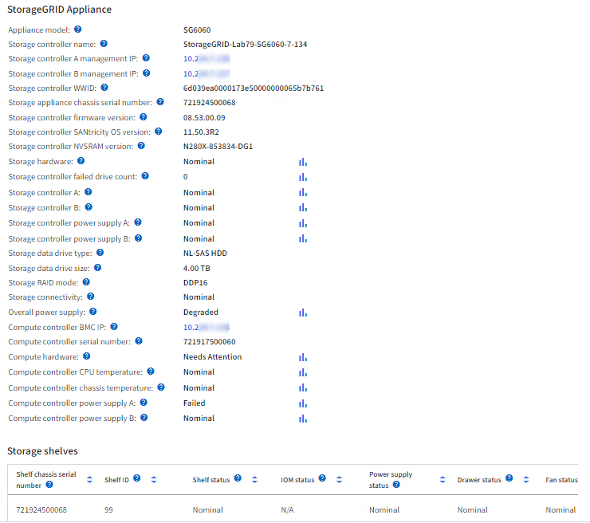

= 檢視硬體索引標籤
:allow-uri-read: 
:icons: font
:imagesdir: ../media/

[role="lead"]
「硬體」索引標籤會顯示每個節點的CPU使用率和記憶體使用量、以及裝置的其他硬體資訊。

NOTE: Grid Manager 會隨每個版本一起更新、可能與此頁面上的範例螢幕擷取畫面不符。

顯示所有節點的Hardware（硬體）索引標籤。

image::../media/nodes_page_hardware_tab_graphs.png[節點頁面硬體索引標籤]

若要顯示不同的時間間隔、請選取圖表或圖表上方的其中一個控制項。您可以顯示1小時、1天、1週或1個月的可用時間間隔資訊。您也可以設定自訂時間間隔、以便指定日期和時間範圍。

若要查看 CPU 使用率和記憶體使用率的詳細資料、請將游標放在每個圖表上。

image::../media/nodes_page_memory_usage_details.png[節點頁面>硬體>記憶體使用量詳細資料]

如果節點是應用裝置節點、此索引標籤也會包含一節、其中包含應用裝置硬體的詳細資訊。

== 檢視應用裝置儲存節點的相關資訊

「節點」頁面會列出每個應用裝置儲存節點的服務健全狀況及所有運算、磁碟設備和網路資源相關資訊。您也可以看到記憶體、儲存硬體、控制器韌體版本、網路資源、網路介面、 網路位址、以及接收和傳輸資料。

.步驟
. 從「節點」頁面、選取應用裝置儲存節點。
. 選擇*總覽*。
+
「概觀」索引標籤的「節點資訊」區段會顯示節點的摘要資訊、例如節點的名稱、類型、ID和連線狀態。IP位址清單包含每個位址的介面名稱、如下所示：

+
** * eth*：網格網路、管理網路或用戶端網路。
** * hic*：設備上的實體10、25或100 GbE連接埠之一。這些連接埠可連結在一起、並連接StorageGRID 至「資訊網」（eth0）和「用戶端網路」（eth2）。
** * MTC*：設備上實體1 GbE連接埠之一。一個或多個MTC介面會連結、形成StorageGRID 「支援支援者支援者網路介面」（eth1）。您可以保留其他MTC介面、讓資料中心的技術人員暫時在本機連線。
+
image::../media/nodes_page_overview_tab_extended.png[節點頁面總覽已擴充]

+
「概觀」索引標籤的「警示」區段會顯示節點的任何作用中警示。

. 選取*硬體*以查看有關應用裝置的詳細資訊。
+
.. 檢視CPU使用率和記憶體圖表、以判斷CPU和記憶體使用率的百分比。若要顯示不同的時間間隔、請選取圖表或圖表上方的其中一個控制項。您可以顯示1小時、1天、1週或1個月的可用時間間隔資訊。您也可以設定自訂時間間隔、以便指定日期和時間範圍。
+
image::../media/nodes_page_hardware_tab_graphs.png[硬體圖表]

.. 向下捲動以檢視應用裝置的元件表。此表包含應用裝置的機型名稱、控制器名稱、序號和IP位址、以及每個元件的狀態等資訊。
+

NOTE: 某些欄位（例如運算控制器BMC IP和運算硬體）僅會針對具有該功能的應用裝置顯示。

+
儲存櫃和擴充櫃的元件（如果是安裝的一部分）會顯示在應用裝置表格下方的獨立表格中。

+

+
[cols="1a,2a"]
|===
| 欄位 | 說明 

 a| 
應用裝置機型
 a| 
此 StorageGRID 應用裝置的型號如 SANtricity OS 所示。

 a| 
儲存控制器名稱
 a| 
SANtricity OS 中顯示的此 StorageGRID 應用裝置名稱。

 a| 
儲存控制器A管理IP
 a| 
儲存控制器 A 上管理連接埠 1 的 IP 位址。您可以使用此 IP 來存取 SANtricity OS 來疑難排解儲存問題。

 a| 
儲存控制器B管理IP
 a| 
儲存控制器 B 上管理連接埠 1 的 IP 位址。您可以使用此 IP 來存取 SANtricity OS 來疑難排解儲存問題。

部分應用裝置機型沒有儲存控制器 B

 a| 
儲存控制器WWID
 a| 
SANtricity OS 中顯示的儲存控制器全球識別碼。

 a| 
儲存應用裝置機箱序號
 a| 
應用裝置的機箱序號。

 a| 
儲存控制器韌體版本
 a| 
此應用裝置儲存控制器上的韌體版本。

 a| 
儲存控制器 SANtricity OS 版本
 a| 
儲存控制器 A 的 SANtricity OS 版本

 a| 
儲存控制器 NVSRAM 版本
 a| 
SANtricity 系統管理員報告的儲存控制器 NVSRAM 版本。

對於 SG6060 和 SG6160 、如果兩個控制器之間的 NVSRAM 版本不相符、則會顯示控制器 A 的版本。如果控制器 A 未安裝或無法運作、則會顯示控制器 B 的版本。

 a| 
儲存硬體
 a| 
儲存控制器硬體的整體狀態。如果「系統管理程式」報告儲存硬體的需求注意狀態、則該系統也會報告此值。SANtricity StorageGRID

如果狀態為「需要注意」、請先使用 SANtricity OS 檢查儲存控制器。然後、請確定不存在其他適用於運算控制器的警示。

 a| 
儲存控制器故障磁碟機數
 a| 
不是最佳的磁碟機數量。

 a| 
儲存控制器A
 a| 
儲存控制器A的狀態

 a| 
儲存控制器B
 a| 
儲存控制器 B 的狀態。部分應用裝置機型沒有儲存控制器 B

 a| 
儲存控制器電源供應器A
 a| 
儲存控制器的電源供應器A狀態。

 a| 
儲存控制器電源供應器B
 a| 
儲存控制器的電源供應器B狀態。

 a| 
儲存資料磁碟機類型
 a| 
應用裝置中的磁碟機類型、例如 HDD （硬碟）或 SSD （固態硬碟）。

 a| 
儲存資料磁碟機大小
 a| 
一個資料磁碟機的有效大小。

SG6160 也會顯示快取磁碟機的大小。

* 附註 * ：對於有擴充機櫃的節點、請改用<<shelf_data_drive_size,每個機櫃的資料磁碟機大小>>。有效磁碟機大小可能因機櫃而異。

 a| 
儲存RAID模式
 a| 
為應用裝置設定的RAID模式。

 a| 
儲存連線能力
 a| 
儲存連線狀態。

 a| 
整體電源供應器
 a| 
產品所有電源供應器的狀態。

 a| 
運算控制器BMC IP
 a| 
運算控制器中基礎板管理控制器（BMC）連接埠的IP位址。您可以使用此IP連線至BMC介面、以監控及診斷應用裝置硬體。

對於不含 BMC 的應用裝置機型、不會顯示此欄位。

 a| 
運算控制器序號
 a| 
運算控制器的序號。

 a| 
運算硬體
 a| 
運算控制器硬體的狀態。如果應用裝置機型沒有獨立的運算硬體和儲存硬體、則不會顯示此欄位。

 a| 
運算控制器CPU溫度
 a| 
運算控制器CPU的溫度狀態。

 a| 
運算控制器機箱溫度
 a| 
運算控制器的溫度狀態。

|===
+
[cols="1a,2a"]
|===
| 儲存櫃表格中的欄 | 說明 

 a| 
機櫃機箱序號
 a| 
儲存櫃機箱的序號。

 a| 
機櫃ID
 a| 
儲存櫃的數字識別碼。

*** 99：儲存控制器機櫃
*** 0：第一個擴充櫃
*** 1：第二個擴充櫃

* 附註： * 擴充機櫃僅適用於 SG6060 和 SG6160 。

 a| 
機櫃狀態
 a| 
儲存櫃的整體狀態。

 a| 
IOM 狀態
 a| 
任何擴充櫃中的輸入/輸出模組（IOM）狀態。不適用（如果不是擴充櫃）。

 a| 
電源供應器狀態
 a| 
儲存櫃電源供應器的整體狀態。

 a| 
藥櫃狀態
 a| 
儲存櫃中的藥櫃狀態。不適用如果機櫃不含藥櫃。

 a| 
風扇狀態
 a| 
儲存櫃中冷卻風扇的整體狀態。

 a| 
磁碟機插槽
 a| 
儲存櫃中的磁碟機插槽總數。

 a| 
資料磁碟機
 a| 
儲存櫃中用於資料儲存的磁碟機數量。

 a| 
[[shel_data_drive_Size]]資料磁碟機大小
 a| 
儲存櫃中一個資料磁碟機的有效大小。

 a| 
快取磁碟機
 a| 
儲存櫃中用於快取的磁碟機數量。

 a| 
快取磁碟機大小
 a| 
儲存櫃中最小快取磁碟機的大小。一般而言、快取磁碟機的大小都相同。

 a| 
組態狀態
 a| 
儲存櫃的組態狀態。

|===
.. 確認所有狀態均為「標稱」。
+
如果狀態不是「標稱」、請檢閱任何目前的警示。您也可以使用SANtricity 「功能變數系統管理程式」來深入瞭解這些硬體價值。請參閱安裝與維護應用裝置的說明。

. 選取*網路*以檢視每個網路的資訊。
+
網路流量圖表提供整體網路流量的摘要。

+
image::../media/nodes_page_network_traffic_graph.png[節點頁面網路流量圖]

+
.. 請參閱「網路介面」一節。
+
image::../media/nodes_page_network_interfaces.png[節點頁面網路介面]

+
下表與「網路介面」表格中* Speed*欄位的值一起使用、以判斷應用裝置上的10/25-GbE網路連接埠是否設定為使用主動/備份模式或LACP模式。

+

NOTE: 表中顯示的值假設使用了全部四個連結。

+
[cols="1a,1a,1a,1a"]
|===
| 連結模式 | 債券模式 | 個別HIC連結速度（hic1、hic2、hic3、hic4） | 預期網格/用戶端網路速度（eth0、eth2） 

 a| 
Aggregate
 a| 
LACP
 a| 
25
 a| 
100

 a| 
固定
 a| 
LACP
 a| 
25
 a| 
50

 a| 
固定
 a| 
使用中/備份
 a| 
25
 a| 
25

 a| 
Aggregate
 a| 
LACP
 a| 
10
 a| 
40

 a| 
固定
 a| 
LACP
 a| 
10
 a| 
20

 a| 
固定
 a| 
使用中/備份
 a| 
10
 a| 
10

|===
+
如需設定 10/25-GbE 連接埠的詳細資訊、請參閱 https://docs.netapp.com/us-en/storagegrid-appliances/installconfig/configuring-network-links.html["設定網路連結"^]。

.. 請參閱「網路通訊」一節。
+
「接收和傳輸」表格顯示已在每個網路上接收和傳送多少位元組和封包、以及其他接收和傳輸度量。

+
image::../media/nodes_page_network_communication.png[節點頁面網路通訊]

. 選取「*儲存設備*」可檢視圖表、以顯示物件資料和物件中繼資料隨時間使用的儲存設備百分比、以及磁碟裝置、磁碟區和物件存放區的相關資訊。
+
image::../media/nodes_page_storage_used_object_data.png[使用的儲存設備-物件資料]

+
image::../media/storage_used_object_metadata.png[使用的儲存設備-物件中繼資料]

+
.. 向下捲動以檢視每個Volume和物件存放區的可用儲存容量。
+
每個磁碟的全球名稱都符合在 SANtricity OS 中檢視標準 Volume 內容（連接至應用裝置儲存控制器的管理軟體）時所顯示的全域 Volume 識別碼（ WWID ）。

+
為了協助您解讀磁碟讀取及寫入與磁碟區掛載點相關的統計資料、「磁碟裝置」表格*名稱*欄（即_sdc_、_sdd_、_sde_等）中顯示的名稱第一部分、會與「磁碟區」表格*「裝置*」欄中顯示的值相符。

+
image::../media/nodes_page_storage_tables.png[節點頁面儲存表格]

== 檢視應用裝置管理節點和閘道節點的相關資訊

「節點」頁面會列出服務健全狀況的相關資訊、以及每個作為管理節點或閘道節點之服務應用裝置的所有運算、磁碟裝置和網路資源。您也可以看到記憶體、儲存硬體、網路資源、網路介面、網路位址、 以及接收和傳輸資料。

.步驟
. 從「節點」頁面、選取應用裝置管理節點或應用裝置閘道節點。
. 選擇*總覽*。
+
「概觀」索引標籤的「節點資訊」區段會顯示節點的摘要資訊、例如節點的名稱、類型、ID和連線狀態。IP位址清單包含每個位址的介面名稱、如下所示：

+
** * adllb*和* adlli*：顯示管理網路介面是否使用主動/備份連結
** * eth*：網格網路、管理網路或用戶端網路。
** * hic*：設備上的實體10、25或100 GbE連接埠之一。這些連接埠可連結在一起、並連接StorageGRID 至「資訊網」（eth0）和「用戶端網路」（eth2）。
** * MTC*：應用裝置上的實體1-GbE連接埠之一。一個或多個MTC介面已繫結、以形成管理網路介面（eth1）。您可以保留其他MTC介面、讓資料中心的技術人員暫時在本機連線。
+
image::../media/nodes_page_overview_tab_services_appliance.png[服務應用裝置的「節點」頁面「總覽」索引標籤]

+
「概觀」索引標籤的「警示」區段會顯示節點的任何作用中警示。

. 選取*硬體*以查看有關應用裝置的詳細資訊。
+
.. 檢視CPU使用率和記憶體圖表、以判斷CPU和記憶體使用率的百分比。若要顯示不同的時間間隔、請選取圖表或圖表上方的其中一個控制項。您可以顯示1小時、1天、1週或1個月的可用時間間隔資訊。您也可以設定自訂時間間隔、以便指定日期和時間範圍。
+
image::../media/nodes_page_hardware_tab_graphs_services_appliance.png[節點頁面服務應用裝置的硬體索引標籤圖表]

.. 向下捲動以檢視應用裝置的元件表。此表包含機型名稱、序號、控制器韌體版本、以及每個元件的狀態等資訊。
+
image::../media/nodes_page_hardware_tab_services_appliance.png[服務應用裝置的「節點」頁面「硬體」索引標籤]

+
[cols="1a,2a"]
|===
| 欄位 | 說明 

 a| 
應用裝置機型
 a| 
此產品的型號StorageGRID 。

 a| 
儲存控制器故障磁碟機數
 a| 
不是最佳的磁碟機數量。

 a| 
儲存資料磁碟機類型
 a| 
應用裝置中的磁碟機類型、例如 HDD （硬碟）或 SSD （固態硬碟）。

 a| 
儲存資料磁碟機大小
 a| 
一個資料磁碟機的有效大小。

 a| 
儲存RAID模式
 a| 
應用裝置的RAID模式。

 a| 
整體電源供應器
 a| 
產品中所有電源供應器的狀態。

 a| 
運算控制器BMC IP
 a| 
運算控制器中基礎板管理控制器（BMC）連接埠的IP位址。您可以使用此IP連線至BMC介面、以監控及診斷應用裝置硬體。

對於不含 BMC 的應用裝置機型、不會顯示此欄位。

 a| 
運算控制器序號
 a| 
運算控制器的序號。

 a| 
運算硬體
 a| 
運算控制器硬體的狀態。

 a| 
運算控制器CPU溫度
 a| 
運算控制器CPU的溫度狀態。

 a| 
運算控制器機箱溫度
 a| 
運算控制器的溫度狀態。

|===
.. 確認所有狀態均為「標稱」。
+
如果狀態不是「標稱」、請檢閱任何目前的警示。

. 選取*網路*以檢視每個網路的資訊。
+
網路流量圖表提供整體網路流量的摘要。

+
image::../media/nodes_page_network_traffic_graph.png[節點頁面網路流量圖]

+
.. 請參閱「網路介面」一節。
+
image::../media/nodes_page_hardware_tab_network_services_appliance.png[節點頁面硬體索引標籤Network Services Appliance]

+
下表與「網路介面」表格中* Speed*欄位的值一起使用、以判斷應用裝置上的四個40/100-GbE網路連接埠是否設定為使用主動/備份模式或LACP模式。

+

NOTE: 表中顯示的值假設使用了全部四個連結。

+
[cols="1a,1a,1a,1a"]
|===
| 連結模式 | 債券模式 | 個別HIC連結速度（hic1、hic2、hic3、hic4） | 預期網格/用戶端網路速度（eth0、eth2） 

 a| 
Aggregate
 a| 
LACP
 a| 
100
 a| 
400

 a| 
固定
 a| 
LACP
 a| 
100
 a| 
200

 a| 
固定
 a| 
使用中/備份
 a| 
100
 a| 
100

 a| 
Aggregate
 a| 
LACP
 a| 
40
 a| 
160

 a| 
固定
 a| 
LACP
 a| 
40
 a| 
80

 a| 
固定
 a| 
使用中/備份
 a| 
40
 a| 
40

|===
.. 請參閱「網路通訊」一節。
+
「接收和傳輸」表格顯示已在每個網路上接收和傳送多少位元組和封包、以及其他接收和傳輸度量。

+
image::../media/nodes_page_network_communication.png[節點頁面網路通訊]

. 選取* Storage *以檢視服務應用裝置上磁碟裝置和磁碟區的相關資訊。
+
image::../media/nodes_page_storage_tab_services_appliance.png[節點頁面儲存索引標籤服務設備]

