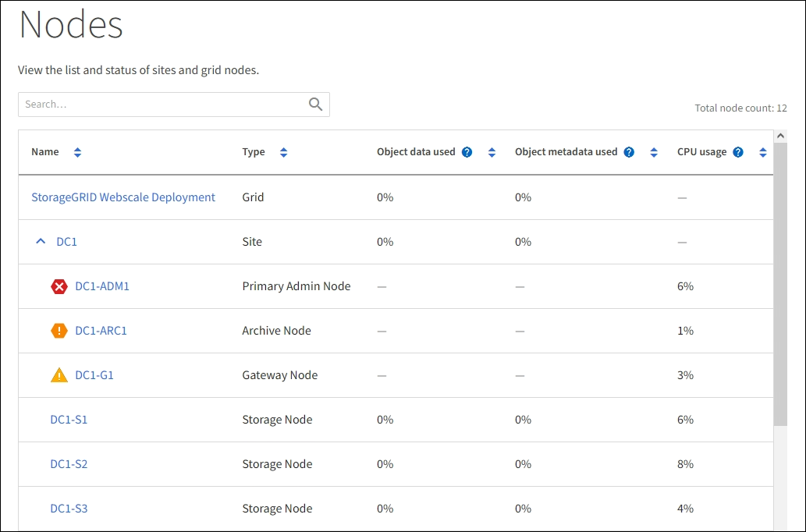

= 檢視「節點」頁面
:allow-uri-read: 
:icons: font
:imagesdir: ../media/

[role="lead"]
當您需要比儀表板更詳細的 StorageGRID 系統資訊時、可以使用「節點」頁面來檢視整個網格、網格中的每個站台、以及站台上的每個節點的度量。

「節點」表格會列出整個網格、每個站台及每個節點的摘要資訊。如果節點中斷連線或有作用中警示、節點名稱旁會出現圖示。如果節點已連線且沒有作用中的警示、則不會顯示任何圖示。

NOTE: 當節點未連線至網格時、例如在升級期間或中斷連線狀態時、某些度量可能無法使用或排除在站台和網格總計之外。節點重新連線至網格之後、請等待數分鐘、讓值穩定下來。

NOTE: 若要變更 Grid Manager 中顯示的儲存值單位、請選取 Grid Manager 右上角的使用者下拉式選單、然後選取 * 使用者偏好 * 。

NOTE: 所示的螢幕擷取畫面為範例。您的結果可能會因 StorageGRID 版本而異。

== 連線狀態圖示

如果節點與網格中斷連線、下列任一圖示會出現在節點名稱旁。

[cols="1a,3a,3a"]
|===
| 圖示 | 說明 | 需要採取行動 

 a| 
image:../media/icon_alarm_blue_unknown.png["藍色問號圖示"]
 a| 
*未連線-未知*

由於不明原因、節點中斷連線或節點上的服務意外停機。例如、節點上的服務可能會停止、或是節點因為停電或非預期的停電而失去網路連線。

也可能會觸發*無法與node*通訊警示。其他警示也可能處於作用中狀態。
 a| 
需要立即注意。link:monitoring-system-health.html#view-current-and-resolved-alerts["選取每個警示"]並遵循建議的行動。

例如、您可能需要重新啟動已停止或重新啟動節點主機的服務。

* 注意 * ：在託管關機作業期間、節點可能會顯示為「未知」。在這些情況下、您可以忽略「未知」狀態。

 a| 
image:../media/icon_alarm_gray_administratively_down.png["灰色問號圖示"]
 a| 
*未連線-管理性關機*

由於預期的原因、節點未連線至網格。

例如、節點或節點上的服務已正常關機、節點正在重新開機、或軟體正在升級。一個或多個警示也可能處於作用中狀態。

根據基礎問題、這些節點通常會在不需介入的情況下重新上線。
 a| 
判斷是否有任何警示影響此節點。

如果有一個或多個警示處於作用中link:monitoring-system-health.html#view-current-and-resolved-alerts["選取每個警示"]狀態、請遵循建議的動作。

|===
如果節點與網格中斷連線、可能會有基礎警示、但只會顯示「未連線」圖示。若要查看節點的作用中警示、請選取節點。

== 警示圖示

如果節點有作用中警示、節點名稱旁會出現下列其中一個圖示：

image:../media/icon_alert_red_critical.png["圖示警示紅色嚴重"]* 重大 * ：存在異常狀況、已停止 StorageGRID 節點或服務的正常作業。您必須立即解決基礎問題。如果問題仍未解決、可能會導致服務中斷和資料遺失。

image:../media/icon_alert_orange_major.png["圖示警示橘色主要"]* 重大 * ：存在異常狀況、影響目前作業或接近臨界警示的臨界值。您應調查重大警示並解決任何潛在問題、確保異常狀況不會停止StorageGRID 執行任何節點或服務的正常運作。

image:../media/icon_alert_yellow_minor.png["圖示警示黃色次要"]* 次要 * ：系統正常運作、但存在異常狀況、可能會影響系統在繼續運作時的運作能力。您應該監控並解決未自行清除的次要警示、以確保不會造成更嚴重的問題。

== 檢視系統、站台或節點的詳細資料

若要篩選「節點」表格中顯示的資訊、請在「 * 搜尋 * 」欄位中輸入搜尋字串。您可以依系統名稱、顯示名稱或類型進行搜尋（例如、輸入 * gat* 以快速找到所有閘道節點）。

若要檢視網格、站台或節點的資訊：

* 選取網格名稱、即可查看整個StorageGRID 作業系統統計資料的彙總摘要。
* 選取特定的資料中心站台、即可查看該站台所有節點統計資料的彙總摘要。
* 選取特定節點以檢視該節點的詳細資訊。

