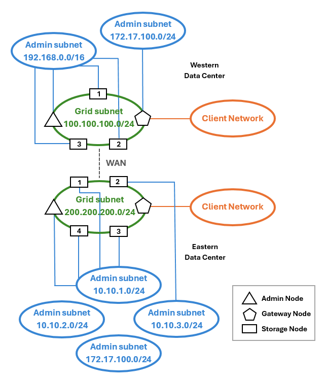

= 三個網路的拓撲
:allow-uri-read: 
:icons: font
:imagesdir: ../media/

[role="lead"]
您可以將這三個網路設定為一個網路拓撲、其中包含私有網格網路、限定站台專屬的管理網路和開放式用戶端網路。使用負載平衡器端點和不受信任的用戶端網路、可視需要提供額外的安全性。

在此範例中：

* Grid Network用於與內部物件管理作業相關的網路流量。
* 管理網路用於與管理功能相關的流量。
* 用戶端網路用於 S3 用戶端要求的相關流量。

* 拓撲範例：網格、管理和用戶端網路 *

