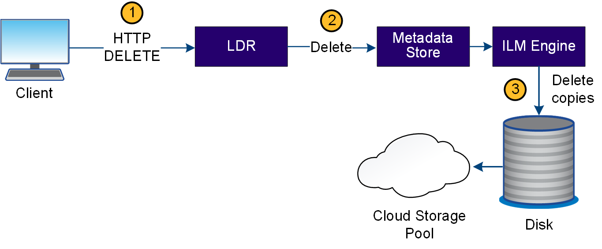
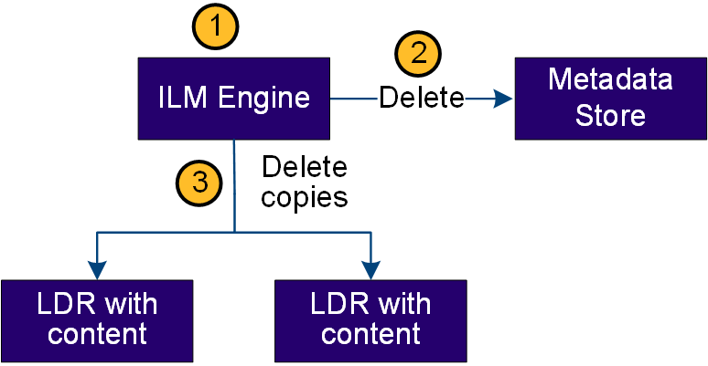

= 刪除資料流程
:allow-uri-read: 
:icons: font
:imagesdir: ../media/

[role="lead"]
當用戶端執行刪除作業或物件的壽命到期時、觸發自動移除時、所有物件複本都會從StorageGRID 該系統移除。已定義刪除物件的資料流程。

== 刪除階層架構

支援多種方法來控制何時保留或刪除物件。StorageGRID物件可以由用戶端要求刪除、也可以自動刪除。不只是用戶端刪除要求、而且S3物件鎖定設定的優先順序總是高於S3儲存區生命週期和ILM放置指示。StorageGRID

* * S3物件鎖定*：如果已啟用網格的全域S3物件鎖定設定、S3用戶端就能建立啟用S3物件鎖定的儲存區、然後使用S3 REST API為新增至該儲存區的每個物件版本指定保留直到日期和合法保留設定。
+
** 合法持有的物件版本無法由任何方法刪除。
** 在物件版本達到保留截止日期之前、任何方法都無法刪除該版本。
** 啟用 S3 物件鎖定的貯體中物件會由 ILM 「永遠」保留。不過、在達到保留截止日期之後、用戶端要求或儲存庫生命週期到期時、即可刪除物件版本。
** 如果 S3 用戶端將預設的保留日期套用至貯體、則不需要為每個物件指定保留日期。

* * 用戶端刪除要求 * ： S3 用戶端可以發出刪除物件要求。當用戶端刪除物件時、物件的所有複本都會從StorageGRID 作業系統中移除。
* * 刪除貯體中的物件 * ：租戶管理員使用者可以使用此選項、從 StorageGRID 系統中永久移除所選貯體中物件和物件版本的所有複本。
* * S3儲存區生命週期*：S3用戶端可將生命週期組態新增至其儲存區、以指定到期行動。如果儲存區生命週期存在、StorageGRID 除非用戶端先刪除物件、否則當符合到期行動中指定的日期或天數時、將自動刪除物件的所有複本。
* * ILM放置指示*：假設儲存區未啟用S3物件鎖定、且沒有儲存區生命週期、StorageGRID 則當ILM規則中的最後一個時間段結束、且未指定任何物件的進一步放置位置時、即可自動刪除物件。
+

NOTE: 當 S3 貯體生命週期設定完成時、生命週期到期動作會覆寫符合生命週期篩選器之物件的 ILM 原則。因此、即使放置物件的任何ILM指示失效、物件仍可能保留在網格上。

如需詳細資訊、請參閱 link:../ilm/how-objects-are-deleted.html["如何刪除物件"] 。

== 用戶端刪除的資料流

. LMR服務會從用戶端應用程式接收刪除要求。
. LDR服務會更新中繼資料存放區、使物件看起來會被用戶端要求刪除、並指示ILM引擎移除所有物件資料複本。
. 物件會從系統中移除。中繼資料儲存區會更新以移除物件中繼資料。

== ILM刪除的資料流

. ILM引擎會判斷物件需要刪除。
. ILM引擎會通知中繼資料存放區。中繼資料儲存區會更新物件中繼資料、使物件看起來會被刪除以供用戶端要求使用。
. ILM引擎會移除物件的所有複本。中繼資料儲存區會更新以移除物件中繼資料。

