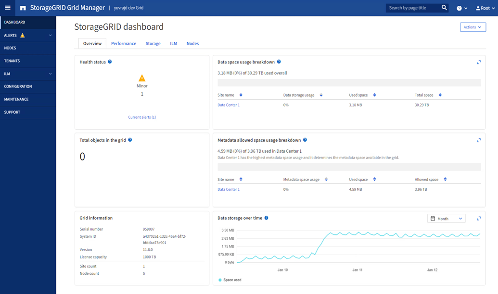

= 探索 StorageGRID Grid Manager
:allow-uri-read: 
:icons: font
:imagesdir: ../media/

[role="lead"]
Grid Manager是瀏覽器型的圖形介面、可讓您設定、管理StorageGRID 及監控您的作業系統。

NOTE: Grid Manager 會隨每個版本一起更新、可能與此頁面上的範例螢幕擷取畫面不符。

當您登入Grid Manager時、即連線至管理節點。每StorageGRID 個系統包含一個主要管理節點和任意數量的非主要管理節點。您可以連線至任何管理節點、每個管理節點都會顯示StorageGRID 類似的畫面、顯示有關該系統的資訊。

您可以使用存取 Grid Manager link:../admin/web-browser-requirements.html["支援的網頁瀏覽器"]。

== Grid Manager儀表板

第一次登入 Grid Manager 時、您可以使用儀表板link:../monitor/viewing-dashboard.html["監控系統活動"]一覽無遺。

儀表板包含有關系統健全狀況和效能、儲存使用、 ILM 程序、 S3 作業和網格中節點的資訊。您可以link:../monitor/viewing-dashboard.html["設定儀表板"]從內含有效監控系統所需資訊的卡片集合中進行選擇。

如需每張卡片所顯示資訊的說明、請選取該卡片的說明圖示image:../media/icon_nms_question.png["問號圖示"]。

== 搜尋欄位

標頭列中的*搜尋*欄位可讓您快速瀏覽至Grid Manager中的特定頁面。例如、您可以輸入 * km * 來存取金鑰管理伺服器（ KMS ）頁面。

您可以使用*搜尋*來尋找Grid Manager側邊列和組態、維護及支援功能表上的項目。您也可以依名稱搜尋網格節點和租戶帳戶等項目。

== 說明功能表

說明功能表image:../media/icon-help-menu-bar.png["功能表列上的說明圖示"]可讓您存取：

* 這link:../fabricpool/use-fabricpool-setup-wizard.html["FabricPool"]和link:../admin/use-s3-setup-wizard.html["S3 設定"]巫師
* 目前版本的StorageGRID文件站點
* link:../admin/using-grid-management-api.html["API 文件"]
* 關於目前安裝的 StorageGRID 版本的資訊

== 警示功能表

警示功能表提供易於使用的介面、可偵測、評估及解決StorageGRID 可能在執行過程中發生的問題。

從「警示」功能表、您可以執行下列link:../monitor/managing-alerts.html["管理警示"]動作：

* 檢閱目前的警示
* 檢閱已解決的警示
* 設定靜音以隱藏警示通知
* 針對觸發警示的條件定義警示規則
* 設定電子郵件伺服器以接收警示通知

== 節點頁面

這link:../monitor/viewing-nodes-page.html["節點頁面"]顯示有​​關整個網格、網格中每個站點以及站點上每個節點的資訊。若要查看特定站點或節點的信息，請選擇該站點或節點。

== 租戶頁面

link:../admin/managing-tenants.html["租戶頁面"]可讓您使用 link:../tenant/index.html["建立及監控儲存租戶帳戶"]StorageGRID 系統。您必須建立至少一個租戶帳戶、以指定誰可以儲存及擷取物件、以及哪些功能可供他們使用。

「租戶」頁面也會提供每個租戶的使用詳細資料、包括使用的儲存容量和物件數目。如果您在建立租戶時設定配額、就可以查看該配額的使用量。

== ILM功能表

link:using-information-lifecycle-management.html["ILM功能表"]可讓您link:../ilm/index.html["設定資訊生命週期管理（ ILM ）規則和原則"]管理資料的耐用度和可用度。您也可以輸入物件識別碼、以檢視該物件的中繼資料。

您可以從 ILM 功能表檢視及管理 ILM ：

* 規則
* 原則
* 原則標籤
* 儲存資源池
* 儲存等級
* 區域
* 物件中繼資料查詢

== 組態功能表

「組態」功能表可讓您指定網路設定、安全性設定、系統設定、監控選項及存取控制選項。

=== 網路工作

網路工作包括：

* link:../admin/managing-high-availability-groups.html["管理高可用度群組"]
* link:../admin/managing-load-balancing.html["管理負載平衡器端點"]
* link:../admin/configuring-s3-api-endpoint-domain-names.html["設定 S3 端點網域名稱"]
* link:../admin/managing-traffic-classification-policies.html["管理流量分類原則"]
* link:../admin/configure-vlan-interfaces.html["設定VLAN介面"]
* link:../admin/enable-cross-origin-resource-sharing-for-management-interface.html["為管理介面啟用StorageGRID CORS"]

=== 安全性工作

安全性工作包括：

* link:../admin/using-storagegrid-security-certificates.html["管理安全性憑證"]
* link:../admin/manage-firewall-controls.html["管理內部防火牆控制"]
* link:../admin/kms-configuring.html["設定金鑰管理伺服器"]
* 配置安全設置，包括link:../admin/manage-tls-ssh-policy.html["TLS 和 SSH 原則"]，link:../admin/changing-network-options-object-encryption.html["網路和物件安全選項"] ，link:../admin/changing-browser-session-timeout-interface.html["介面安全性設定"] ， 和link:../admin/manage-external-ssh-access.html["SSH 存取選項"]
* 配置設定link:../admin/configuring-storage-proxy-settings.html["儲存代理伺服器"]或link:../admin/configuring-admin-proxy-settings.html["管理 Proxy"]

=== 系統工作

系統工作包括：

* 使用link:../admin/grid-federation-overview.html["網格同盟"]複製租用戶帳戶資訊並在兩個StorageGRID系統之間複製物件數據
* （可選）啟用link:../admin/configuring-stored-object-compression.html["壓縮儲存的物件"]選項
* 或者，配置link:../s3/consistency.html["預設桶一致性設定"]
* link:../ilm/managing-objects-with-s3-object-lock.html["管理 S3 對象鎖"]
* 了解儲存設置，例如link:../admin/what-storage-volume-watermarks-are.html["儲存Volume浮點"]
* link:../ilm/manage-erasure-coding-profiles.html["管理銷毀編碼設定檔"]

=== 監控工作

監控工作包括：

* link:../monitor/configure-log-management.html["設定日誌管理"]
* link:../monitor/using-snmp-monitoring.html["使用SNMP監控"]

=== 存取控制工作

存取控制工作包括：

* link:../admin/managing-admin-groups.html["管理管理群組"]
* link:../admin/managing-users.html["管理管理員用戶"]
* 變更link:../admin/changing-provisioning-passphrase.html["資源配置複雜密碼"]或者link:../admin/change-node-console-password.html["節點主控台密碼"]
* link:../admin/using-identity-federation.html["使用身分識別聯盟"]
* link:../admin/how-sso-works.html["配置 SSO"]

== 維護功能表

「維護」功能表可讓您執行維護工作、系統維護和網路維護。

=== 工作

維護工作包括：

* link:../maintain/decommission-procedure.html["取消委任作業"] 移除未使用的網格節點和站台
* link:../expand/index.html["擴充作業"]新增網格節點和站台
* link:../maintain/warnings-and-considerations-for-grid-node-recovery.html["網格節點還原程序"]更換故障節點並還原資料
* link:../maintain/rename-grid-site-node-overview.html["重新命名程序"]可更改網格、站點和節點的顯示名稱
* link:../troubleshoot/verifying-object-integrity.html["物件存在檢查作業"]驗證物件資料是否存在（雖然不是正確的）
* 執行link:../maintain/rolling-reboot-procedure.html["循環重新開機"]重新啟動多個網格節點
* link:../maintain/restoring-volume.html["Volume 還原作業"]

=== 系統

您可以執行的系統維護工作包括：

* link:../admin/viewing-storagegrid-license-information.html["檢視StorageGRID 本授權資訊"]或者link:../admin/updating-storagegrid-license-information.html["更新許可證信息"]
* 產生並下載link:../maintain/downloading-recovery-package.html["恢復包"]
* 在選定設備上執行 StorageGRID 軟體更新、包括軟體升級、 Hotfix 及 SANtricity OS 軟體更新
+
** link:../upgrade/index.html["升級程序"]
** link:../maintain/storagegrid-hotfix-procedure.html["修復程序"]
** https://docs.netapp.com/us-en/storagegrid-appliances/sg6000/upgrading-santricity-os-on-storage-controllers-using-grid-manager-sg6000.html["使用 Grid Manager 升級 SG6000 儲存控制器上的 SANtricity OS"^]
** https://docs.netapp.com/us-en/storagegrid-appliances/sg5700/upgrading-santricity-os-on-storage-controllers-using-grid-manager-sg5700.html["使用 Grid Manager 升級 SG5700 儲存控制器上的 SANtricity OS"^]

=== 網路

您可以執行的網路維護工作包括：

* link:../maintain/configuring-dns-servers.html["設定 DNS 伺服器"]
* link:../maintain/updating-subnets-for-grid-network.html["更新網格網路子網"]
* link:../maintain/configuring-ntp-servers.html["管理NTP伺服器"]

== 支援功能表

「支援」功能表提供的選項可協助技術支援人員分析及疑難排解您的系統。

=== 工具

從「支援」功能表的「工具」區段、您可以：

* link:../admin/configure-autosupport-grid-manager.html["設定AutoSupport 功能"]
* link:../monitor/running-diagnostics.html["執行診斷"] 位於網格的目前狀態
* link:../monitor/collecting-log-files-and-system-data.html["收集記錄檔和系統資料"]
* link:../monitor/reviewing-support-metrics.html["檢視支援指標"]
+

NOTE: * Metrics *選項提供的工具、是專供技術支援使用。這些工具中的某些功能和功能表項目是刻意無法運作的。

=== 其他

從「支援」功能表的其他區段、您可以：

* 配置link:../monitor/manage-io-prioritization.html["I/O 優先權"]
* 配置link:../admin/configure-autosupport-grid-manager.html["AutoSupport電子郵件設定（舊版）"]
* 管理link:../admin/manage-link-costs.html["連結成本"]
* 查看節點服務ID
* 管理link:../admin/what-storage-volume-watermarks-are.html["儲存浮水印"]

