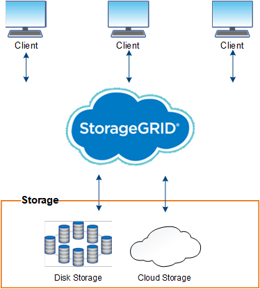

= 什麼是StorageGRID 功能？
:allow-uri-read: 
:icons: font
:imagesdir: ../media/

[role="lead"]
NetApp ® StorageGRID ® 是一套軟體定義的物件儲存套件、可在公有雲、私有雲和混合式多雲端環境中支援各種使用案例。StorageGRID 提供 Amazon S3 API 的原生支援、並提供領先業界的創新技術、例如自動化生命週期管理、可長期以符合成本效益的方式儲存、保護、保護及保留非結構化資料。

提供安全、持久的大規模儲存非結構化資料。StorageGRID以中繼資料為導向的整合式生命週期管理原則、可在資料生命週期中最佳化資料的存放位置。內容會放置在適當的位置、適當的時間、以及適當的儲存層、以降低成本。

由分散各地、備援的異質節點所組成、可與現有和新一代用戶端應用程式整合。StorageGRID

NOTE: 已移除對歸檔節點的支援。透過 S3 API 將物件從歸檔節點移至外部歸檔儲存系統link:../ilm/what-cloud-storage-pool-is.html["ILM 雲端儲存資源池"]、已由取代、提供更多功能。

== StorageGRID 的優點

這個系統的優點StorageGRID 包括：

* 可大幅擴充且易於使用的地理分散式資料儲存庫、適用於非結構化資料。
* Amazon Web Services 簡單儲存服務 (S3) 標準物件儲存協定。
* 混合雲已啟用。原則型資訊生命週期管理（ILM）會將物件儲存至公有雲、包括Amazon Web Services（AWS）和Microsoft Azure。透過支援內容複寫、事件通知及中繼資料搜尋儲存至公有雲的物件。StorageGRID
* 靈活的資料保護功能、確保持久性與可用度。您可以使用複寫和分層銷毀編碼來保護資料。閒置和飛行中資料驗證可確保完整性、以利長期保留。
* 動態資料生命週期管理、有助於管理儲存成本。您可以建立 ILM 規則、在物件層級管理資料生命週期、自訂資料位置、耐用性、效能、成本、 和保留時間。
* 高可用度的資料儲存設備和部分管理功能、搭配整合式負載平衡功能、以最佳化StorageGRID 整個VMware資源的資料負載。
* 支援多個儲存租戶帳戶、可將儲存在系統上的物件依不同實體分隔。
* 監控StorageGRID 您的整套系統健全狀況的眾多工具、包括全方位警示系統、圖形儀表板、以及所有節點和站台的詳細狀態。
* 支援軟體或硬體型部署。您可以在StorageGRID 下列任一項目上部署此功能：
+
** 在VMware中執行的虛擬機器。
** Linux主機上的Container引擎。
** StorageGRID工程設備。
+
*** 儲存設備提供物件儲存。
*** 服務設備提供網格管理和負載平衡服務。

* 符合下列法規的相關儲存需求：
+
** 17 CFR中的證券交易委員會（SEC）第240.17A-4（f）條規範交易所會員、經紀商或交易商。
** 金融業監管局（FINRA）第4511（c）條、遵守SEC第17A-4（f）條的格式和媒體要求。
** 《商品期貨交易委員會（CFTC）規範商品期貨交易的條例》第17 CFR第1.31（c）至（d）條。

* 不中斷的升級與維護作業。在升級、擴充、取消委任及維護程序期間、維持對內容的存取。
* 聯合身分識別管理：整合Active Directory、OpenLDAP或Oracle Directory Service以進行使用者驗證。支援單一登入（SSO）、使用安全聲明標記語言2.0（SAML 2.0）標準、在StorageGRID 支援的範圍是在支援的範圍內、交換驗證和授權資料。

