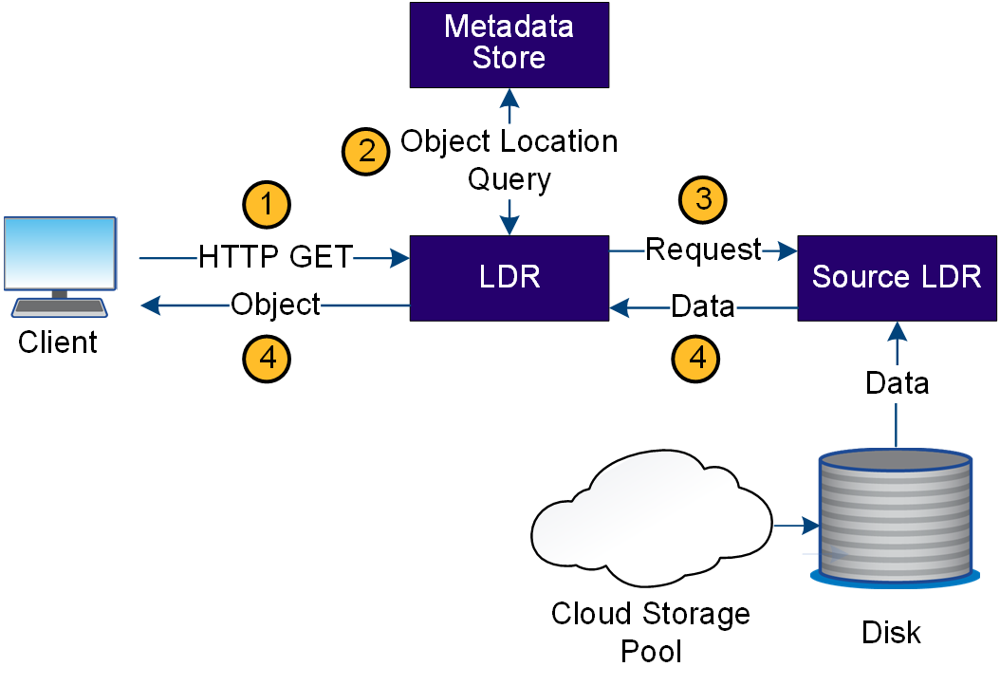

= StorageGRID 如何處理物件擷取
:allow-uri-read: 
:icons: font
:imagesdir: ../media/

[role="lead"]
擷取作業由定義的StorageGRID 資料流組成、可在支援系統和用戶端之間進行。系統會使用屬性來追蹤從儲存節點或雲端儲存池擷取物件的情況（如有必要）。

Storage Node的LMR服務會查詢中繼資料存放區以找出物件資料的位置、然後從來源LMR服務擷取資料。優先的是從儲存節點擷取。如果物件在儲存節點上無法使用、則擷取要求會導向至雲端儲存池。

NOTE: 如果唯一的物件複本位於 AWS Glacier 儲存設備或 Azure 歸檔層、則用戶端應用程式必須發出 S3 RestoreObject 要求、才能將可擷取的複本還原至 Cloud Storage Pool 。

. LMR服務會從用戶端應用程式接收擷取要求。
. LDR服務會查詢中繼資料存放區、以取得物件資料位置和中繼資料。
. LMR服務會將擷取要求轉送至來源LMR服務。
. 來源LDR服務會從查詢的LDR服務傳回物件資料、系統會將物件傳回用戶端應用程式。

