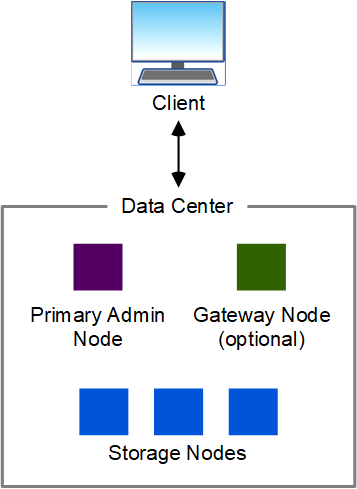
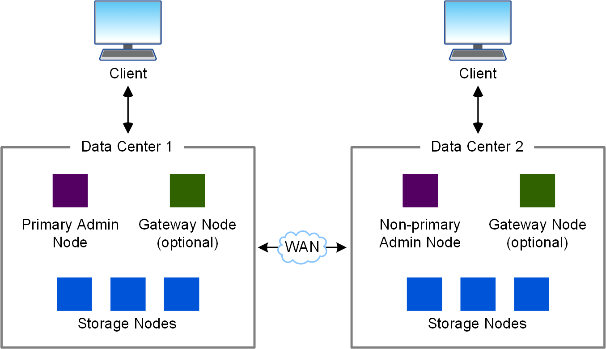
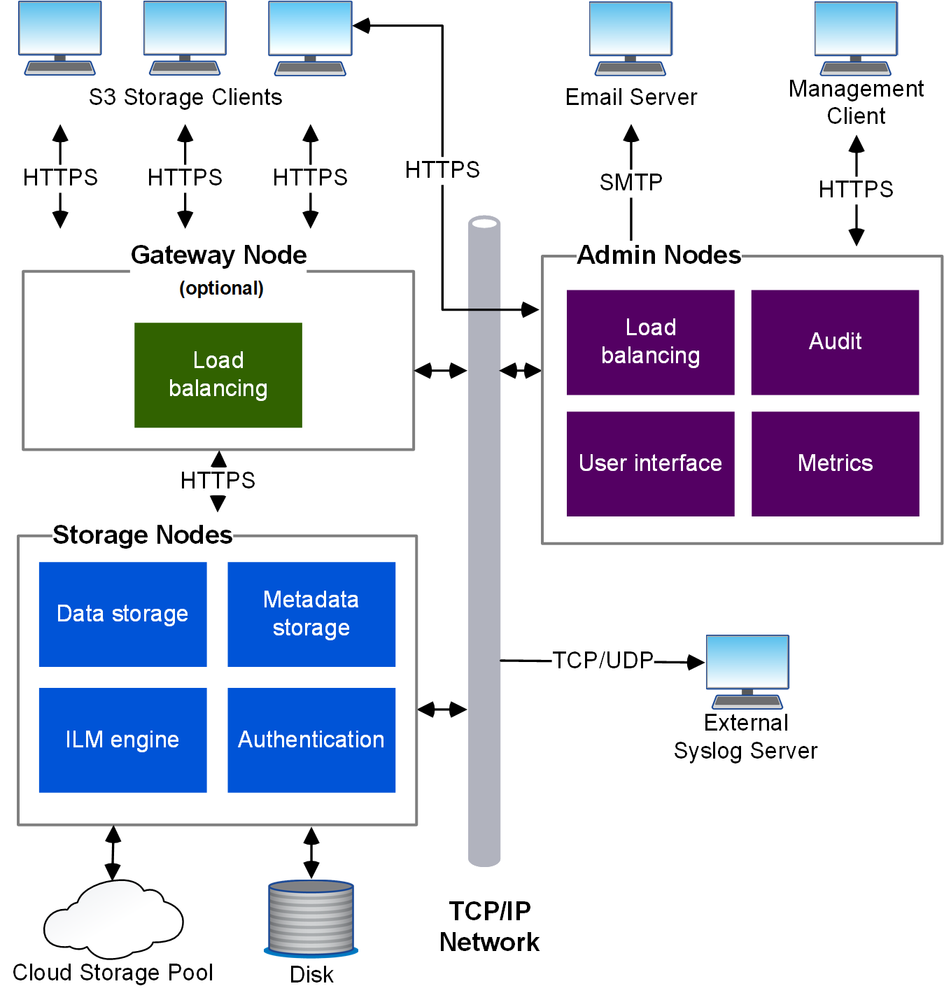

= 架構與網路拓撲StorageGRID
:allow-uri-read: 
:icons: font
:imagesdir: ../media/

[role="lead"]
這個系統包含多種類型的網格節點、位於一或多個資料中心站台。StorageGRID

請參閱link:nodes-and-services.html["網格節點類型說明"]。

如需 StorageGRID 網路拓撲、需求及網格通訊的其他資訊，請參閱link:../network/index.html["網路準則"]。

== 部署拓撲

此系統可部署至單一資料中心站台或多個資料中心站台。StorageGRID

=== 單一站台

在部署單一站台的StorageGRID 情況下、將會集中化整個過程中的基礎架構和運作。

=== 多個站台

在部署多個站台的情況下、StorageGRID 每個站台都能安裝不同類型和數量的支援資源。例如、一個資料中心可能需要比另一個資料中心更多的儲存設備。

不同站台通常位於不同故障領域的不同地理位置、例如地震故障線或洪水平原。資料共享與災難恢復是透過自動將資料發佈至其他站台來達成。

單一資料中心內也可存在多個邏輯站台、以允許使用分散式複寫和銷毀編碼來提高可用度和恢復能力。

=== 網格節點備援

在單一站台或多站台部署中、您可以選擇性地包含多個管理節點或閘道節點來提供備援。例如、您可以在單一站台或多個站台上安裝多個管理節點。不過StorageGRID 、每個功能完善的系統只能有一個主要管理節點。

== 系統架構

下圖顯示StorageGRID 如何在一個E不到 位的系統中排列網格節點。

S3 用戶端會在 StorageGRID 中儲存及擷取物件。其他用戶端則用於傳送電子郵件通知、存取StorageGRID 「資訊管理」介面、以及選擇性存取稽核共用。

S3 用戶端可以連線至閘道節點或管理節點、以使用負載平衡介面來連接儲存節點。或者、 S3 用戶端也可以使用 HTTPS 直接連線至儲存節點。

物件可以儲存在 StorageGRID 中的軟體或硬體型儲存節點、或儲存在雲端儲存池中、其中包含外部 S3 儲存區或 Azure Blob 儲存容器。
