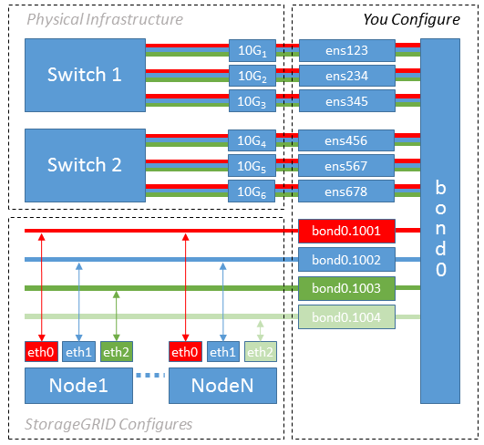

= 設定主機網路（ Red Hat Enterprise Linux ）
:allow-uri-read: 
:icons: font
:imagesdir: ../media/

[role="lead"]
在主機上完成Linux安裝之後、您可能需要執行一些額外的組態、以便在每個主機上準備一組適合對應至StorageGRID 稍後部署之支援節點的網路介面。

.開始之前
* 您已檢閱link:../network/index.html["網路連線準則StorageGRID"]。
* 您已檢閱有關的資訊link:node-container-migration-requirements.html["節點容器移轉需求"]。
* 如果您使用的是虛擬主機、請先閱讀<<mac_address_cloning_rhel,MAC位址複製的考量與建議>>再設定主機網路。

NOTE: 如果您使用VM做為主機、應該選取VMXNET 3做為虛擬網路介面卡。VMware E1000網路介面卡在StorageGRID 某些Linux版本上部署了VMware vCenter Container、導致連線問題。

.關於這項工作
網格節點必須能夠存取網格網路、以及管理網路和用戶端網路（可選）。您可以建立對應、將主機的實體介面與每個網格節點的虛擬介面建立關聯、藉此提供此存取。建立主機介面時、請使用易記的名稱來協助跨所有主機進行部署、並啟用移轉。

同一個介面可在主機與一個或多個節點之間共用。例如、您可以使用相同的介面進行主機存取和節點管理網路存取、以利主機和節點維護。雖然主機與個別節點之間可以共用相同的介面、但所有介面都必須有不同的IP位址。IP 位址無法在節點之間或主機與任何節點之間共用。

您可以使用相同的主機網路介面、為StorageGRID 主機上的所有支援節點提供Grid Network介面；您可以為每個節點使用不同的主機網路介面；也可以在兩者之間執行某些作業。不過、您通常不會為單一節點提供與Grid和管理網路介面相同的主機網路介面、也不會提供與某個節點相同的Grid Network介面、以及與另一個節點相同的Client Network介面。

您可以透過多種方式完成此工作。例如、如果您的主機是虛擬機器、而且您要為每個主機部署一或兩個 StorageGRID 節點、則可以在 Hypervisor 中建立正確數量的網路介面、並使用一對一對應。如果您要在裸機主機上部署多個節點以供正式作業使用、您可以利用Linux網路堆疊的VLAN和LACP支援來實現容錯能力和頻寬共用。以下各節提供這兩個範例的詳細方法。您不需要使用上述任一範例、也可以使用任何符合您需求的方法。

NOTE: 請勿直接使用連結或橋接裝置做為容器網路介面。這樣做可能會防止節點啟動、因為在容器命名空間中使用含有連結和橋接裝置的MAC VLAN時發生核心問題。而是使用非連結裝置、例如VLAN或虛擬乙太網路（vith）配對。將此裝置指定為節點組態檔中的網路介面。

.相關資訊
link:creating-node-configuration-files.html["正在建立節點組態檔"]

== MAC位址複製的考量與建議

.[[Mac_address_cloning_RHEL]
MAC位址複製會導致容器使用主機的MAC位址、而主機使用您指定的位址或隨機產生的位址的MAC位址。您應該使用MAC位址複製來避免使用混雜模式網路組態。

=== 啟用MAC複製

在某些環境中、您可以透過MAC位址複製來增強安全性、因為它可讓您將專用的虛擬NIC用於管理網路、網格網路和用戶端網路。讓容器使用主機上專用NIC的MAC位址、可避免使用雜亂模式網路組態。

NOTE: Mac位址複製是設計用於虛擬伺服器安裝、可能無法在所有實體應用裝置組態中正常運作。

NOTE: 如果某個節點因為MAC複製目標介面正忙線而無法啟動、您可能需要在啟動節點之前將連結設定為「關閉」。此外、虛擬環境可能會在連結啟動時、防止網路介面上的MAC複製。如果某個節點因為介面忙碌而無法設定MAC位址並啟動、請在啟動節點之前將連結設定為「關閉」、這樣可能可以解決此問題。

Mac位址複製預設為停用、必須由節點組態金鑰設定。安裝StorageGRID 時應啟用此功能。

每個網路都有一個金鑰：

* `ADMIN_NETWORK_TARGET_TYPE_INTERFACE_CLONE_MAC`
* `GRID_NETWORK_TARGET_TYPE_INTERFACE_CLONE_MAC`
* `CLIENT_NETWORK_TARGET_TYPE_INTERFACE_CLONE_MAC`

將金鑰設定為「true」會導致容器使用主機NIC的MAC位址。此外、主機也會使用指定容器網路的MAC位址。根據預設、容器位址是隨機產生的位址、但如果您已使用節點組態金鑰設定位址、則 `_NETWORK_MAC`會改用該位址。主機和容器將永遠擁有不同的MAC位址。

NOTE: 在虛擬主機上啟用MAC複製、而不同時在Hypervisor上啟用雜亂模式、可能會導致使用主機介面的Linux主機網路停止運作。

=== Mac複製使用案例

有兩種使用案例可考慮使用MAC複製：

* 未啟用 MAC 複製：當節點組態檔案中的金鑰未設定或設定為「假」時 `_CLONE_MAC`、主機將使用主機 NIC MAC 、除非金鑰中指定了 MAC 、否則容器將會有 StorageGRID 產生的 MAC `_NETWORK_MAC` 。如果在金鑰中設定了位址 `_NETWORK_MAC`、則容器會在金鑰中指定位址 `_NETWORK_MAC`。此金鑰組態需要使用混雜模式。
* 啟用 MAC 複製：當節點組態檔案中的金鑰設定為「 true 」時 `_CLONE_MAC`、容器會使用主機 NIC MAC 、而且除非金鑰中指定了 MAC 、否則主機會使用 StorageGRID 產生的 MAC `_NETWORK_MAC` 。如果在金鑰中設定了位址 `_NETWORK_MAC`、則主機會使用指定的位址、而非產生的位址。在此金鑰組態中、您不應使用混雜模式。

NOTE: 如果您不想使用 MAC 位址複製、而是希望允許所有介面接收和傳輸 MAC 位址的資料、而非 Hypervisor 指定的位址、 請確定虛擬交換器和連接埠群組層級的安全性內容在「雜亂模式」、「 MAC 位址變更」和「僞造傳輸」中設為 * 接受 * 。虛擬交換器上設定的值可由連接埠群組層級的值覆寫、因此請確保兩個位置的設定都相同。

若要啟用 MAC 複製link:creating-node-configuration-files.html["建立節點組態檔的指示"]、請參閱。

=== Mac複製範例

以 MAC 位址為 11 ： 22 ： 33 ： 44 ： 55 ： 66 的主機啟用 MAC 複製範例、適用於介面 ens256 、並在節點組態檔案中使用下列金鑰：

* `ADMIN_NETWORK_TARGET = ens256`
* `ADMIN_NETWORK_MAC = b2:9c:02:c2:27:10`
* `ADMIN_NETWORK_TARGET_TYPE_INTERFACE_CLONE_MAC = true`

* 結果 * ： ens256 的主機 MAC 為 B2:9c ： 02 ： C2 ： 27 ： 10 、管理網路 MAC 為 11 ： 22 ： 33 ： 44 ： 55 ： 66

== 範例1：1對1對應至實體或虛擬NIC

範例1說明簡單的實體介面對應、只需極少或不需要主機端組態。

image::../media/rhel_install_vlan_diag_1.gif[Red Hat安裝VLAN圖表]

Linux 作業系統會在安裝或開機期間、或是在介面熱新增時、自動建立 `ensXYZ`介面。除了確保介面設定為在開機後自動啟動之外、不需要任何組態。您必須決定 `ensXYZ`哪個 StorageGRID 網路（網格、管理或用戶端）對應、以便稍後在組態程序中提供正確的對應。

請注意、圖中顯示了多StorageGRID 個支援節點、不過您通常會將此組態用於單節點VM。

如果交換器1是實體交換器、您應該將連接至介面10G1到10G3的連接埠設定為存取模式、然後將它們放在適當的VLAN上。

== 範例2：LACP連結傳輸VLAN

.關於這項工作
範例2假設您熟悉連結網路介面、以及在所使用的Linux發佈版本上建立VLAN介面。

範例2說明通用、靈活、以VLAN為基礎的配置、可在單一主機上的所有節點之間共享所有可用的網路頻寬。此範例特別適用於裸機主機。

若要瞭解此範例、假設每個資料中心的Grid、Admin和Client Networks各有三個子網路。子網路位於不同的VLAN（1001、1002和1003）上、並以LACP連結主幹連接埠（bond0）呈現給主機。您可以在連結上設定三個VLAN介面：bond0.1001、bond0.1002和bond0.1003。

如果同一主機上的節點網路需要不同的VLAN和子網路、您可以在連結上新增VLAN介面、然後將它們對應到主機（如圖中的bond0.1004所示）。

.步驟
. 將StorageGRID 用於實現無線網路連接的所有實體網路介面、整合到單一LACP連結中。
+
在每個主機上使用相同的連結名稱。例如 `bond0`：。

. 使用標準的 VLAN 介面命名慣例、建立將此連結作為其相關「實體裝置」的 VLAN 介面 `physdev-name.VLAN ID`。
+
請注意、步驟1和步驟2需要在邊緣交換器上進行適當的組態、以終止網路連結的其他端點。邊緣交換器連接埠也必須整合至LACP連接埠通道（設定為主幹）、並允許通過所有必要的VLAN。

+
提供此每個主機網路組態配置方案的介面組態檔範例。

.相關資訊
link:example-etc-sysconfig-network-scripts.html["例如：etc/sysconfig/network-scripts"]
