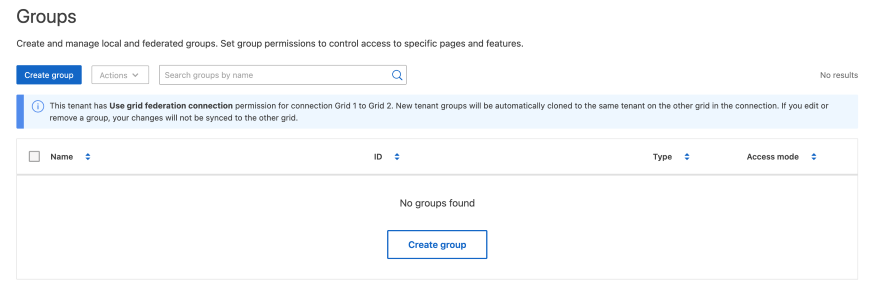

= 為S3租戶建立群組
:allow-uri-read: 
:icons: font
:imagesdir: ../media/

[role="lead"]
您可以匯入同盟群組或建立本機群組、來管理S3使用者群組的權限。

.開始之前
* 您可以使用登入租戶管理程式link:../admin/web-browser-requirements.html["支援的網頁瀏覽器"]。
* 您屬於具有的使用者群組link:tenant-management-permissions.html["root 存取權限"]。
* 如果您計畫匯入同盟群組、則您擁有link:using-identity-federation.html["已設定的身分識別聯盟"]、且同盟群組已存在於已設定的身分識別來源中。
* 如果您的租戶帳戶具有 * 使用網格同盟連線 * 權限、您已檢閱的工作流程和考量事項link:grid-federation-account-clone.html["複製租戶群組和使用者"]、而且您已登入租戶的來源網格。

== 存取建立群組精靈

第一步是存取「建立群組」精靈。

.步驟
. 選擇“存取管理”>“群組”。
. 如果您的租戶帳戶具有 * 使用網格同盟連線 * 權限、請確認出現藍色橫幅、表示在此網格上建立的新群組將會複製到連線中其他網格上的同一個租戶。如果未顯示此橫幅、您可能會登入租戶的目的地網格。
+

. 選取*建立群組*。

== 選擇群組類型

您可以建立本機群組或匯入同盟群組。

.步驟
. 選取*本機群組*索引標籤以建立本機群組、或選取*聯盟群組*索引標籤、從先前設定的身分識別來源匯入群組。
+
如果StorageGRID 您的系統啟用單一登入（SSO）、屬於本機群組的使用者將無法登入租戶管理程式、不過他們可以根據群組權限、使用用戶端應用程式來管理租戶的資源。

. 輸入群組名稱。
+
** *本機群組*：輸入顯示名稱和唯一名稱。您可以稍後再編輯顯示名稱。
+

NOTE: 如果您的租戶帳戶具有 * 使用網格同盟連線 * 權限、則如果目的地網格上的租戶已經存在相同的 * 唯一名稱 * 、就會發生複製錯誤。

** *聯盟群組*：輸入唯一名稱。對於 Active Directory 、唯一名稱是與屬性相關的名稱 `sAMAccountName`。對於 OpenLDAP 、唯一名稱是與屬性相關聯的名稱 `uid`。

. 選擇*繼續*。

== 管理群組權限

群組權限可控制使用者可在租戶管理器和租戶管理 API 中執行的工作。

.步驟
. 對於 * 存取模式 * 、請選取下列其中一項：
+
** * 讀寫 * （預設）：使用者可以登入租戶管理員並管理租戶組態。
** *唯讀*：使用者只能檢視設定和功能。他們無法在租戶管理員或租戶管理 API 中進行任何變更或執行任何作業。本機唯讀使用者可以變更自己的密碼。
+

NOTE: 如果使用者屬於多個群組、且任何群組設定為唯讀、則使用者將擁有所有選取設定和功能的唯讀存取權。

. 為此群組選取一或多個權限。
+
請參閱。 link:../tenant/tenant-management-permissions.html["租戶管理權限"]

. 選擇*繼續*。

== 設定 S3 群組原則

群組原則決定使用者將擁有哪些 S3 存取權限。

.步驟
. 選取您要用於此群組的原則。
+
[cols="1a,2a"]
|===
| 群組原則 | 說明 

 a| 
無 S3 存取權
 a| 
預設。此群組中的使用者無法存取 S3 資源、除非已透過貯體原則授予存取權限。如果選取此選項、預設只有root使用者可以存取S3資源。

 a| 
唯讀存取
 a| 
此群組中的使用者擁有 S3 資源的唯讀存取權。例如、此群組中的使用者可以列出物件並讀取物件資料、中繼資料和標記。選取此選項時、唯讀群組原則的Json字串會出現在文字方塊中。您無法編輯此字串。

 a| 
完整存取
 a| 
此群組中的使用者可完全存取 S3 資源、包括貯體。選取此選項時、會在文字方塊中顯示完整存取群組原則的Json字串。您無法編輯此字串。

 a| 
勒索軟體緩解
 a| 
此原則範例適用於此租戶的所有貯體。此群組中的使用者可以執行一般動作、但無法從已啟用物件版本設定的儲存區中永久刪除物件。

擁有「 * 管理所有儲存區 * 」權限的租戶管理員使用者可以覆寫此群組原則。將「管理所有貯體」權限限制於信任的使用者、並在可行的情況下使用「多因素驗證」（ MFA ）。

 a| 
自訂
 a| 
群組中的使用者會獲得您在文字方塊中指定的權限。

|===
. 如果您選取*自訂*、請輸入群組原則。每個群組原則的大小上限為5、120位元組。您必須輸入有效的Json格式字串。
+
如需群組原則的詳細資訊，包括語言語法和範例，請參閱link:../s3/example-group-policies.html["群組原則範例"]。

. 如果您要建立本機群組、請選取*繼續*。如果您要建立聯盟群組、請選取*建立群組*和*完成*。

== 新增使用者（僅限本機群組）

您可以儲存群組而不新增使用者、也可以選擇性地新增已存在的任何本機使用者。

NOTE: 如果您的租戶帳戶具有 * 使用網格同盟連線 * 權限、則當您在來源網格上建立本機群組時、所選取的任何使用者、都不會被複製到目的地網格時納入。因此、建立群組時請勿選取使用者。而是在建立使用者時選取群組。

.步驟
. 您也可以為此群組選取一或多個本機使用者。
. 選擇* Create group（創建組）*和* Finish（完成）*。
+
您建立的群組會出現在群組清單中。

+
如果您的租戶帳戶具有 * 使用網格同盟連線 * 權限、且您位於租戶的來源網格上、則新群組會複製到租戶的目的地網格。* 成功 * 會在群組詳細資料頁面的「概述」區段中顯示為 * 複製狀態 * 。

