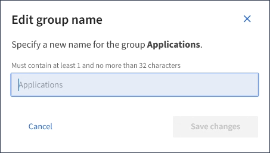

= 編輯群組名稱
:allow-uri-read: 
:icons: font
:imagesdir: ../media/

[role="lead"]
您可以編輯群組的顯示名稱。您無法編輯群組的唯一名稱。

.開始之前
* 您可以使用登入租戶管理程式link:../admin/web-browser-requirements.html["支援的網頁瀏覽器"]。
* 您屬於具有「根目錄」存取權限的使用者群組。請參閱。 link:tenant-management-permissions.html["租戶管理權限"]

.步驟
. 選擇*存取管理*>*群組*。
. 選取您要編輯其顯示名稱之群組的核取方塊。
. 選擇*操作*>*編輯群組名稱*。
+
「編輯群組名稱」對話方塊隨即出現。

+

. 如果您正在編輯本機群組、請視需要更新顯示名稱。
+
您無法變更群組的唯一名稱。您無法編輯同盟群組的顯示名稱。

. 選取*儲存變更*。
+
頁面右上角會出現確認訊息。

