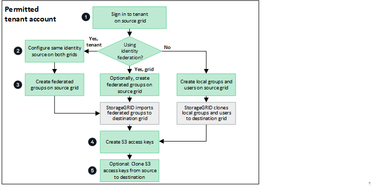

= 複製租戶群組和使用者
:allow-uri-read: 
:icons: font
:imagesdir: ../media/

[role="lead"]
如果建立或編輯租戶以使用網格同盟連線、則該租戶會從一個 StorageGRID 系統（來源租戶）複寫到另一個 StorageGRID 系統（複本租戶）。複寫租用戶之後、任何新增至來源租用戶的群組和使用者都會複製到複本租用戶。

最初建立租戶的 StorageGRID 系統是租戶的 _ 來源網格 _ 。複寫租戶的 StorageGRID 系統是租戶的 _ 目的地網格 _ 。兩個租戶帳戶都有相同的帳戶 ID 、名稱、說明、儲存配額和指派的權限、 但目的地租戶最初並沒有 root 使用者密碼。如需詳細資訊、請參閱link:../admin/grid-federation-what-is-account-clone.html["什麼是帳戶複製"]和link:../admin/grid-federation-manage-tenants.html["管理允許的租戶"]。

貯體物件需要複製租戶帳戶資訊link:../admin/grid-federation-what-is-cross-grid-replication.html["跨網格複寫"]。在兩個網格上擁有相同的租戶群組和使用者、可確保您存取任一網格上對應的貯體和物件。

== 帳戶複製的租戶工作流程

如果您的租戶帳戶具有 * 使用網格同盟連線 * 權限、請檢閱工作流程圖、查看您將執行哪些步驟來複製群組、使用者和 S3 存取金鑰。

以下是工作流程的主要步驟：

.image:https://raw.githubusercontent.com/NetAppDocs/common/main/media/number-1.png["一"]登入租戶
[role="quick-margin-para"]
登入來源網格（最初建立租戶的網格）上的租戶帳戶。

.image:https://raw.githubusercontent.com/NetAppDocs/common/main/media/number-2.png["二"]您也可以選擇設定身分識別聯盟
[role="quick-margin-para"]
如果您的租戶帳戶具有 * 使用自己的身分識別來源 * 權限、可以使用同盟群組和使用者、請為來源和目的地租戶帳戶設定相同的身分識別來源（使用相同的設定）。除非兩個網格使用相同的身分識別來源、否則無法複製同盟群組和使用者。有關說明，請參閱link:using-identity-federation.html["使用身分識別聯盟"]。

.image:https://raw.githubusercontent.com/NetAppDocs/common/main/media/number-3.png["三"]建立群組和使用者
[role="quick-margin-para"]
建立群組和使用者時、請務必從租戶的來源網格開始。當您新增群組時、 StorageGRID 會自動將其複製到目的地網格。

[role="quick-margin-list"]
* 如果身分識別同盟是針對整個 StorageGRID 系統或租戶帳戶而設定、請link:creating-groups-for-s3-tenant.html["建立新的租戶群組"]從身分識別來源匯入同盟群組。

[role="quick-margin-list"]
* 如果您不使用身分識別聯盟、link:creating-groups-for-s3-tenant.html["建立新的本機群組"]則link:managing-local-users.html["建立本機使用者"]。

.image:https://raw.githubusercontent.com/NetAppDocs/common/main/media/number-4.png["四"]建立 S3 存取金鑰
[role="quick-margin-para"]
您可以link:creating-your-own-s3-access-keys.html["建立您自己的存取金鑰"]或是link:creating-another-users-s3-access-keys.html["建立其他使用者的存取金鑰"]在來源網格或目的地網格上存取該網格上的貯體。

.image:https://raw.githubusercontent.com/NetAppDocs/common/main/media/number-5.png["五"]您也可以選擇複製 S3 存取金鑰
[role="quick-margin-para"]
如果您需要在兩個網格上存取具有相同存取金鑰的貯體、請在來源網格上建立存取金鑰、然後使用 Tenant Manager API 將它們手動複製到目的地網格。有關說明，請參閱link:../tenant/grid-federation-clone-keys-with-api.html["使用 API 複製 S3 存取金鑰"]。

== 如何複製群組、使用者和 S3 存取金鑰？

請參閱本節、瞭解如何在租戶來源網格和租戶目的地網格之間複製群組、使用者和 S3 存取金鑰。

=== 複製在來源網格上建立的本機群組

建立租戶帳戶並複寫到目的地網格之後、 StorageGRID 會自動將您新增至租戶來源網格的任何本機群組、複製到租戶的目的地網格。

原始群組及其複本具有相同的存取模式、群組權限和 S3 群組原則。有關說明，請參閱link:creating-groups-for-s3-tenant.html["為S3租戶建立群組"]。

image::../media/grid-federation-account-clone.png[顯示本機群組已從來源網格複製到目的地網格的影像]

NOTE: 當您在來源網格上建立本機群組時所選取的任何使用者、都不會被複製到目的地網格時納入其中。因此、建立群組時請勿選取使用者。而是在建立使用者時選取群組。

=== 複製在來源網格上建立的本機使用者

當您在來源網格上建立新的本機使用者時、 StorageGRID 會自動將該使用者複製到目的地網格。原始使用者及其複本具有相同的全名、使用者名稱及 * 拒絕存取 * 設定。兩個使用者也屬於同一個群組。有關說明，請參閱link:managing-local-users.html["管理本機使用者"]。

基於安全考量、本機使用者密碼不會複製到目的地網格。如果本機使用者需要存取目的地網格上的 Tenant Manager 、則租戶帳戶的根使用者必須在目的地網格上新增該使用者的密碼。有關說明，請參閱link:managing-local-users.html["管理本機使用者"]。

image::../media/grid-federation-local-user-clone.png[顯示本機使用者已從來源網格複製到目的地網格的影像]

=== 複製在來源網格上建立的同盟群組

假設已符合使用和link:../admin/grid-federation-what-is-account-clone.html#account-clone-identity-federation["身分識別聯盟"]的帳戶複製需求link:../admin/grid-federation-what-is-account-clone.html#account-clone-sso["單一登入"]、您在來源網格上為租用戶建立（匯入）的同盟群組會自動複製到目的地網格上的租用戶。

這兩個群組都有相同的存取模式、群組權限和 S3 群組原則。

為來源租戶建立同盟群組並複製到目的地租戶之後、同盟使用者可以在任一網格上登入租戶。

image::../media/grid-federation-federated-group-clone.png[顯示同盟群組已從來源網格複製到目的地網格的影像]

=== S3 存取金鑰可以手動複製

StorageGRID 不會自動複製 S3 存取金鑰、因為每個網格上都有不同的金鑰、因此安全性得到改善。

若要管理兩個網格上的存取金鑰、您可以執行下列其中一項：

* 如果您不需要對每個網格使用相同的按鍵、您可以或link:creating-another-users-s3-access-keys.html["建立其他使用者的存取金鑰"]在每個網格上使用相同的按鍵link:creating-your-own-s3-access-keys.html["建立您自己的存取金鑰"]。
* 如果您需要在兩個網格上使用相同的金鑰、您可以在來源網格上建立金鑰、然後使用 Tenant Manager API 手動將金鑰link:../tenant/grid-federation-clone-keys-with-api.html["複製金鑰"]傳送至目的地網格。

image::../media/grid-federation-s3-access-key.png[顯示 S3 存取金鑰可選擇性地從來源網格複製到目的地網格的影像]

NOTE: 當您複製同盟使用者的 S3 存取金鑰時、使用者和 S3 存取金鑰都會複製到目的地租戶。

=== 不會複製新增至目的地網格的群組和使用者

只會從租戶的來源網格到租戶的目的地網格進行複製。如果您在租戶的目的地網格上建立或匯入群組和使用者、 StorageGRID 將不會將這些項目複製回租戶的來源網格。

image::../media/grid-federation-account-not-cloned.png[顯示目的地網格詳細資料的影像不會複製到來源網格]

=== 編輯或刪除的群組、使用者和存取金鑰不會複製

只有在您建立新群組和使用者時、才會進行複製。

如果您在任一網格上編輯或刪除群組、使用者或存取金鑰、您的變更將不會複製到其他網格。

image::../media/grid-federation-account-clone-edit-delete.png[顯示已編輯或刪除的詳細資料不會複製的影像]
