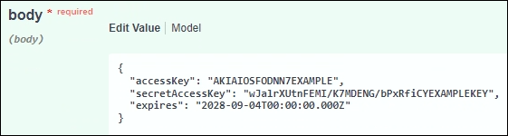

= 使用 API 複製 S3 存取金鑰
:allow-uri-read: 
:icons: font
:imagesdir: ../media/

[role="lead"]
如果您的租戶帳戶具有 * 使用網格同盟連線 * 權限、您可以使用租戶管理 API 、將 S3 存取金鑰從來源網格上的租戶手動複製到目的地網格上的租戶。

.開始之前
* 租戶帳戶具有 * 使用網格同盟連線 * 權限。
* 網格聯盟連線的 * 連線狀態 * 為 * 已連線 * 。
* 您可以使用登入租戶來源網格上的租戶管理員link:../admin/web-browser-requirements.html["支援的網頁瀏覽器"]。
* 您屬於具有的使用者群組link:tenant-management-permissions.html["管理您自己的 S3 認證或根存取權限"]。
* 如果您要複製本機使用者的存取金鑰、則該使用者已存在於兩個網格上。
+

NOTE: 當您複製同盟使用者的 S3 存取金鑰時、使用者和 S3 存取金鑰都會新增至目的地租戶。

== 複製您自己的存取金鑰

如果您需要存取兩個網格上的相同儲存格、則可以複製自己的存取金鑰。

.步驟
. 使用來源網格上的 Tenant Manager 、link:creating-your-own-s3-access-keys.html["建立您自己的存取金鑰"]然後下載 `.csv`檔案。
. 從租戶管理器的頂端、選取說明圖示、然後選取 * API 文件 * 。
. 在 *S2* 區段中、選取下列端點：
+
`POST /org/users/current-user/replicate-s3-access-key`

+
image::../media/grid-federation-post-current-user-replicate.png[用於複寫自己存取金鑰的後端點]

. 選擇*試用*。
. 在 * 本文 * 文字方塊中、將 *AccessKey* 和 *secretAccessKey* 的範例項目取代為您下載的 * 。 csv* 檔案中的值。
+
請務必保留每個字串的雙引號。

+

. 如果金鑰即將過期、請將 * Expires* 的範例項目取代為 ISO 8601 資料時間格式的字串到期日和時間（例如 `2024-02-28T22:46:33-08:00`）。如果金鑰不會過期、請輸入 * null * 作為 * Expires* 項目的值（或移除 * Expires* 行及前面的逗號）。
. 選擇*執行*。
. 確認伺服器回應碼為 *204* 、表示金鑰已成功複製到目的地網格。

== 複製其他使用者的存取金鑰

如果其他使用者需要存取兩個網格上的相同儲存格、您可以複製該使用者的存取金鑰。

.步驟
. 使用來源網格上的 Tenant Manager 、link:creating-another-users-s3-access-keys.html["建立其他使用者的 S3 存取金鑰"]然後下載 `.csv`檔案。
. 從租戶管理器的頂端、選取說明圖示、然後選取 * API 文件 * 。
. 取得使用者 ID 。您需要此值來複製其他使用者的存取金鑰。
+
.. 從 * 使用者 * 區段中、選取下列端點：
+
`GET /org/users`

.. 選擇*試用*。
.. 指定在查找用戶時要使用的任何參數。
.. 選擇*執行*。
.. 尋找您要複製金鑰的使用者、然後在 * id* 欄位中複製該數字。

. 在 *S2* 區段中、選取下列端點：
+
`POST /org/users/{userId}/replicate-s3-access-key`

+
image::../media/grid-federation-post-other-user.png[用於複寫其他使用者存取金鑰的 POST 端點]

. 選擇*試用*。
. 在 * 使用者 ID* 文字方塊中、貼上您複製的使用者 ID 。
. 在 * 本文 * 文字方塊中、將 * 範例存取金鑰 * 和 * 秘密存取金鑰 * 的範例項目、取代為該使用者的 * 。 csv* 檔案中的值。
+
請務必保留字串周圍的雙引號。

. 如果金鑰即將過期、請將 * Expires* 的範例項目取代為 ISO 8601 資料時間格式的字串到期日和時間（例如 `2023-02-28T22:46:33-08:00`）。如果金鑰不會過期、請輸入 * null * 作為 * Expires* 項目的值（或移除 * Expires* 行及前面的逗號）。
. 選擇*執行*。
. 確認伺服器回應碼為 *204* 、表示金鑰已成功複製到目的地網格。

