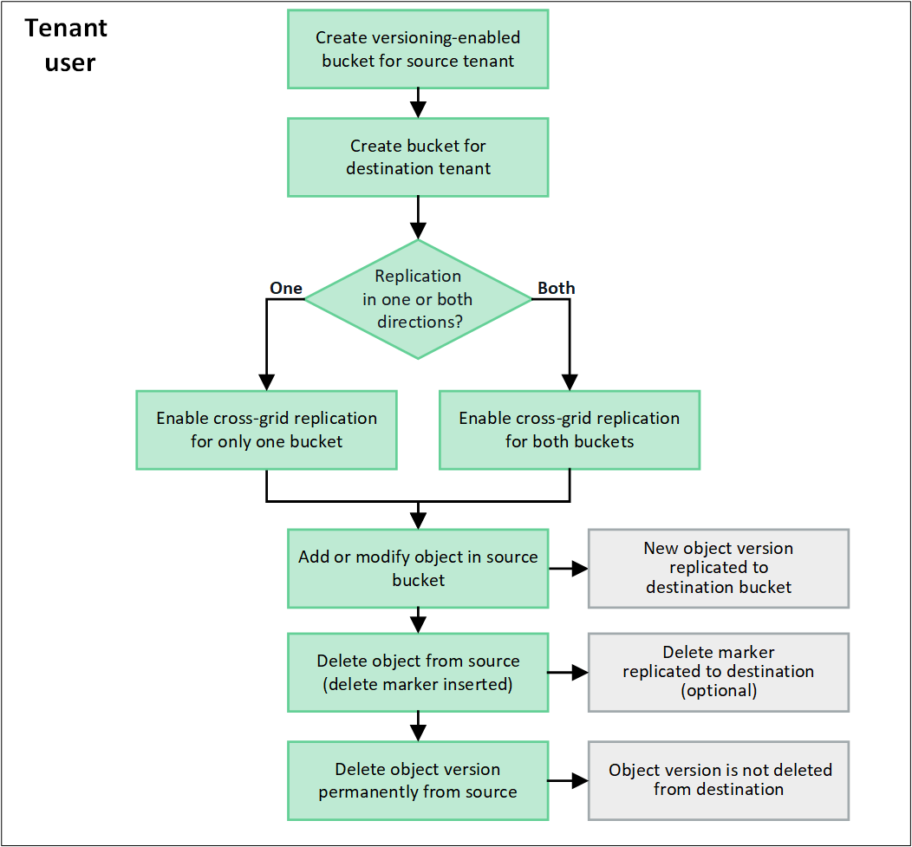

= 管理跨網格複寫
:allow-uri-read: 
:icons: font
:imagesdir: ../media/

[role="lead"]
如果您的租戶帳戶在建立時已獲指派 * 使用網格同盟連線 * 權限、您可以使用跨網格複寫、在租戶來源網格上的貯體和租戶目的地網格上的貯體之間自動複寫物件。跨網格複寫可在一個或兩個方向進行。

== 跨網格複寫的工作流程

工作流程圖概述了在兩個網格上的貯體之間設定跨網格複寫的步驟。以下將詳細說明這些步驟。

== 設定跨網格複寫

在使用跨網格複寫之前、您必須先登入每個網格上對應的租戶帳戶、然後建立相同的工作區。然後、您可以在任一或兩個貯體上啟用跨網格複寫。

.開始之前
* 您已檢閱跨網格複寫的需求。請參閱。 link:../admin/grid-federation-what-is-cross-grid-replication.html["什麼是跨網格複寫"]
* 您使用的是link:../admin/web-browser-requirements.html["支援的網頁瀏覽器"]。
* 租戶帳戶具有 * 使用網格同盟連線 * 權限、而且兩個網格上都有相同的租戶帳戶。請參閱。 link:../admin/grid-federation-manage-tenants.html["管理網格同盟連線的允許租戶"]
* 您要登入的租戶使用者已存在於兩個網格中link:tenant-management-permissions.html["root 存取權限"]、並且屬於具有的使用者群組。
* 如果您將以本機使用者身分登入租戶的目的地網格、則租戶帳戶的根使用者已在該網格上設定您的使用者帳戶密碼。

=== 建立兩個相同的貯體

第一步是登入每個網格上對應的租戶帳戶、然後建立相同的貯體。

.步驟
. 從網格聯盟連線的任一網格開始、建立新的儲存格：
+
.. 使用位於兩個網格上的租戶使用者身分證明登入租戶帳戶。
+

NOTE: 如果您無法以本機使用者身分登入租戶的目的地網格、請確認租戶帳戶的根使用者已設定您的使用者帳戶密碼。

.. 按照的說明進行操作link:creating-s3-bucket.html["建立 S3 儲存貯體"]。
.. 在 * 管理物件設定 * 索引標籤上、選取 * 啟用物件版本設定 * 。
.. 如果您的 StorageGRID 系統已啟用 S3 物件鎖定、請勿啟用儲存貯體的 S3 物件鎖定。
.. 選取*建立桶*。
.. 選擇*完成*。

. 重複這些步驟、在 Grid Federation 連線的其他網格上、為相同的租戶帳戶建立相同的貯體。
+

TIP: 根據需要、每個貯體可以使用不同的區域。

=== 啟用跨網格複寫

您必須先執行這些步驟、才能將任何物件新增至任一貯體。

.步驟
. 從您要複寫物件的網格開始、啟用link:../admin/grid-federation-what-is-cross-grid-replication.html["單向跨網格複寫"]：
+
.. 登入貯體的租戶帳戶。
.. 從儀表板選取 * 檢視貯體 * 、或選取 * 儲存空間（ S3 ） * > * 鏟斗 * 。
.. 從表格中選取貯體名稱、以存取貯體詳細資料頁面。
.. 選取 * 跨網格複寫 * 標籤。
.. 選取 * 啟用 * 、然後檢閱要求清單。
.. 如果符合所有需求、請選取您要使用的網格同盟連線。
.. 您也可以變更 * 複寫刪除標記 * 的設定、以判斷如果 S3 用戶端向不含版本 ID 的來源網格發出刪除要求、目的地網格上會發生什麼情況：
+
*** * 是 * （預設）：刪除標記會新增至來源貯體、並複寫至目的地貯體。
*** * 否 * ：刪除標記會新增至來源貯體、但不會複寫至目的地貯體。
+
image::../media/grid-federation-cross-grid-replication-client-deletes.png[顯示在兩個網格上複寫用戶端刪除的影像]

+

NOTE: 如果刪除要求包含版本 ID 、則該物件版本會從來源貯體中永久移除。StorageGRID 不會複寫包含版本 ID 的刪除要求、因此不會從目的地刪除相同的物件版本。

+
如需詳細資訊、請參閱 link:../admin/grid-federation-what-is-cross-grid-replication.html["什麼是跨網格複寫"] 。

.. 您也可以變更 * 跨網格複寫 * 稽核類別的設定、以管理稽核訊息的數量：
+
*** * 錯誤 * （預設）：稽核輸出中僅包含失敗的跨網格複寫要求。
*** * 正常 * ：包含所有跨網格複寫要求、大幅增加稽核輸出的容量。

.. 檢閱您的選擇。除非兩個貯體都是空的、否則您無法變更這些設定。
.. 選取 * 啟用和測試 * 。
+
稍後會出現成功訊息。新增至此貯體的物件現在會自動複寫到其他網格。* 交叉網格複寫 * 會在貯體詳細資料頁面上顯示為啟用的功能。

. 或者link:../admin/grid-federation-what-is-cross-grid-replication.html["雙向啟用跨網格複寫"]、前往其他網格和上的對應儲存格。

== 測試網格之間的複寫

如果已為貯體啟用跨網格複寫、您可能需要驗證連線和跨網格複寫是否正常運作、以及來源和目的地貯體是否仍符合所有需求（例如、版本設定仍為啟用狀態）。

.開始之前
* 您使用的是link:../admin/web-browser-requirements.html["支援的網頁瀏覽器"]。
* 您屬於具有的使用者群組link:tenant-management-permissions.html["root 存取權限"]。

.步驟
. 登入貯體的租戶帳戶。
. 從儀表板選取 * 檢視貯體 * 、或選取 * 儲存空間（ S3 ） * > * 鏟斗 * 。
. 從表格中選取貯體名稱、以存取貯體詳細資料頁面。
. 選取 * 跨網格複寫 * 標籤。
. 選擇*測試連線*。
+
如果連線正常、就會出現成功橫幅。否則會出現錯誤訊息、您和網格管理員可以使用該訊息來解決問題。如需詳細資訊、請參閱 link:../admin/grid-federation-troubleshoot.html["疑難排解網格同盟錯誤"]。

. 如果跨網格複寫設定為雙向進行、請前往另一個網格上的對應儲存格、然後選取 * 測試連線 * 、確認跨網格複寫在另一個方向上運作。

== 停用跨網格複寫

如果您不想再將物件複製到其他網格、可以永久停止跨網格複寫。

停用跨網格複寫之前、請注意下列事項：

* 停用跨網格複寫並不會移除已在網格之間複製的任何物件。例如、如果您停用該貯體的跨網格複寫、則不會移除已複製到 Grid 2 的 On Grid 1 `my-bucket` 中的物件 `my-bucket`。如果您要刪除這些物件、必須手動移除它們。
* 如果已為每個貯體啟用跨網格複寫（也就是說、如果雙向進行複寫）、您可以停用其中一個或兩個貯體的跨網格複寫。例如、您可能想要停用從「在網格 1 」複寫物件 `my-bucket`至 `my-bucket`「在網格 2 」、同時繼續將物件從「在網格 2 」複寫 `my-bucket`至 `my-bucket`「在網格 1 」。
* 您必須先停用跨網格複寫、才能移除租用戶使用網格同盟連線的權限。請參閱。 link:../admin/grid-federation-manage-tenants.html["管理允許的租戶"]
* 如果您停用包含物件之貯體的跨網格複寫、則除非您同時刪除來源和目的地貯體中的所有物件、否則將無法重新啟用跨網格複寫。
+

CAUTION: 除非兩個儲存區都是空的、否則無法重新啟用複寫。

.開始之前
* 您使用的是link:../admin/web-browser-requirements.html["支援的網頁瀏覽器"]。
* 您屬於具有的使用者群組link:tenant-management-permissions.html["root 存取權限"]。

.步驟
. 從您不再想複寫物件的網格開始、停止貯體的跨網格複寫：
+
.. 登入貯體的租戶帳戶。
.. 從儀表板選取 * 檢視貯體 * 、或選取 * 儲存空間（ S3 ） * > * 鏟斗 * 。
.. 從表格中選取貯體名稱、以存取貯體詳細資料頁面。
.. 選取 * 跨網格複寫 * 標籤。
.. 選取 * 停用複寫 * 。
.. 如果您確定要停用此貯體的跨網格複寫、請在文字方塊中鍵入 * 是 * 、然後選取 * 停用 * 。
+
稍後會出現成功訊息。新增至此貯體的物件無法再自動複寫到其他網格。* 跨網格複寫 * 不再顯示為「已啟用」功能。

. 如果跨網格複寫設定為雙向進行、請移至另一個網格上的對應儲存格、並在另一個方向停止跨網格複寫。

