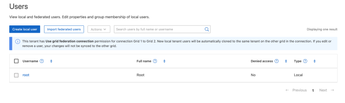

= 管理本機使用者
:allow-uri-read: 
:icons: font
:imagesdir: ../media/

[role="lead"]
您可以建立本機使用者並將其指派給本機群組、以決定這些使用者可以存取哪些功能。租戶管理程式包含一個預先定義的本機使用者、名稱為「 root 」。雖然您可以新增及移除本機使用者、但無法移除根使用者。

NOTE: 如果您的 StorageGRID 系統啟用單一登入（ SSO ）、本機使用者將無法登入租戶管理員或租戶管理 API 、不過他們可以根據群組權限使用用戶端應用程式來存取租戶的資源。

.開始之前
* 您可以使用登入租戶管理程式link:../admin/web-browser-requirements.html["支援的網頁瀏覽器"]。
* 您屬於具有的使用者群組link:tenant-management-permissions.html["root 存取權限"]。
* 如果您的租戶帳戶具有 * 使用網格同盟連線 * 權限、您已檢閱的工作流程和考量事項link:grid-federation-account-clone.html["複製租戶群組和使用者"]、而且您已登入租戶的來源網格。

== [[create-user]] 建立本機使用者

您可以建立本機使用者並將其指派給一或多個本機群組、以控制其存取權限。

不屬於任何群組的 S3 使用者沒有管理權限或 S3 群組原則套用到他們。這些使用者可能會透過儲存區原則授予S3儲存區存取權。

不屬於任何群組的 Swift 使用者沒有管理權限或 Swift Container 存取權。

=== 存取建立使用者精靈

.步驟
. 選擇*存取管理*>*使用者*。
+
如果您的租戶帳戶具有 * 使用網格同盟連線 * 權限、則藍色橫幅會指出這是租戶的來源網格。您在此網格上建立的任何本機使用者都會複製到連線中的其他網格。

+

. 選取*建立使用者*。

=== 輸入認證

.步驟
. 對於 * 輸入使用者認證 * 步驟、請填寫下列欄位。
+
[cols="1a,3a"]
|===
| 欄位 | 說明 

 a| 
全名
 a| 
此使用者的全名、例如人員的名字和姓氏、或應用程式的名稱。

 a| 
使用者名稱
 a| 
此使用者將用來登入的名稱。使用者名稱必須是唯一的、而且無法變更。

* 附註 * ：如果您的租戶帳戶具有 * 使用網格同盟連線 * 權限、則如果目的地網格上的租戶已經存在相同的 * 使用者名稱 * 、就會發生複製錯誤。

 a| 
密碼和確認密碼
 a| 
使用者在登入時最初使用的密碼。

 a| 
拒絕存取
 a| 
選取 * 是 * 可防止此使用者登入租戶帳戶、即使他們仍屬於一個或多個群組。

例如、選取 * 是 * 可暫時暫停使用者登入的能力。

|===
. 選擇*繼續*。

=== 指派給群組

.步驟
. 將使用者指派給一或多個本機群組、以判斷他們可以執行哪些工作。
+
將使用者指派給群組是選擇性的。如果您願意、可以在建立或編輯群組時選取使用者。

+
不屬於任何群組的使用者將沒有管理權限。權限是累積性的。使用者將擁有所屬所有群組的所有權限。請參閱。 link:tenant-management-permissions.html["租戶管理權限"]

. 選取*建立使用者*。
+
如果您的租戶帳戶具有 * 使用網格同盟連線 * 權限、且您位於租戶的來源網格上、則新的本機使用者會複製到租戶的目的地網格。* 成功 * 會在使用者詳細資料頁面的「概述」區段中顯示為 * 複製狀態 * 。

. 選擇 * 完成 * 返回「使用者」頁面。

== 檢視或編輯本機使用者

.步驟
. 選擇*存取管理*>*使用者*。
. 檢閱「使用者」頁面上提供的資訊、其中列出此租戶帳戶所有本機和同盟使用者的基本資訊。
+
如果租戶帳戶具有 * 使用網格同盟連線 * 權限、且您正在租戶來源網格上檢視使用者：

+
** 橫幅訊息表示如果您編輯或移除使用者、您的變更將不會同步至其他網格。
** 如有需要、橫幅訊息會指出使用者是否未複製到目的地網格上的租用戶。您可以<<clone-users,重試失敗的使用者複製>>。

. 若要變更使用者的全名：
+
.. 選取使用者的核取方塊。
.. 選擇* Actions *>* Edit full name*（*操作*>*編輯全名*）。
.. 輸入新名稱。
.. 選取 * 儲存變更 *

. 如果您想要檢視更多詳細資料或進行其他編輯、請執行下列其中一項：
+
** 選取使用者名稱。
** 選取使用者的核取方塊、然後選取 * 動作 * > * 檢視使用者詳細資料 * 。

. 檢閱「總覽」一節、其中顯示每位使用者的下列資訊：
+
** 全名
** 使用者名稱
** 使用者類型
** 拒絕存取
** 存取模式
** 群組成員資格
** 如果租戶帳戶具有「 * 使用網格同盟連線 * 」權限、且您正在租戶來源網格上檢視使用者、則會顯示其他欄位：
+
*** 克隆狀態，可以是 * 成功 * 或 * 失敗 *
*** 藍色橫幅表示如果您編輯此使用者、您的變更將不會同步至其他網格。

. 視需要編輯使用者設定。如需輸入內容的詳細資訊、請參閱<<create-user,建立本機使用者>>。
+
.. 在概述部分中，通過選擇名稱或編輯圖標來更改全名image:../media/icon_edit_tm.png["編輯圖示"]。
+
您無法變更使用者名稱。

.. 在 * 密碼 * 標籤上、變更使用者的密碼、然後選取 * 儲存變更 * 。
.. 在 * 存取 * 索引標籤上、選取 * 否 * 以允許使用者登入、或選取 * 是 * 以防止使用者登入。然後、選取 * 儲存變更 * 。
.. 在 * 存取鍵 * 索引標籤上、選取 * 建立鍵 * link:creating-another-users-s3-access-keys.html["建立其他使用者的 S3 存取金鑰"]、然後依照的指示進行。
.. 在 * 群組 * 索引標籤上、選取 * 編輯群組 * 、將使用者新增至群組或從群組中移除使用者。然後選取 * 儲存變更 * 。

. 確認您為變更的每個區段選擇了 * 儲存變更 * 。

== 重複的本機使用者

您可以複製本機使用者、以更快建立新使用者。

NOTE: 如果您的租戶帳戶具有 * 使用網格同盟連線 * 權限、且您從租戶的來源網格複製使用者、則複製的使用者將會複製到租戶的目的地網格。

.步驟
. 選擇*存取管理*>*使用者*。
. 選取您要複製之使用者的核取方塊。
. 選取*「動作*」>*「重複使用者*」。
. 如需輸入內容的詳細資訊、請參閱<<create-user,建立本機使用者>>。
. 選取*建立使用者*。

== [[clone-user]] 重試使用者複製

若要重試失敗的複製：

. 選取使用者名稱下方的 _ （複製失敗） _ 的每位使用者。
. 選取 * 動作 * > * 複製使用者 * 。
. 從您要複製的每位使用者的詳細資料頁面、檢視複製作業的狀態。

如需更多資訊link:grid-federation-account-clone.html["複製租戶群組和使用者"]、請參閱。

== 刪除一或多個本機使用者

您可以永久刪除不再需要存取 StorageGRID 租戶帳戶的一或多個本機使用者。

NOTE: 如果您的租戶帳戶具有 * 使用網格同盟連線 * 權限、且您刪除了本機使用者、 StorageGRID 將不會刪除其他網格上的對應使用者。如果您需要保持此資訊同步、則必須從兩個方格中刪除相同的使用者。

NOTE: 您必須使用同盟識別來源來刪除同盟使用者。

.步驟
. 選擇*存取管理*>*使用者*。
. 選取您要刪除的每個使用者的核取方塊。
. 選擇 * 行動 * > * 刪除使用者 * 或 * 行動 * > * 刪除使用者 * 。
+
隨即顯示確認對話方塊。

. 選取 * 刪除使用者 * 或 * 刪除使用者 * 。

