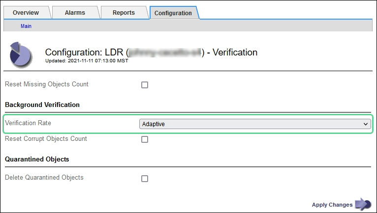

= 驗證物件完整性
:allow-uri-read: 
:icons: font
:imagesdir: ../media/

[role="lead"]
此系統可驗證儲存節點上物件資料的完整性、同時檢查毀損和遺失的物件。StorageGRID

驗證程序有兩種：背景驗證和物件存在檢查（先前稱為前景驗證）。他們共同合作、確保資料完整性。背景驗證會自動執行、並持續檢查物件資料的正確性。使用者可觸發物件存在檢查、以更快驗證物件的存在（雖然不正確）。

== 什麼是背景驗證？

背景驗證程序會自動持續檢查儲存節點是否有物件資料毀損的複本、並自動嘗試修復找到的任何問題。

背景驗證會檢查複寫物件和銷毀編碼物件的完整性、如下所示：

* *複寫物件*：如果背景驗證程序找到毀損的複寫物件、則毀損的複本會從其位置移除、並隔離儲存節點上的其他位置。接著會產生新的未損毀複本、並將其放置在符合使用中 ILM 原則的位置。新複本可能不會放在原始複本所使用的儲存節點上。

NOTE: 毀損的物件資料會被隔離、而非從系統中刪除、以便仍可存取。如需存取隔離物件資料的詳細資訊、請聯絡技術支援部門。

* *刪除編碼物件*：如果背景驗證程序偵測到刪除編碼物件的片段毀損、StorageGRID 則會使用剩餘的資料和同位元檢查片段、自動嘗試在同一個儲存節點上重新建置遺失的片段。如果損壞的片段無法重建、則會嘗試擷取該物件的另一個複本。如果擷取成功、則會執行ILM評估、以建立銷毀編碼物件的替換複本。
+
背景驗證程序僅會檢查儲存節點上的物件。它不會檢查 Cloud Storage Pool 中的物件。物件必須超過四天才能符合背景驗證資格。

背景驗證會以不干擾一般系統活動的持續速度執行。背景驗證無法停止。不過、您可以提高背景驗證率、以便在懷疑有問題時更快驗證儲存節點的內容。

=== 與背景驗證相關的警示

如果系統偵測到毀損的物件無法自動修正（因為毀損會防止物件被識別）、就會觸發 * 未識別的毀損物件偵測 * 警示。

如果背景驗證因為找不到其他複本而無法取代毀損的物件、就會觸發 * 物件遺失 * 警示。

=== 變更背景驗證率

如果您擔心資料完整性、可以變更背景驗證檢查儲存節點上複寫物件資料的速度。

.開始之前
* 您必須使用登入 Grid Manager link:../admin/web-browser-requirements.html["支援的網頁瀏覽器"]。
* 您有 link:../admin/admin-group-permissions.html["特定存取權限"]。

.關於這項工作
您可以變更儲存節點上背景驗證的驗證率：

* Adaptive：預設設定。此工作的設計可驗證最多4 MB/s或10個物件（以先超過者為準）。
* 高：儲存驗證會快速進行、速度可能會減慢一般系統活動的速度。

僅當您懷疑硬體或軟體故障可能有毀損的物件資料時、才可使用「高驗證率」。高優先順序背景驗證完成後、驗證率會自動重設為調適性。

.步驟
. 選取*支援*>*工具*>*網格拓撲*。
. 選擇「*儲存節點_*」>「* LdR*」>「*驗證*」。
. 選擇*組態*>*主要*。
. 轉至* LdR*>* Verification*>* Configuration *>* Main*。
. 在背景驗證下、選取*驗證率*>*高*或*驗證率*>*調適性*。
+

. 按一下*套用變更*。
. 監控複寫物件的背景驗證結果。
+
.. 轉至*節點*>*儲存節點*>*物件*。
.. 在「驗證」區段中、監控*毀損物件*和*毀損物件未識別*的值。
+
如果背景驗證發現毀損的複寫物件資料、*毀損的Objects*度量會遞增、StorageGRID 而Sing會嘗試從資料中擷取物件識別碼、如下所示：

+
*** 如果可以擷取物件識別碼、StorageGRID 則會自動建立物件資料的新複本。新的複本可以在 StorageGRID 系統中的任何位置製作、以滿足使用中的 ILM 原則。
*** 如果無法擷取物件識別碼（因為其已毀損）、則會遞增 * 「 Unidentified* 毀損物件」度量、並觸發 * 「 Unidentified Corrupt object Detected* 」（偵測到 * 未識別的毀損物件）警示。

.. 如果發現毀損的複寫物件資料、請聯絡技術支援部門、以判斷毀損的根本原因。

. 監控銷毀編碼物件的背景驗證結果。
+
如果背景驗證發現銷毀編碼物件資料的毀損片段、則偵測到毀損的片段屬性會遞增。在同一個儲存節點上重新建置毀損的片段以恢復。StorageGRID

+
.. 選取*支援*>*工具*>*網格拓撲*。
.. 選擇「*儲存節點_*>* LdR*>*刪除編碼*」。
.. 在「驗證結果」表中、監控「偵測到毀損的片段（ECCD）」屬性。

. 當作業系統自動還原毀損的物件StorageGRID 之後、請重設毀損的物件數。
+
.. 選取*支援*>*工具*>*網格拓撲*。
.. 選擇「*儲存節點_*」>「* LdR *」>「*驗證*」>「*組態*」。
.. 選取*重設毀損的物件計數*。
.. 按一下*套用變更*。

. 如果您確信不需要隔離的物件、可以將其刪除。
+

NOTE: 如果觸發了 * 物件遺失 * 警示、技術支援人員可能會想要存取隔離的物件、以協助偵錯基礎問題或嘗試資料恢復。

+
.. 選取*支援*>*工具*>*網格拓撲*。
.. 選擇「*儲存節點_*」>「* LdR *」>「*驗證*」>「*組態*」。
.. 選取*刪除隔離的物件*。
.. 選取*套用變更*。

== 什麼是物件存在檢查？

物件存在檢查可驗證儲存節點上是否存在所有預期的物件複本和銷毀編碼片段。物件存在檢查不會驗證物件資料本身（背景驗證會驗證）、而是提供驗證儲存裝置完整性的方法、尤其是最近發生的硬體問題可能會影響資料完整性時。

與自動進行背景驗證不同、您必須手動啟動物件存在檢查工作。

物件存在檢查會讀取StorageGRID 儲存在物件中的每個物件的中繼資料、並驗證複寫的物件複本和銷毀編碼的物件片段是否存在。任何遺失的資料都會以下列方式處理：

* *複製的複本*：如果缺少複製物件資料的複本、StorageGRID 則會自動嘗試從儲存在系統其他地方的複本中更換複本。儲存節點會透過ILM評估執行現有複本、以判斷此物件不再符合目前的ILM原則、因為缺少另一個複本。系統會產生並放置新的複本、以滿足系統的主動式 ILM 原則。此新複本可能不會放在儲存遺失複本的相同位置。
* *刪除編碼的片段*：如果刪除編碼物件的片段遺失、StorageGRID 則會使用其餘的片段、自動嘗試在同一個儲存節點上重建遺失的片段。如果無法重建遺失的片段（因為遺失的片段太多）、 ILM 會嘗試尋找物件的另一個複本、以用於產生新的銷毀編碼片段。

=== 執行物件存在檢查

您一次只能建立並執行一個物件存在檢查工作。當您建立工作時、請選取您要驗證的儲存節點和磁碟區。您也可以選取工作的一致性。

.開始之前
* 您已使用登入 Grid Manager link:../admin/web-browser-requirements.html["支援的網頁瀏覽器"]。
* 您有link:../admin/admin-group-permissions.html["維護或根存取權限"]。
* 您已確保要檢查的儲存節點已上線。選取*節點*以檢視節點表格。請確定您要檢查的節點節點名稱旁未出現警示圖示。
* 您已確保下列程序*未*在您要檢查的節點上執行：
+
** 網格擴充以新增儲存節點
** 儲存節點取消委任
** 恢復故障的儲存磁碟區
** 恢復具有故障系統磁碟機的儲存節點
** EC重新平衡
** 應用裝置節點複製

物件存在檢查無法在這些程序進行期間提供實用資訊。

.關於這項工作
根據網格中的物件數量、選取的儲存節點和磁碟區、以及選取的一致性、物件存在檢查工作可能需要數天或數週的時間才能完成。您一次只能執行一個工作、但可以同時選取多個儲存節點和磁碟區。

.步驟
. 選擇*維護*>*工作*>*物件存在檢查*。
. 選取*建立工作*。「建立物件存在檢查」工作精靈隨即出現。
. 選取包含您要驗證之磁碟區的節點。若要選取所有線上節點、請選取欄標題中的 * 節點名稱 * 核取方塊。
+
您可以依節點名稱或站台進行搜尋。

+
您無法選取未連線至網格的節點。

. 選擇*繼續*。
. 為清單中的每個節點選取一或多個磁碟區。您可以使用儲存磁碟區編號或節點名稱來搜尋磁碟區。
+
若要為您選取的每個節點選取所有磁碟區、請選取欄標題中的 * 儲存磁碟區 * 核取方塊。

. 選擇*繼續*。
. 選取工作的一致性。
+
一致性決定物件中繼資料的複本數量、用於物件存在檢查。

+
** * Strong站台*：單一站台的兩個中繼資料複本。
** *強式全域*：每個站台有兩份中繼資料複本。
** * All（全部）*（預設）：每個站台的所有三個中繼資料複本。
+
如需一致性的詳細資訊、請參閱精靈中的說明。

. 選擇*繼續*。
. 檢閱並驗證您的選擇。您可以選取*上一個*、移至精靈的上一個步驟、以更新您的選擇。
+
物件存在檢查工作會產生並執行、直到發生下列其中一項：

+
** 工作完成。
** 您可以暫停或取消工作。您可以恢復已暫停的工作、但無法恢復已取消的工作。
** 工作中斷。觸發*物件存在檢查已停止*警示。請遵循針對警示所指定的修正行動。
** 工作失敗。觸發*物件存在檢查失敗*警示。請遵循針對警示所指定的修正行動。
** 出現「服務無法使用」或「內部伺服器錯誤」訊息。一分鐘後、重新整理頁面以繼續監控工作。
+

NOTE: 視需要、您可以離開「物件存在」檢查頁面、然後返回以繼續監控工作。

. 當工作執行時、請檢視*作用中工作*索引標籤、並記下偵測到的遺失物件複本值。
+
此值代表一或多個遺失片段的複寫物件和銷毀編碼物件的遺失複本總數。

+
如果偵測到的遺失物件複本數量大於100、則儲存節點的儲存設備可能會發生問題。

+
image::../media/oec_active.png[OEC作用中工作]

. 工作完成後、請採取任何其他必要行動：
+
** 如果偵測到的物件複本遺失為零、則找不到問題。無需採取任何行動。
** 如果偵測到的物件複本遺失大於零、且未觸發*物件遺失*警示、則系統會修復所有遺失的複本。請確認已修正任何硬體問題、以避免物件複本未來受損。
** 如果偵測到的物件複本遺失大於零、且已觸發*物件遺失*警示、則資料完整性可能會受到影響。聯絡技術支援。
** 您可以使用 Grep 擷取 LLST 稽核訊息來調查遺失的物件複本： `grep LLST audit_file_name`。
+
此程序類似於的link:../troubleshoot/investigating-lost-objects.html["調查遺失的物件"]，不過對於您搜尋的物件複本 `LLST`而非 `OLST`。

. 如果您為工作選擇了強式站台或強式全域一致性、請等待約三週的中繼資料一致性、然後再次在相同的磁碟區上重新執行工作。
+
當執行此工作時、若有時間為工作中所含的節點和磁碟區達到中繼資料一致性、重新執行工作可能會清除錯誤回報的物件複本、或是在遺失時檢查其他物件複本。StorageGRID

+
.. 選擇*維護*>*物件存在檢查*>*工作歷程*。
.. 判斷哪些工作已準備好要重新執行：
+
... 請查看*結束時間*欄、以判斷三週前執行的工作。
... 對於這些工作、請掃描一致性控制欄、找出強站台或強全域。

.. 選中要重新運行的每個作業的複選框，然後選擇 *rerun* 。
+
image::../media/oec_rerun.png[OEC重新執行]

.. 在重新執行工作精靈中、檢閱選取的節點和磁碟區、以及一致性。
.. 當您準備好重新執行工作時、請選取*重新執行*。

此時會出現作用中工作索引標籤。您選取的所有工作都會在強式站台的一致性上以單一工作的方式重新執行。「詳細資料」區段中的*相關工作*欄位會列出原始工作的工作ID。

.完成後
如果您仍對資料完整性有任何疑慮、請前往*支援*>*工具*>*網格拓撲*>*站台*>*儲存節點*>* LdR*>*驗證*>*組態*>*主要*、並提高背景驗證率。背景驗證會檢查所有儲存的物件資料是否正確、並修復發現的任何問題。盡快找出並修復潛在問題、可降低資料遺失的風險。
