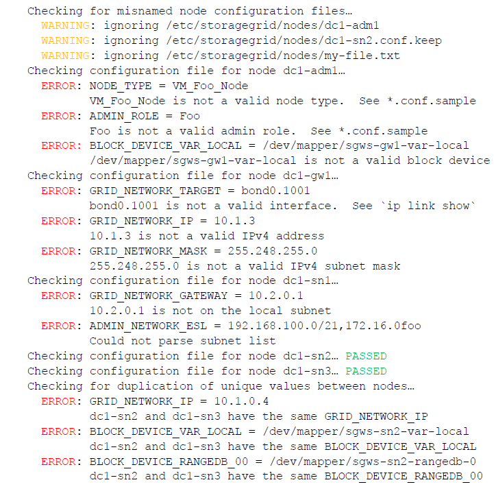

= 驗StorageGRID 證此組態
:allow-uri-read: 
:icons: font
:imagesdir: ../media/

[role="lead"]
在中為每個 StorageGRID 節點建立組態檔案之後 `/etc/storagegrid/nodes`、您必須驗證這些檔案的內容。

若要驗證組態檔的內容、請在每個主機上執行下列命令：

[listing]
----
sudo storagegrid node validate all
----
如果檔案正確、輸出會顯示每個組態檔的* passed *、如範例所示。

NOTE: 當僅在中繼資料節點上使用一個 LUN 時、您可能會收到可忽略的警告訊息。

image::../media/rhel_node_configuration_file_output.gif[此影像由周邊文字說明。]

TIP: 對於自動安裝，您可以使用命令中的或 `--quiet`選項 `storagegrid`（例如 `storagegrid --quiet...`）來抑制此輸出 `-q`。如果您抑制輸出、則在偵測到任何組態警告或錯誤時、命令會有非零的結束值。

如果組態檔不正確、問題會顯示為*警告*和*錯誤*、如範例所示。如果發現任何組態錯誤、您必須先加以修正、才能繼續安裝。

