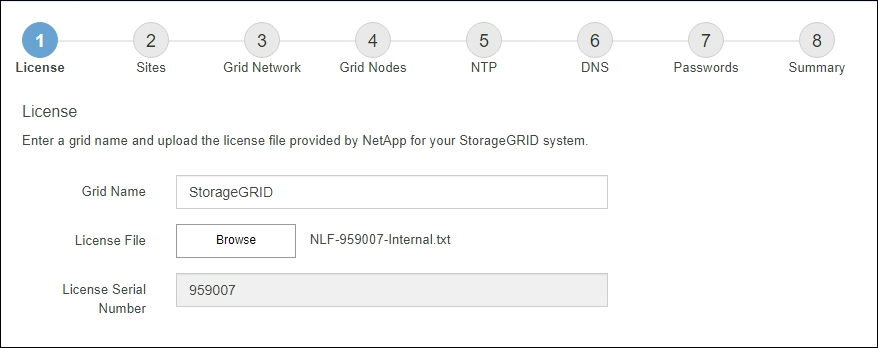

= 指定StorageGRID 不含授權的資訊
:allow-uri-read: 
:icons: font
:imagesdir: ../media/

[role="lead"]
您必須指定StorageGRID 您的系統名稱、並上傳NetApp提供的授權檔案。

.步驟
. 在「授權」頁面上的 * 網格名稱 * 欄位中、輸入 StorageGRID 系統的有意義名稱。
+
安裝後、名稱會顯示在節點功能表頂端。

. 選取 * 瀏覽 * 、找到 NetApp 授權檔案(`NLF-_unique-id_.txt`）、然後選取 * 開啟 * 。
+
授權檔案已驗證、並顯示序號。

+

NOTE: 此產品的安裝歸檔包含免費授權、不提供任何產品的支援權利。StorageGRID您可以更新至安裝後提供支援的授權。

+

. 選擇*下一步*。

